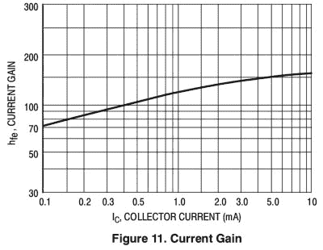
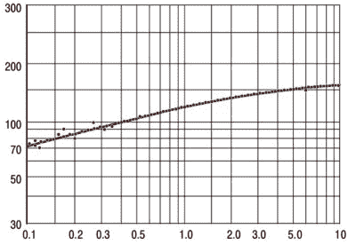

# 使用 webplot 数字化仪数字化您的图形

> 原文：<https://hackaday.com/2016/05/12/digitize-your-graphs-with-webplotdigitizer/>

您是否曾经不得不编写一些代码来解释 ADC 采集的非线性模拟读数？当你的传递函数所需要处理的只是半导体数据手册中的一张图表，这张图表可能是 30 年前写的，打印出来只有邮票大小，这是一项相当烦人的任务。如果你能看到图表背后的数字，那该多好啊！

你不能去敲 80 年代发明它的工程师的办公室门，他现在可能已经退休，正在打高尔夫球或种植珍贵的牵牛花。但是你可以将图表数字化，让自己更接近行动，有一个方便的在线工具可以帮助你。

2N3904 current gain

[WebPlotDigitizer](http://arohatgi.info/WebPlotDigitizer/) 并不新鲜，到现在已经有好几年了。但它仍然值得一谈，因为它是那些需要保留的工具之一。如果你曾经需要它，你会知道我们的意思。

那么它是如何工作的呢？加载一个带有图形的图像，在 X 轴和 Y 轴上选择一些点，用记号笔工具粗略地描绘曲线，然后设置它的运动。让我们试一试。我们将尝试对几天前我们检查过的[的](http://hackaday.com/2016/04/26/pillaging-the-wealth-of-information-in-a-datasheet/) [2N3904 数据手册](http://www.onsemi.com/pub_link/Collateral/2N3903-D.PDF) (PDF)中的电流增益图进行数字化处理。

Data points!

因此，打开 WebPlotDigitizer 应用程序，以 JPEG 格式加载从工作表中捕获的图形图像。它询问你加载了什么类型的图形，在这个例子中是 2D X-Y 图。它要求您识别轴上的四个已知点，并提供它们的值。你也可以告诉它坐标轴在这一点上是否是对数的。选择右侧的“自动模式”，然后点击“笔”并标记图形轨迹，然后选择轨迹的颜色。点击“运行”按钮，您的数据点就会出现。点击“查看数据”按钮，你就有了。也许要去掉几个缺点，但它做得很好。

如果 WebPlotDigitizer 引起了您的兴趣，您会很高兴地知道它是开源的，并且您可以在 GitHub 上找到它的所有代码。还有一个方便的视频教程，你可以在休息时看到。

 [https://www.youtube.com/embed/P7GbGdMvopU?version=3&rel=1&showsearch=0&showinfo=1&iv_load_policy=1&fs=1&hl=en-US&autohide=2&wmode=transparent](https://www.youtube.com/embed/P7GbGdMvopU?version=3&rel=1&showsearch=0&showinfo=1&iv_load_policy=1&fs=1&hl=en-US&autohide=2&wmode=transparent)

通过查看 Hackaday 档案，我们已经讨论过这个主题几次了。 [Engauge 是另一个图形数字化仪](http://hackaday.com/2015/12/22/engauge-makes-graph-thieving-a-cinch/)，我们也介绍过[一个用于伺服样条的摄影数字化仪](http://hackaday.com/2015/02/01/spline-thieving-makes-hobby-servos-even-more-useful/)。

向[JD]脱帽致敬。