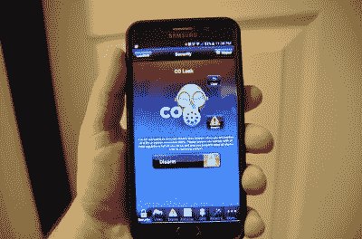
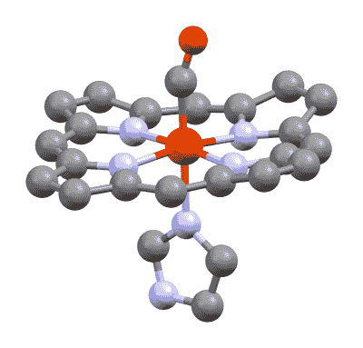
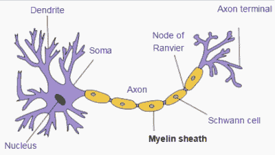
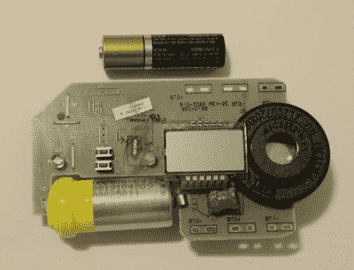
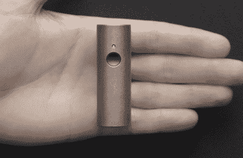

# 一氧化碳:寻找无声的黑仔

> 原文：<https://hackaday.com/2016/05/04/carbon-monoxide-hunting-a-silent-killer/>

沃尔特和莫莉·韦伯刚刚结束了几周的工作。他是一个重要案件的联邦调查局探员。她在霍顿米夫林从事管理工作。1995 年 2 月一个阳光明媚的星期五晚上，两人开始了急需的周末滑雪旅行。他们开了五个小时的车来到了加利福尼亚猛犸湖滑雪区的塞拉山脉。这是一次临时的旅行，所以大多数较好的酒店都被预订了。这对疲惫的夫妇在周五晚上 11:30 左右入住了一家价格较低的汽车旅馆。他们很快安顿下来，上床睡觉，计划着周六早上 7 点的叫醒服务。

周六前台打电话，没人接。服务台经理认为他们起得很早，已经在斜坡上了。星期天也是一样。直到一个女佣去检查房间，才发现这对夫妇还在床上，没有反应。

房间里的燃气供暖设备维修不善，导致废气排入小房间。一氧化碳迅速积聚，毒害了这对运动员夫妇。沃尔特已经死了，莫莉也奄奄一息。她被紧急送往洛马琳达大学医疗中心。她表现为临床脑死亡。她运动员般的体格使她成为器官捐赠的绝佳人选。Takkin Lo 医生]拒绝为她做手术，而是凭直觉尝试一种未经证实的治疗方法来挽救她的生命。她被安置在高压氧舱中，并接受了积极的治疗。

她的家人聚集在她周围，从全国各地赶来与他们所爱的人团聚。尽管困难重重，莫莉还是在九天后从昏迷中醒来。不过，她还没有脱离险境。这场磨难给她留下了严重的脑损伤。她需要重新学习如何走路、吞咽和完成日常任务。令莫莉的家人最难过的是她的整个性格都变了。从昏迷中醒来的人和入住汽车旅馆的不是同一个人。

 可悲的是，莫莉的故事不是虚构的。这是事实，她和她的家人已经一起生活了 20 多年。莫莉的姐姐 [Lyrysa Smith](http://www.lyrysasmith.com/) 已经在一本名为[正常生活:一个姐姐经历脑损伤](http://www.amazon.com/Normal-Life-Sisters-Odyssey-Through-ebook/dp/B00HNWAV70)的优秀书中记录了这个故事。这本书描述了人类处理严重脑损伤的一面。她设法用语言表达了对脑损伤患者的护理者来说有多困难。心理学家说，当一个亲人受到脑损伤时，整个家庭都会受到脑损伤。

如果沃尔特和莫莉的房间里安装了一氧化碳探测器，这场悲剧本来是可以避免的。许多汽车旅馆和酒店仍然没有一氧化碳探测器，这就是为什么 Lyrysa 建议旅行时总是带着电池供电的探测器。

#### 沉默的黑仔

Security systems can report CO leaks directly to your cell phone.

一氧化碳是一种无嗅、无味、无色的气体，与空气的摩尔质量几乎相同(一氧化碳平均比空气轻 3%)。这意味着一氧化碳不会上升或下降，而是均匀地分散到一个封闭空间的空气中。这就是为什么探测器可以安装在墙上插座的下方，或者天花板的上方。这种气体在浓度超过百万分之 35(PPM)时对人类有毒。正因为如此，一氧化碳被称为无声杀手。我们都听说过不要用厨房的炉子作为取暖设备，或者不要在室内运行发电机。原因是一氧化碳。

美国疾病控制中心指出，每年有超过 20，000 次急诊室就诊是由于意外一氧化碳中毒，其中包括超过 400 例死亡。一氧化碳中毒从头痛开始。它会发展成头晕、恶心和一般流感样症状。大多数人认为他们只是得了流感，然后上床睡觉。这往往是一个致命的错误。

#### 生物

Carboxyhemoglobin molecule, by Rifleman 82 via Wikipedia

人体内总会发现少量的一氧化碳。已知该分子在人体内具有一些治疗性抗炎作用。然而在更高的浓度下，一氧化碳变得极其有毒。一氧化碳中毒最可怕的部分是它的运作方式。血红蛋白是红细胞中携带氧气的分子。血红蛋白在肺部与氧气一起增加，成为氧合血红蛋白。然后，循环系统将这种氧合血红蛋白运送到全身，并将其有效载荷输送到肌肉和器官。一氧化碳也与血红蛋白结合，产生碳氧血红蛋白。事实上，这种结合比氧强 200 多倍。这意味着碳氧血红蛋白不那么容易分离。碳氧血红蛋白本质上成为一种惰性分子，在循环系统中循环，使器官缺氧。

这就是事情变得棘手的地方。

众所周知，治疗一氧化碳中毒的方法是呼吸新鲜空气。然而，它不会立即清除血液中的碳氧血红蛋白。这需要时间。碳氧血红蛋白的半衰期为 4 至 6 小时。不过，有一种方法可以加快速度。给受害者使用纯氧可以将半衰期减少到不到一小时。

在极端情况下，使用高压氧治疗。受害者被放入加压到三个大气压的纯氧室。这迫使氧气扩散到血浆中，并被带到饥饿的组织中。

Structure of a neuron, by Quasar Jarosz via Wikipedia

对于急性中毒患者来说，熬过最初的发作并不意味着最坏的情况已经过去。许多患者开始康复，但在 2 到 40 天后，情况发生了变化。病人很快表现出进一步脑损伤的迹象。平衡、记忆和认知功能都会受到影响。这种现象被称为延迟神经心理学后遗症，这对莫莉·韦伯来说是毁灭性的。神经心理后遗症的机制仍未完全了解。研究表明，一氧化碳会损害神经细胞周围的髓鞘碱性蛋白(MBP)。受损的 MBP 会触发身体的免疫系统。称为白细胞的白细胞攻击并清除受损的 MBP。然而白细胞并没有就此止步。他们开始攻击健康的 MBP，破坏健康的脑组织。 这种生物学上的一击两中的结果留下了永久性的脑损伤，可能需要数年才能恢复——如果有可能恢复的话。

在研究这篇文章的过程中，我想起了我们对大脑的了解是多么的少，它是如何受伤的，以及它是如何从受伤中恢复的。如果有一个地方，生物黑客真的可以发挥巨大的作用，那就是研究并试图理解这一切是如何工作的。

#### 环境

一氧化碳是由几种不同的方法产生的。火山和其他地质来源向大气中释放一氧化碳，森林火灾也是如此。主要的贡献者是人类。像美国国家航空航天局的 Terra 宇宙飞船这样的卫星一直在关注大气中的一氧化碳。条纹经常出现在城市上空，以及农作物残渣和森林被焚烧的地方。

一氧化碳的主要生成方式是碳基燃料的不完全燃烧。如果没有足够的氧气将燃料氧化成二氧化碳，就会产生一氧化碳。内燃机产生大量的一氧化碳。在美国，1975 年以后生产的汽油和柴油车辆装有催化转化器，大大减少了一氧化碳的排放。然而，并不是所有的车辆都保养得很好。每年都有坐在排气系统有问题的空转汽车里的人死亡的报道。

发电机和动力清洗机等小型发动机往往没有催化转换器，但它们仍然会产生大量的一氧化碳。家中运行的发电机每年都会杀死很多家庭。即使在半封闭的空间如停车场运行动力清洗机也足以使气体积累到危险水平。

在家里，大多数一氧化碳中毒事件都是由于燃气用具的问题造成的。正确调节的热水器、锅炉或炉子会产生一些一氧化碳。如果空气带没有正确调节，一氧化碳水平会上升。如果排气管堵塞或受损，一氧化碳就会进入生活空间。就在上周，俄克拉荷马州的一户人家因为屋顶工人堵住了热水器排气管而充满了一氧化碳。谢天谢地，这家人家里有一氧化碳探测器，没有人受伤。

#### 检测一氧化碳

正如上述俄克拉何马州的家庭所了解到的那样，防止一氧化碳中毒的最好方法是一个好的探测器。这需要一种检测气体的方法，这可不是一件容易的事。为了保证安全设备的可靠性，探测器和其中的传感器必须精确且可重复。有几种不同的方法来测量 CO。半导体传感器使用加热到 400°c 的二氧化锡。当暴露在 CO 中时，传感器的电阻会发生变化。这种传感器的一个很好的例子是 MQ-7，它在制造商群体中很受欢迎。不幸的是，这种传感器的功率要求意味着它不太适合电池供电的设备。

绝大多数一氧化碳传感器使用电化学电池，非常类似于我们在 Hackaday 上经常看到的燃料电池。典型的一氧化碳传感器是具有两个或三个电极的两个或三个端子的装置:工作电极、反电极，有时是参比电极。所有端子都接触电解液。在一氧化碳电池中，电解质通常是硫酸。

Carbon monoxide detector – the metal can on the lower left is the electrochemical sensing cell.

工作电极是动作发生的地方。工作电极通常由铂制成，位于防水但透气的薄膜后面。空气进入电池并接触电极。铂氧化任何一氧化碳，导致电池不平衡。反电极是添加或移除电子以“对抗”工作电极上发生的反应的地方。如果存在，参考电极与一氧化碳隔离，并提供电解质电势的参考。现代检测机设计中经常忽略这一点。如今，对电极具有双重功能——作为测量点和平衡电池输入。每个电池都是不同的，这就是为什么大多数制造商测试每个电池，甚至在电池外壳上印上每 PPM 的毫安值。

管理和读取一氧化碳传感器需要相当多的电子设备。在经典模拟系统中，一个称为稳压器的运算放大器电路监控参比电极，并改变对电极的电压以保持电池平衡。当电流流入或流出工作电极时，测量电池的总输出。该电流以纳安为单位，因此跨阻放大器用于将电流转换为电压，并将信号提升至模数转换器易于测量的水平。

为了获得使用一氧化碳电池的实用观点，我联系了[邪恶设备](http://shop.wickeddevice.com/)的【Victor Aprea】。[Victor]创造了[空气质量蛋](http://shop.wickeddevice.com/product-category/air-quality-egg/)，一个开源的空气质量测量设备。Victor 发现，获得准确的一氧化碳读数需要的不仅仅是读取传感器。传感器响应曲线根据环境条件而变化。温度是个大问题——在极端温度情况下，一氧化碳读数可能会相差 15%。大气压力是另一个因素，其他气体也有影响。[Victor]花了相当多的时间来绘制曲线并修改空气质量 Egg 的固件以进行补偿。他就自己的工作写了几篇内容丰富的博客:[这里](http://shop.wickeddevice.com/2015/07/14/temperature-compensation/)，这里[这里](http://shop.wickeddevice.com/2015/08/05/temperature-compensation-part-deux/)，这里[这里](http://shop.wickeddevice.com/2015/08/06/pressure-compensation/)。[Victor]还发现与其他气体的交叉敏感性是一个问题。值得庆幸的是，空气质量鸡蛋中使用的特殊 CO 传感器并不像环境问题那样是个大问题。

我应该注意到，检测器不仅仅是传感元件。大多数国家都有设计一氧化碳探测器的安全标准。在美国，普遍接受的标准是 UL 2034。2034 标准基于人类 10%的碳氧血红蛋白饱和度。这个想法是，当浓度高到足以危险时，探测器会发出警报，但只是在一定时间过后。例如，当浓度为 70 PPM 时，警报应在 60 至 240 分钟内响起。这听起来有点违反直觉，因为人类在大约 35 PPM 时开始遭受一氧化碳中毒。时间延迟是为了减少假警报。如果一氧化碳探测器误报太多，以至于有人因误报而拔掉电池，那么它就没有用。

作为本文研究的一部分，我对商用一氧化碳报警器进行了一些测试。你可以在我的 [Hackaday.io 项目页面](https://hackaday.io/project/11555-testing-carbon-monoxide-detectors)上找到我的测试结果，并看到拆除。

#### 所以，黑？

那么为什么这些都在 Hackaday 上？很简单，因为一氧化碳探测器还不够普及。在美国，有关于使用一氧化碳探测器的法律。然而，它们仍然非常柔软。

[根据国家立法机构全国会议(NCSL):](http://www.ncsl.org/research/environment-and-natural-resources/carbon-monoxide-detectors-state-statutes.aspx)

*   5 个州要求在学校建筑中安装一氧化碳探测器。
*   12 个州要求在旅馆和汽车旅馆安装一氧化碳探测器。
*   37 个州要求家庭使用一氧化碳探测器。

如今，几乎每个人都带着智能手机。为什么我们没有一氧化碳探测器在里面？智能手表也是如此。苹果手表上被大肆宣传的传感器套件能够测量佩戴者血液中的氧饱和度。使用这种传感器来测量一氧化碳饱和度只需增加几个发光二极管和软件。

人们已经做出了一些努力来混合智能手机和传感器。全细胞项目是 DHS 在 2010 年为手机增加传感器的一项努力。不幸的是，它没有真正去任何地方。

Atomtube – will it work?

SensorDrone 是一款感知一切的设备，2013 年在 Kickstarter 上表现良好。SensorDrone 确实交付给了支持者，但它从未获得 Sensorcon 所希望的社区支持。今天，它似乎已经从 Sensorcon 的网站上消失了。 [Atomtube 是一个类似的项目，最近在 Indiegogo](https://www.indiegogo.com/projects/atmotube-the-portable-air-pollution-monitor#/) 上完成。它还没有交付，所以我不能说它在现实世界中会有多好。

独立的可穿戴一氧化碳传感器确实存在，但它们有一些警告。像 BW 和 T2 这样的公司向消防员、暖通空调技术人员和其他专业人士出售这些传感器。这种传感器的价格在 100 美元以上，仍然相对昂贵。它们还需要定期校准和碰撞测试，这意味着要么投资昂贵的校准气体系统，要么将传感器送回制造商并支付费用。这其中的大部分是必需的，因为电化学电池不能很好地老化。他们的反应会随着时间而减弱。如果暴露在化学物质和某些溶剂中，细胞也会受到损害。尽管如此，可佩戴的一氧化碳探测器被证明可以拯救生命。[长岛的两名急救人员正在一家餐馆吃早餐，这时他们的一氧化碳探测器发出警报](http://www.honeywell.com/newsroom/news/2015/01/honeywell-innovation-saves-lives-honeywell-carbon-monoxide-detectors-alert-long-island-diners-to-dangerous-leak)。急救人员能够在任何人生病之前疏散用餐者。就在一年前，长岛另一家餐馆发生一氧化碳泄漏，导致一人死亡，26 人住院。找到检测一氧化碳的新方法——光谱学，不同的硅传感器，或者我还没有想到的技术——可能是解决这个问题的更好方法。一氧化碳感测和检测方面的任何进步都将成为 [Hackaday 奖](https://hackaday.io/prize)的优秀参赛作品。如果每个人都在这样的项目上一起工作，我们可以努力确保像莫利这样的故事不再发生。

作者注:我要感谢 Lyrysa Smith 和 Victor Aprea 对本文研究的帮助。