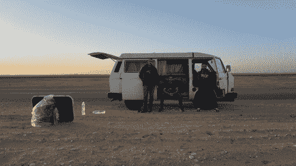

# 经营一个黑客空间很难:埃及版

> 原文：<https://hackaday.com/2016/05/08/running-a-hackerspace-is-hard-egypt-edition/>

众所周知，管理一个黑客空间很困难。不同的个性，不同的物质要求，以及经常受到限制的空间可能需要不断的协商。但是如果你认为让金属加工工人在你的电子工作台上刮屑是个问题，试着让你的整个黑客空间在短时间内被拆除。

此刻开罗的局势远非正常。开罗黑客空间最近搬到的大楼遭到突袭，关闭了两个月，然后在严格的监视下于二月重新开放。

一切都很顺利，直到大楼的一部分意外倒塌。然后他们得到了拆除令，接着是延期，接着是武装警察进入并破坏东西，接着是进一步宣布该建筑是安全的，现在是一个遗产地。一周多的时间里。虽然联排别墅中的一些艺术工作室被保留了下来，但开罗黑客空间的空间却消失了。

好消息是什么？没有人在这一切中受伤，开罗黑客空间的工作人员能够在最初的拆除通知后取出他们的设备。他们最近一直在研究一种移动黑客空间的方法，所以希望他们能够继续黑客活动。

因此，当你在为谁没有清理 hackspace 的咖啡机，或者你最喜欢的烙铁的正确位置而争吵时，善意地想想 Cairo 的工作人员，然后回到你最擅长的事情上来——项目。

你呢？你有哪些黑客空间的故事？请通过[举报热线](http://hackaday.com/submit-a-tip/)联系我们，我们很乐意倾听。