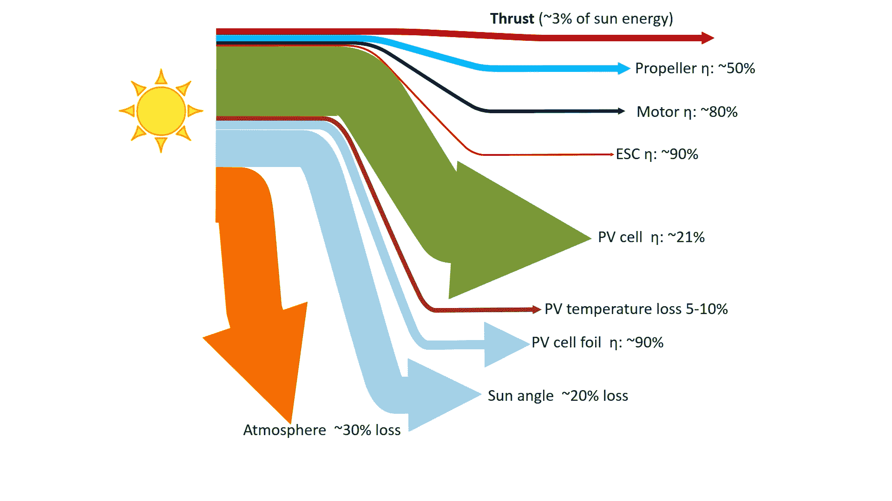

# 太阳能 FPV 飞机永远飞行

> 原文：<https://hackaday.com/2016/05/10/solar-fpv-plane-flies-forever/>

我们热爱太阳能。它不仅环保，而且重量相对较轻，涉及脆弱的高科技。就是那种我们想要[绑在大型模型飞机](https://www.youtube.com/watch?v=rMkPjBf6dNQ)机翼上的东西。

遥控飞机上的太阳能会让你有无限的续航里程。现在，一个正常的土地和交换电池的过程可能对一些人来说已经足够好了，但从[Prometreus]的 YouTube[频道](https://www.youtube.com/user/Prometreus/videos)来看，他是一个飞越阿尔卑斯山的长途飞行爱好者，也是一个将 FPV 长途连接推向崩溃边缘的爱好者。对于他和他的朋友来说，电池电量绝对是他能飞多远/多长时间的限制因素。

我们所有的信息都在视频里，但这已经足够了。[Prometreus]没有为最大功率点跟踪而烦恼，而是给他的太阳能电池接上电线，使其在电池电压和他看到的太阳水平下工作。因此，在阴天，它就不那么好用了。(看看这个提交给 Hackaday 奖的 MPPT 建筑。)

他可以远程控制太阳能电池的开关，看到电池消耗的电流降到零以下是非常令人满意的。最后，他带着满满的电池着陆了。多酷啊。

 [https://www.youtube.com/embed/rMkPjBf6dNQ?version=3&rel=1&showsearch=0&showinfo=1&iv_load_policy=1&fs=1&hl=en-US&autohide=2&wmode=transparent](https://www.youtube.com/embed/rMkPjBf6dNQ?version=3&rel=1&showsearch=0&showinfo=1&iv_load_policy=1&fs=1&hl=en-US&autohide=2&wmode=transparent)

