# 弯曲金属板的艺术和科学

> 原文：<https://hackaday.com/2016/05/18/the-art-and-science-of-bending-sheet-metal/>

发动机支架。坚固的围栏。一个 43.7 的支架。一般黑客需要至少一个有角度的金属部件，最好的工具仍然是好的折弯机。弯曲零件需要在平面图的设计和布局中进行一些额外的思考，因此如果您想了解弯曲余量、弯曲扣除以及如何在没有压力机的情况下弯曲精确的零件，请继续阅读。

## 弯曲方法

[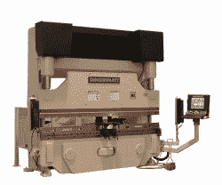](https://hackaday.com/wp-content/uploads/2016/05/press_brake.jpg)

Press brake ([source](https://en.wikipedia.org/wiki/Bending_(metalworking)#/media/File:Press_Brake.jpg))

最常见的弯曲方法，但肯定不是唯一的，是空气弯曲和打底。它们可以在同一个压弯机上完成，通常不需要超过 25 吨的压力用于通用车间。压弯机还配有手动或 CNC 控制的后规，可以精确定位弯折线。就像所有的压力机一样，折弯机对它们的潜在危险有一点欺骗性。他们看起来很平静，移动很慢，但是当他们的力量碰到物质的时候，事情会发生得很快。

然而，如果你不能使用压弯机，你也不是完全不走运。有开槽技术，其中材料在弯曲线处被削弱，仅足以使用台钳将一个漂亮的弯曲加工成 1/4 英寸的钢。

### 空气弯曲

[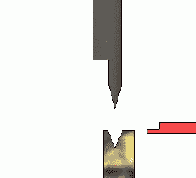](https://hackaday.com/wp-content/uploads/2016/05/biegeanimation_2d.gif)

Air bending animation – ([source](https://de.wikipedia.org/wiki/Biegen#/media/File:Biegeanimation_2D.gif))

空气弯曲使用冲压工具和通常为 V 形的底模。冲头的轮廓定义了弯曲半径，而冲程深度定义了弯曲角度。由于冲程深度可在机器上调节，气动弯曲可让您将板材弯曲至任意角度，而无需更换冲模或冲孔工具。底模的开口应根据材料厚度和弯曲半径适当选择，一个好的经验法则是材料厚度的 6 至 12 倍。这样做将确保良好的结果和较长的工具寿命。然而，你会很快注意到，即使专业车间使用他们的 3/4“底部模具几乎任何事情，所以就是这样。冲头松开后，材料会弹回一点，必须通过过度弯曲材料来补偿。空气弯曲在角度精度方面不是很好，但可以适应不同的材料、材料厚度和弯曲角度，而无需重新加工。

### 查明真相

[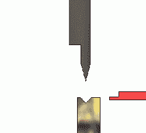](https://hackaday.com/wp-content/uploads/2016/05/biegeanimation_2d-2-edit.gif)

Bottoming animation – (edited, [source](https://de.wikipedia.org/wiki/Biegen#/media/File:Biegeanimation_2D.gif))

就像气弯一样，打底用的是冲头和 V 型底模。但是，冲头会将材料压在底部模具的内表面上，因此底部工具的角度定义了弯曲角度。因此，该方法需要单独的底模和为每个弯曲角度重新加工工具，以及明显更大的压力。但是，它比空气弯曲更精确，回弹更小。您通常会在通用车间或制造商空间中找到一种带 90°底模的压弯机，对于任何小于 90°的弯曲角度，相同的模具将用于空气弯曲。然而，由于筑底涉及更大的力，使用正确的模具也更重要。根据经验，8 倍的材料厚度可以形成良好的底部模具开口。然而，由于几何正确的开口也取决于弯曲半径，有[种更好的方法来计算开口宽度](http://www.thefabricator.com/article/bending/taking-the-danger-out-of-bottom-bending)。

### 打孔

[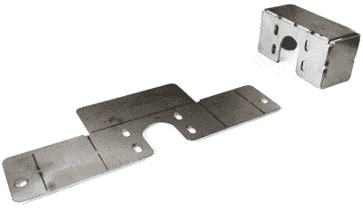](http://www.crown-international.co.uk/metal-fabrication-services/)

Example for a manually bendable bracket by Crown International ([image source](http://www.crown-international.co.uk/metal-fabrication-services/))

为了定义折弯区域并减少将钣金零件折弯成无需压弯机即可处理的零件所需的力，可以在折弯线处切割槽，以选择性地削弱材料。它类似于[切缝弯曲](http://hackaday.com/2012/09/04/playing-around-with-kerf-bending/)，但不那么脆弱。开槽是一种很好的技术，可以为小型机器人项目甚至大型空载结构定制金属外壳和框架。然而，由于它明显削弱了材料，对于依赖于弯曲区域结构完整性的重型承载部件来说，这是一个禁忌。甚至有[的专利](http://www.industrialorigami.com/)方法使用某些开槽模式，即使他们背后的想法足够简单，他们也可以相当巧妙。

## 弯曲几何学

根据折弯角度和半径，折弯区域中的材料会变形。为了得到我们想要的最终零件尺寸，我们必须事先考虑到这一点。大多数专业 CAD 工具，如 Solidworks 或 Rhino，将为您完成所有的弯曲数学计算，但不幸的是，许多其他好工具，如 Fusion 360、OpenSCAD 或 FreeCAD，需要您获得额外的插件，利用[在线计算器](http://www.sheetmetalguy.com/bend-calculator.htm)，或手工计算。

### 工作表

首先假设你想用一张极小的薄片材料做一个 90°的支架，或者说，实际上，用一张纸。因为它很薄，实际上不包含任何材料，所以它会弯曲，没有材料变形。为了使它更简单，我们选择了 0 的弯曲半径，这使它成为一个折痕。在这种理论上的情况下，我们需要切断的带的长度 L 将是支架的两侧 A 和 b 的总和。

[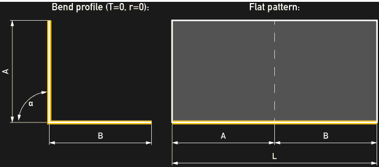](https://hackaday.com/wp-content/uploads/2016/05/steel_bending_illu-014.png)

如果我们现在添加一个弯曲半径，我们的支架将不再由两条直边 A 和 B 组成，而是由两条缩短的腿组成，我称之为 A 和 B。这两条腿由长度为 c 的弧连接。到目前为止，一切顺利。

[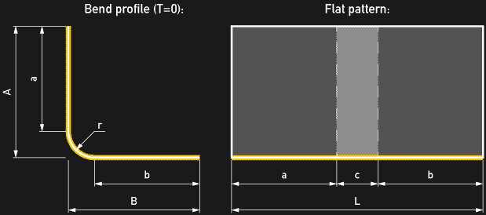](https://hackaday.com/wp-content/uploads/2016/05/steel_bending_illu-024.png)

### 长方体

要想弯曲一个具有相当厚度的金属板，请将注意力集中在厚度范围内的一个假想的中心板，即所谓的中性线或中性轴。这条中性线的行为就像上面的薄板一样，在弯曲过程中保持不变形。我们必须记住的唯一两件事是，材料厚度 t 使中性线的弯曲半径 r '偏移了材料厚度的一半，并且我们的腿 a 和 b 变得有点短。像钢和铝这样的真实材料的行为并不完全像这条中心线，但是中性线的概念仍然有助于描述它们。

### 弯曲余量和 k 系数

和往常一样，真实世界的材质不会像我们的模型那样简单。当材料在压力机的硬化钢工具之间呈现出新的形状后，这条中间的中性线会被相互作用弄得乱七八糟。如果没有材料特性的详细且相当复杂的模型，我们就无法真正了解弯曲后中性线的走向。为简单起见，可以使用基于简化近似的假想中性线来预测展开模式的长度:

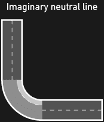

为此，引入了校正因子 k。该因子将折弯区域中的中性线段从其中心路径偏移，直到它具有展开模式的相应区域的长度。对于给定的材料、材料厚度、弯曲半径和弯曲方法，k 因子由经验确定。它反映了弯曲区域中所有真实但未知的失真。

[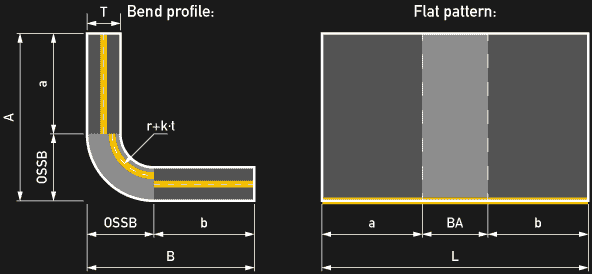](https://hackaday.com/wp-content/uploads/2016/05/steel_bending_illu-044.png)

由于 k 系数取决于几个因素，因此使用了根据经验确定的给定设置的 k 系数表。使用 k 系数，我们现在可以计算弯曲余量“BA”，即进入弯曲区域的扁平材料的长度。它只是“假想”中性线段的弧长，已被 k 系数抵消:

[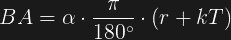](https://hackaday.com/wp-content/uploads/2016/05/ba1.png)

当然，近似值仅与所使用的 k 因子一样真实，并且为您打算使用的材料保留自己的 k 值表是有意义的。但是，以下值是一个很好的起点:

[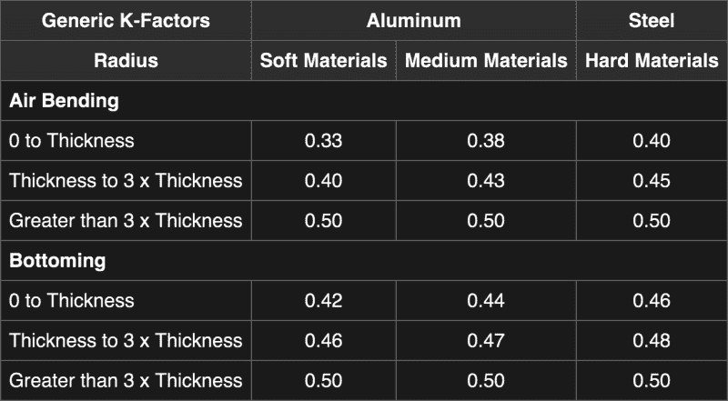](https://hackaday.com/wp-content/uploads/2016/05/k-values-grey.png)

“Rule of Thumb” k-factor table (source: [Wikipedia](https://en.wikipedia.org/wiki/Bending_(metalworking)#Bend_deduction))

### 开槽弯管的弯曲余量

在折弯轴处对钣金开槽时，折弯区域的材料平均密度会降低。对于材料应该被削弱多少没有特别的规则，但是根据经验，对于高达 1/8″的钢，20%的密度是一个好的选择。密度为 20%时，桥宽 w 是槽长 s 的 1/4，如下图所示。对于桥宽 w，我建议不要低于材料厚度 t 的 3/4。

[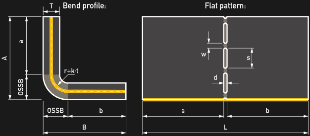](https://hackaday.com/wp-content/uploads/2016/05/slotting_illu-013.png)

#### 直槽

当使用直槽时，展开模式中的折弯区域将与槽宽度 d 一样宽，因此出于所有实际目的，在这种情况下，槽宽度等于折弯余量。根据所需的弯曲半径，可以计算槽宽:

[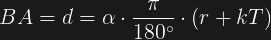](https://hackaday.com/wp-content/uploads/2016/05/ba-d1.png)

但是，半径不能太大，根据经验，应低于材料厚度的 2/3。

#### 工程槽

[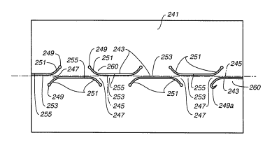](https://hackaday.com/wp-content/uploads/2016/05/us07152449-20061226-d00000.png)

“Smiley” shaped slot pattern (by Industrial Origami Inc. – [patent source](https://patents.google.com/patent/US7152449B2/en?assignee=Industrial+Origami%2c+Inc.,Industrial+Origami%2c+Llc,Industrial+Origami%2c+Inc.%2c+San+Francisco))

槽可以以一种更可预测且与材料无关的方式成形，以控制弯曲。虽然在金属上切割非直线槽听起来微不足道，但这一领域仍有许多专利。对于教育用途和 DIY 项目，Industrial Origami Inc .的相关专利可能仍然是一个很好的资源。它们包含一整套更智能设计的插槽模式，如[笑脸形状、自动索引铰链](https://patents.google.com/patent/US7152449B2/en?assignee=Industrial+Origami%2c+Inc.,Industrial+Origami%2c+Llc,Industrial+Origami%2c+Inc.%2c+San+Francisco)、[扭曲铰链](https://patents.google.com/patent/US7032426B2/en?assignee=Industrial+Origami%2c+Inc.,Industrial+Origami%2c+Llc,Industrial+Origami%2c+Inc.%2c+San+Francisco)和[其他类似折纸的方法](https://patents.google.com/patent/US7464574B2/en?assignee=Industrial+Origami%2c+Inc.,Industrial+Origami%2c+Llc,Industrial+Origami%2c+Inc.%2c+San+Francisco)。

大多数图案的设计方式都允许材料在弯曲完成后能够自我索引。例如，笑脸图案的对角桥将随着它们被弯曲扭曲而缩短，有效地将两个平坦侧边边对边地拉到一起，因此实际上没有弯曲半径，也没有材料相关的弯曲余量需要考虑。这种方法允许非常精确的弯曲，具有可忽略的变形和非常坚固的零件。仍然可以使用外部缩进的公式，因为 OSSB 是纯几何的，所以不需要 k 因子表。

### 外界的挫折“OSSB”

要获得我们的展开模式长度 L，我们必须知道我们的直腿长度 a 和 b。当然，如果您使用 CAD 设计零件，您可以从 CAD 工具中读取尺寸。然而，如果你只有一张只有基本尺寸的技术图纸，或者一张餐巾纸上的草图，你就必须手工绘制。

弯头的边长(A 或 B)与其腿长(A 或 B)之差称为外侧缩进或“OSSB”。所以腿的长度定义为:

A = A–OSSB

B = B–OSSB

在这一点上，有两种不同的边长定义 A 和 B 是常用的，它取决于弯曲角度。对于小于 90°的弯曲角度，它们通常被定义为从顶点到边缘的长度，对于大于 90°的弯曲角度，它们通常从弯曲到边缘的切线开始测量。对于 90°的弯曲角度，这两者是相同的。在所有公式和示例中，弯曲角度α都使用度。

[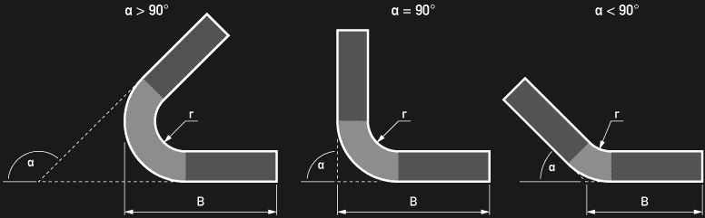](https://hackaday.com/wp-content/uploads/2016/05/steel_bending_illu-055.png)

#### α< 90°时的 OSSB

对于小于 90°的弯曲角度α，通常，当从顶点到边缘标注 A 和 B 时，外侧缩进的公式总是取决于弯曲角度:

[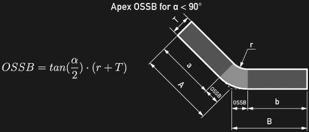](https://hackaday.com/wp-content/uploads/2016/05/steel_bending_illu-096.png)

#### α> = 90°时的 OSSB

对于大于 90°的弯曲角度，通常，当 A 和 B 从弯曲的切线到边缘进行标注时，外部缩进与弯曲角度无关:

[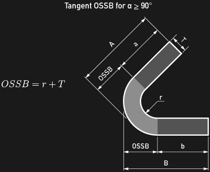](https://hackaday.com/wp-content/uploads/2016/05/steel_bending_illu-067.png)

#### 选择的自由

除非你受限于某个规范，否则你仍然可以从顶点到边缘标注 A 和 B，并使用第一个公式，即使你的弯曲角度大于 90°，只要它小于 180°。然而，对于更大的角度，这变得非常不切实际，因为顶点远离弯曲移动。

[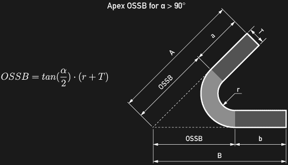](https://hackaday.com/wp-content/uploads/2016/05/steel_bending_illu-077.png)

## 平面模式长度

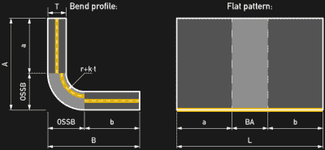最后，我们可以将所有东西放在一起，通过将碎片放在一起，计算我们需要切割金属的平面模型长度 L:

### 弯曲扣除“BD”

实际上，展开模式的长度总是比 A 和 B 之和短，因此上述所有内容都可以归结为 A + B 和 L 之差，这被称为弯曲演绎“BD”。

#### 对于α< = 90°

[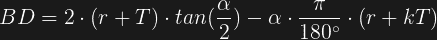](https://hackaday.com/wp-content/uploads/2016/05/bd-tan1.png)

#### 对于α> = 90°

[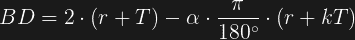](https://hackaday.com/wp-content/uploads/2016/05/bd-rt1.png)

## 立即设计您的零件

因此，了解弯曲津贴和弯曲扣除的基本知识，你应该能够使用折弯机或开槽法和老虎钳来建造自己的定制钢外壳、机器人框架或安装支架。你不需要拥有激光或等离子切割机来定制不锈钢或铝的形状。当地的工作室和在线服务机构会很乐意将你的设计输入到他们高度自动化的制造流水线中，即使是少量的设计也能负担得起。最后，请欣赏以下由 Dan Gelbart 制作的折弯机介绍视频:

 [https://www.youtube.com/embed/dS5kwdaNhZo?version=3&rel=1&showsearch=0&showinfo=1&iv_load_policy=1&fs=1&hl=en-US&autohide=2&wmode=transparent](https://www.youtube.com/embed/dS5kwdaNhZo?version=3&rel=1&showsearch=0&showinfo=1&iv_load_policy=1&fs=1&hl=en-US&autohide=2&wmode=transparent)

