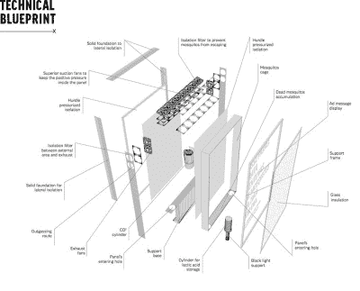

# 这个广告牌杀死了寨卡蚊子

> 原文：<https://hackaday.com/2016/05/10/this-billboard-kills-zika-mosquitoes/>

偶尔，有效的广告根本不需要任何人的参与。这个广告牌由两家巴西广告公司设计和建造，并在知识共享许可下免费提供，为捕捉埃及伊蚊提供了一个可再生的解决方案，埃及伊蚊是寨卡病毒的主要载体。

Click to embiggen.

这个设计看起来很简单，尽管这个计划还需要一些解释。广告牌里面是几罐 Lurex 3，这是一种基于乳酸的蚊子引诱剂，在亚马逊上可以很便宜地买到。这种乳酸模仿人类汗液的气味，和 CO₂.一起以薄雾的形式向外释放，最远可达 4 公里(2.5 英里)卢勒克斯和 CO₂一起，就像一个流汗的，用嘴呼吸的人类灯塔，引诱蚊子进入广告牌，它们被困在那里，注定会脱水而死。
 创作者发布了广告牌的蓝图，并鼓励其他人去建造它们。到目前为止，这些机构已经在里约热内卢安装了两台。如果休息后的视频有任何指示，至少其中一个是在人口稠密的地区建立的。这有利于传播信息，但对于任何停下来阅读的人来说可能是非常糟糕的。希望这些广告牌实际上是在城外，只是为了拍摄这段视频才在城里放置的。

蚊子没有真正的补救能力，能够携带多种病毒和疾病。几年前，我们报道了一个非常不同的解决方案，旨在从源头上阻止这些吸血动物——通过不断扰乱它们繁殖所需的死水。

 [https://www.youtube.com/embed/79uqMKUoIjE?version=3&rel=1&showsearch=0&showinfo=1&iv_load_policy=1&fs=1&hl=en-US&autohide=2&wmode=transparent](https://www.youtube.com/embed/79uqMKUoIjE?version=3&rel=1&showsearch=0&showinfo=1&iv_load_policy=1&fs=1&hl=en-US&autohide=2&wmode=transparent)

谢谢你的提示，[马克]。