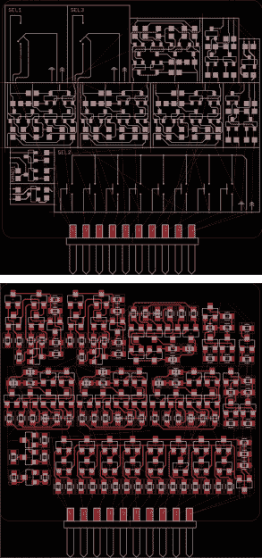

# 彻底改造 VHDL

> 原文：<https://hackaday.com/2016/05/16/reinventing-vhdl-badly/>

几年前，菲利普·彼得启动了一个小宠物项目。他想制造自己的处理器。这真的很平常——每隔几个月，你就会发现有人有一个新项目，用继电器、逻辑芯片或裸晶体管制造 CPU。Philip 是一名软件开发人员，虽然构建硬件的技术和理论几十年来没有太大变化，但软件开发在过去几年里取得了突飞猛进的发展。他正在寻求用分立元件制造一个中央处理器。

在互联网上搜索一些像 KiCad 和 Eagle 这样的原理图捕获程序的提示和技巧，你会发现一些可怕的设计选择。如果您想要电路板上某个特定电路的多个副本，您必须复制并粘贴。电路仿真与原理图捕获和 PCB 设计完全分开，单元测试——确保你设计的电路做它应该做的事情——是一个完全陌生的概念。与最简单的软件 IDE 相比，原理图捕获和 EDA 套件落后了几十年。这就是菲利普的用武之地。他自己承认，他对 VHDL 进行了糟糕的改造，但他确实有一些值得一听的想法。

 [https://www.youtube.com/embed/xiKhKGRdpzQ?version=3&rel=1&showsearch=0&showinfo=1&iv_load_policy=1&fs=1&hl=en-US&autohide=2&wmode=transparent](https://www.youtube.com/embed/xiKhKGRdpzQ?version=3&rel=1&showsearch=0&showinfo=1&iv_load_policy=1&fs=1&hl=en-US&autohide=2&wmode=transparent)

A circuit design split into modules (top) which is turned into a mostly complete PCB after running a script (bottom)

Philip 正在使用 Eagle 构建他的小型处理器——并不是说这有什么错——但随着 EDA 套件的选择，这一本质上为 DOS 编写的程序有了 30 年的更新历史。也就是说，Eagle 为编写常见任务的脚本提供了很多选择，并且结合了一些定制的 Python 脚本来编写这些 Eagle 脚本，Phillip 成功地做到了事半功倍。

在为他的处理器设计单个模块时，Philip 把这个电路分成了更小的模块。通过定义电路的基本单元，这些模块可以连接在一起并自动放置在电路板上。当然，Eagle 总是将未放置的组件添加到边上的线中。对于一个有数百个组件的电路板，仅仅是组织一切使布局*成为可能*就会占用大部分设计时间。Philip 编写了 Eagle 自动完成这项工作的脚本，这是值得称赞的。

然而，将软件开发背景引入原理图捕获和电路板设计，比在 Eagle 中添加模块和对象要走得更远。测试驱动开发是它的优势所在，Philip 在设计他的处理器时相信最终他会把事情搞砸。软件开发人员就是这样谦逊的。

测试驱动开发的实现很有趣，这是我们以前在硬件环境中没有见过的。他将模块(例如 XOR)定义为一系列测试。如果输入 A 为假，输入 B 为真，则输出将为真。菲利普依靠模拟硬件模拟器 SPICE 来检验电路是否能通过单元测试。

原理图捕获和电路板设计是一个非常非常难解决的问题。Eagle 发展了快 30 年了，还是不太理想。Altium 已经存在了更长的时间，仍然存在问题和不直观的做事方式。KiCad 在 25 岁时仍然是一个婴儿，一般的假设是 KiCad 正在到达那里，但它还不是黄金时间。

Philip 所做的是从软件开发领域引进工具和技术，生产出比我们现在拥有的好得多的东西。是的，它更抽象，但这从未阻止任何人将 enterprise Java 放在简历上。