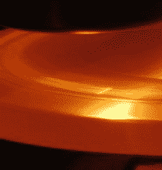
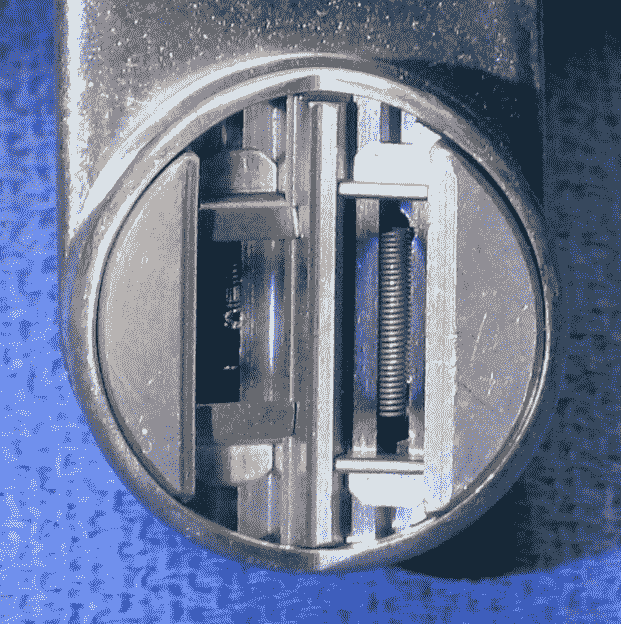
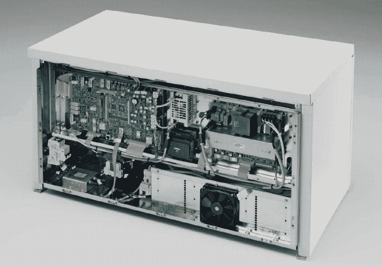
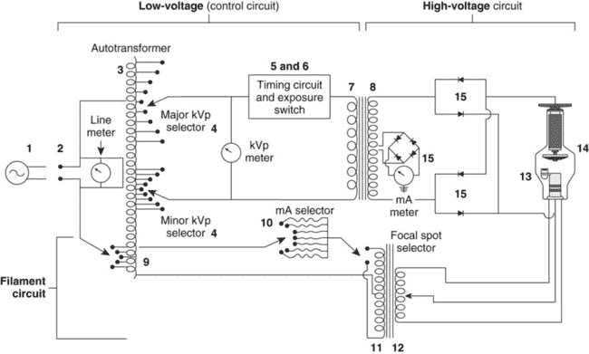

# 看内在:制造医用 X 射线

> 原文：<https://hackaday.com/2016/05/12/to-see-within-making-medical-x-rays/>

高中毕业后我有点失落。我涉猎了一个学期的电气工程，但认为它不适合我——如果能重来一次，我什么都愿意做。在我寻找赚钱的方法时，我偶然发现了放射技术——学习如何拍 x 光片。我认为这是一个结合我在医学、电子学和摄影方面的兴趣的好方法，所以在两年的学习课程后，我获得了我的助理学位，通过了考试，并获得了在我的名字后面加上“R.T.(R) (ARRT)”的权利。

职业生涯大概就到此为止了。在医疗保健行业有一些特定的现实，其中最主要的是你真的必须喜欢和病人打交道。我发现我更喜欢技术而不是人，所以我很快转向更大更好的东西。但是对这项技术的热爱从未消失，所以我想我应该看看生产医用 X 射线到底需要什么，看看它和我在放射科的时候有什么不同。

### 管子

首先:什么是 X 射线？它们只不过是电磁波，生活在紫外光和伽马辐射之间的光谱上，或者从大约 30 拍赫兹到 30 赫兹。原则上，X 射线很容易产生——你真正需要的只是一卷胶带和一个真空室。不过，这是一个微不足道的例子，它依赖于[摩擦发光](https://en.wikipedia.org/wiki/Triboluminescence)，而不是通过高能电子与致密金属的相互作用，这就是医用 X 射线的产生方式。不过，原理很简单——只需从热阴极产生一些电子，并使用高压将它们加速到目标阳极。

然而实际上，这并不容易。虽然一些真空管在其主要功能中会附带产生 X 射线——[老式电子管电视机箱中的高压整流器](https://en.wikipedia.org/wiki/X-ray_tube#Hazards_of_X-ray_production_from_vacuum_tubes)在这方面臭名昭著——但制造 X 射线管是一件棘手的事情。甚至[一个简单的固定阳极 DIY X 射线管](http://hackaday.com/2013/06/02/building-a-miniature-x-ray-tube/)也需要相当多的技能和一些专门的设备来制造，而一个可靠、长寿命的医用 X 射线管是一个巨大的工程进步。

Visible-light photo of a rotating anode during exposure; note the bright focal point and overall heating of anode. Source: [Rolf Behling](http://amos3.aapm.org/abstracts/pdf/77-22639-312436-101838.pdf)

医用 X 射线管——本质上是粒子加速器——必须解决的主要问题都来自产生有用辐射量所需的巨大能量。散热考虑很重要。首先，阴极必须达到足够高的温度来蒸发电子，温度在 800 到 1000 摄氏度之间。阳极和阴极之间的电压很容易超过 100kV；这些电子撞击阳极的动能可以使其在焦点处加热到 2500 摄氏度。

处理阳极加热是旋转阳极管设计要处理的问题。旋转阳极管不是一个被电子反复轰击的固定靶，而是一个连接在旋转轴上的盘形钨合金靶。当技术人员说，“深呼吸，保持住，”你听到一个马达开始转动，这是阳极旋转到大约 10，000 转/分钟。电子束的焦点仍然只有几平方毫米，但事实上，当电子束打开时，一个新的阳极表面在电子束下旋转，将热负荷分散到更大的区域。

![Rotating anode X-ray tube. By Daniel W. Rickey [CC BY-SA 3.0], via Wikimedia Commons](img/c5aef674509d7433dcc0d9a075a32c16.png)

旋转阳极 X 射线管。作者丹尼尔·w·里奇[ [CC BY-SA 3.0](http://creativecommons.org/licenses/by-sa/3.0) ]

说起来简单，做起来难。阳极需要在真空管里面，但电机不能。这意味着阳极连接到管内的转子和轴承，定子绕组在管外。能在真空中工作，承受真空管中各种热负荷，并能可靠传导 100 kV 或更高电压的轴承是一种特殊的轴承。在一些新的电子管中，标准的滚珠轴承已经被流体动力轴承取代，流体动力轴承使用镓铟合金薄膜，可以从阳极传导几千瓦的热量。

Dual-filament cathode cup. The smaller focal-point filament has seen better days. Source: [Samuel M. Goldwasser](http://www.repairfaq.org/sam/xraysys.htm)

阴极也是一项相当惊人的工程。与音频放大管的灯丝相比，X 射线管的阴极更像阴极射线管的电子枪，它将电子束成形并导向目标。钨丝位于一个聚焦杯中，通过静电形成电子束。大多数电子管有一个双灯丝阴极；技术人员可以选择较小的阴极，以便在阳极上形成较小的焦点，并形成更紧密的电子束，从而更好地对小结构进行成像。像乳房 x 线照相术这样的专业检查通常使用细丝小到 0.3 毫米的管子，以及由钼制成的阳极，以获得更好地可视化微妙结构的“更软”光束。

虽然电子束的静电聚焦非常简单且已被证实，但新型电子管正转向磁聚焦。这些设计有一个扁平的灯丝，而不是一个杯子，并且使用磁性四极来形成光束，使这些 X 射线管更像一个粒子加速器。

### 发电机

Siemens Polydoros RF-Series Generator. Source: [Siemens](http://www.oem-products.siemens.com/x-ray-generator)

那么是什么驱动了这一切呢？放射室里那些灰灰色的柜子后面藏着什么样的电子设备？在放射学术语中，这些机柜统称为发电机，其工作是为整个 X 射线套件提供所有电力和控制。显然，这意味着为灯丝提供电流以及高压场来加速电子。但是管道中还有很多其他东西——旋转阳极的定子绕组，可能还有磁聚焦所需的信号。还需要电力来操作试管的物理支撑、病床控制、操作员控制台以及套件中的几乎所有东西。

Basic X-ray generator circuit. Source: [RadiologyKey.com](http://radiologykey.com/x-ray-circuit-and-tube-heat-management/)

在过去，发电机是一个非常简单的电路。它基本上包括一个自耦变压器，为阳极高压供电的升压变压器和整流器，以及一个为阴极供电的低压部分。计时电路控制曝光时间的长短，并为技师提供一个简单的控制台。

现在，发电机是非常复杂的设备，带有嵌入式计算机，可以与以太网和 CAN 总线通信。光滑的触摸屏用户界面比旧的旋钮和开关更有可能，自动曝光控制等特殊功能也内置其中。但在其核心，发电机的工作仍然是一样的——加热阴极和加速电子。

尽管工程技术已经取得了很大进步，控制电子设备也发生了变化，但今天使用的 X 射线管看起来与我 30 年前在这个领域学习的 X 射线管非常相似。这在很大程度上是因为物理学就是物理学，尽管有其他方法来产生医疗 X 射线，如使用太瓦激光器的汤姆逊散射或电子在交变磁场中摆动并以准直 X 射线的形式释放能量的 T2 波荡器，但标准的 X 射线真空管和发生器是目前为止我们在未来相当长一段时间内提供医疗 X 射线的最实用的方法。