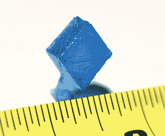

# Peachy Printer 倒闭，投资者建了一栋房子而不是一台打印机

> 原文：<https://hackaday.com/2016/05/11/peachy-printer-collapses-investor-built-a-house-instead-of-a-printer/>

Peachy 打印机最初是一个为 100 美元的立体平版 3D 打印机进行的众筹活动，[现在已经胎死腹中](https://www.kickstarter.com/projects/117421627/the-peachy-printer-the-first-100-3d-printer-and-sc/posts/1572573)。Peachy Printer 的创造者赖兰·格雷斯顿(Rylan Grayston)宣布，投资者、Peachy Printer 50%的所有者和商业伙伴[已经窃取了超过 30 万美元的 Kickstarter 竞选资金](http://www.peachyprinter.com/)。据[Rylan]说，这笔钱是用来盖房子的。

An example print from the Peachy Printer Kickstarter campaign

当 Peachy 打印机在 Kickstarter 上发布时，无论从哪方面来看，它都是一款改变游戏规则的产品。与 Form 1 和 DLP 投影仪套件打印机等其他立体平版打印机不同，Peachy 价格便宜。这也是荒谬的聪明。Peachy 打印机不是使用步进电机将照片从树脂缸中取出，而是将树脂漂浮在盐水缸中。通过向这个大桶中慢慢滴盐水，树脂的水平面上升，允许电流计和激光二极管打印 3D 物体的下一层。在我们对 Peachy 打印机的第一次报道中，每个人都对这款打印机的简单感到兴奋。它不是一台高分辨率打印机，但它是一台仅售 100 美元的 3D 树脂打印机。即使在 Kickstarter 活动启动近三年后的今天，市场上也没有类似的东西。

在过去的两年里，[Rylan]似乎让 Peachy 打印机处于一种伪隐形模式。在 3D 打印机论坛上，关于 Peachy 打印机的传言不绝于耳，来自[Rylan]的信息非常少。去年，Peachy 打印机似乎只是另一个失败的众筹 3D 打印机。要么是[瑞兰]不具备将一款新设备推向市场的工程能力，要么是供应商出了问题，要么是[瑞兰]无法将产品推出市场。

在发布到 Kickstarter 活动的更新中，Peachy Printer 未能交付的原因变得显而易见。Kickstarter 活动旨在将收到的资金——587，435.73 美元——直接存入[大卫·波音]的账户。收到资金 30 天后，[大卫]已经花掉了 165，000 美元。仅仅三个多月，除了转入 Peachy Printer 公司账户的 20 万美元，所有 Kickstarter 资金都被[David]花光了。

由于没有资金来完成 Peachy 打印机的开发，[Rylan]寻找替代方法来维持公司运营，直到 Kickstarter rewards 发货。Peachy Printer 获得了总额为 9 万美元和 13.5 万美元的两笔政府拨款。2015 年 3 月，[Rylan]的一名家庭成员借给 Peachy Printer 5 万美元。用新的销售来资助 Kickstarter 奖励的计划——一个通常被 Kickstarter 支持者瞧不起的计划——是不可能的，因为认证 Peachy 打印机中的激光所需的成本和时间会使公司陷入赤字。

现在，[Rylan]和 Peachy Printer 正在向[David Boe]寻求还款，理由是 Kickstarter 的奖励资金仍被用于建造房屋。一旦房子完工，银行将从建筑抵押贷款中支付资金，然后资金可以从[David]转移到 Peachy Printer。

总之，自 Kickstarter 基金支付给[大卫]以来，Peachy 打印机就是一个烂摊子。如果抵押贷款建设资金到位，生产恢复，有可能有办法摆脱这种局面，将 Peachy 打印机送到所有 Kickstarter 支持者手中，但这是一大堆“如果”。失败的 3D 打印机 Kickstarter 项目并不新鲜，但[Rylan]在 Peachy 打印机上的经历是迄今为止我们见过的众筹项目中记录最完整的失败。