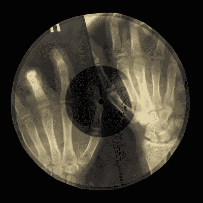

# 回顾:1950 年代俄罗斯的音乐

> 原文：<https://hackaday.com/2016/05/27/retrotechtacular-examining-music-in-1950s-russia/>

如果你告诉 12 岁的我，有一天我可以点播几乎任何我想听的歌曲，还可以像我在文本框中键入艺术家的名字和部分标题一样快地调出歌词，我会 a)真的希望你不是在开玩笑，b)希望比我已经成长得更快。

今天，音乐的可用性，尤其是在任何一个有第一世界互联网接入的地方，真的有点令人震惊。虽然使这成为可能的技术只是最近才出现，但在美国，听音乐的自由已经相当开放了。我们最接近政府审查的是父母忠告贴纸，而这些只是警告。唯一真正阻挡在孩子耳朵和他们想听的音乐之间的是父母的意识和/或同意。

然而，音乐自由和发现的景观在世界的其他角落已经相当不同，尤其是在摇滚乐的早期。当美国青少年在小理查德和猫王狂热的新音乐中滑旱冰、蹦蹦跳跳的时候，苏联的孩子们却陷入了一种声音隔绝的状态。斯大林政府扼住了文化的流入，并极大地限制了通过广播传播的音乐。他们视西方和其他音乐为威胁，认为音乐家是苏联的敌人。

但是音乐的吸引力往往会抢了政治的风头。20 世纪 40 年代末，一名波兰男子来到列宁格勒，在一台从战争中抢救回来的录音车床上开始了一项切割业余录音的小行动。他在下班后用同样的设备经营副业，用它来走私从东欧走私进来的唱片。其他人开始制作他的车床的自制版本，很快，人们喜欢的各种被禁止的音乐——美国布吉伍吉舞曲、爵士乐、摇滚到俄罗斯移民和吉普赛音乐——都可以在一种新型的黑市上买到。

 很快有人发现 x 光胶片是记录的好媒介。它支持最初的凹槽切割和回放，使其成为生产大量盗版的理想选择。恰好医用 x 光片被医院集体丢弃，于是它们被投机倒把的私酒贩子从垃圾箱里解放出来。这些 x 光片中的录音是原版的粗糙、噼啪作响的复制品，但它们仍然备受追捧。一个巨大的市场为这些灵活的记录打开了。它们很容易藏在袖子里，藏在街头小贩的衣襟下面，这些小贩以几个卢布或一瓶伏特加的价格出售它们。

这些盗版被知情人士恰如其分地称为“骨头”或“肋骨”。在俄语中，它们被称为 *roentgenizdat* ，大致翻译为“x 光压制的”。盗录唱片的行为变得很普遍。最终，俄罗斯政府打击了分销网络，并将这些头目送进了监狱。这种做法一直持续到大约 1966 年，当时黑市被卷到卷的磁带所接管。

不久之后，政府批准市民使用卷对卷，市场萎缩。今天，根据唱片的稀有度和新颖度，一些伦琴唱片可以用不同的价格在 T2 买到。幸运的是，[有人已经数字化了一些录音](http://bujhm.livejournal.com/381660.html)供你欣赏。

今年一月， [NPR 采访了英国音乐家斯蒂芬·科茨](http://www.npr.org/2016/01/09/462289635/bones-and-grooves-weird-secret-history-of-soviet-x-ray-music)，他在俄国旅行时发现了其中一张 x 光唱片。他的发现让他陷入了一个研究的兔子洞，最终导致了[的 X 射线音频项目](https://x-rayaudio.squarespace.com/x-rayaudionews/)，其中包括一本书和一个简短的纪录片，在休息后嵌入。另一个视频展示了这些“骨记录”的几个片段，它们的原始和它们所代表的历史令人不寒而栗。

 [https://www.youtube.com/embed/XMCCYnDvpJQ?version=3&rel=1&showsearch=0&showinfo=1&iv_load_policy=1&fs=1&hl=en-US&autohide=2&wmode=transparent](https://www.youtube.com/embed/XMCCYnDvpJQ?version=3&rel=1&showsearch=0&showinfo=1&iv_load_policy=1&fs=1&hl=en-US&autohide=2&wmode=transparent)

 [https://www.youtube.com/embed/UkpMEN6sM00?version=3&rel=1&showsearch=0&showinfo=1&iv_load_policy=1&fs=1&hl=en-US&autohide=2&wmode=transparent](https://www.youtube.com/embed/UkpMEN6sM00?version=3&rel=1&showsearch=0&showinfo=1&iv_load_policy=1&fs=1&hl=en-US&autohide=2&wmode=transparent)

感谢 [@motherslug](https://www.instagram.com/motherslug/) 让我意识到这段特殊的音乐历史。

* * *

**Retrotechtacular is a column featuring hacks, technology, and kitsch from ages of yore. Help keep it fresh by [sending in your ideas for future installments](mailto:tips@hackaday.com?Subject=[Retrotechtacular]).**