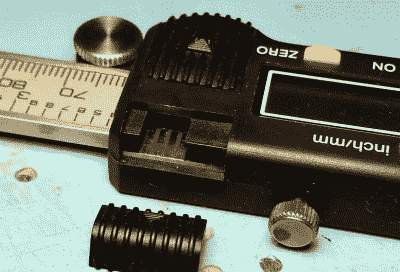

# 改进的数字卡尺接口，包括 3D 打印连接器

> 原文：<https://hackaday.com/2016/05/17/improved-digital-caliper-interfacing-including-3d-printed-connector/>

[MakinStuff]写信给我们，让我们了解他做的一个[项目，该项目旨在改进无处不在的廉价中国数字卡尺](http://www.makingstuff.info/Projects/29/DigitalCaliperDataCable.aspx)的接口。与这种通用卡尺模型的接口是一个很好的领域，但他的项目将有关接口和读取数据的一切都放在一个地方，并做了一些改进:一个 [3D 打印连接器](http://www.thingiverse.com/thing:1543247)，使焊盘的匹配更加稳定可靠，一个简单的接口电路，用于转换逻辑电平，以及一个中断驱动的[样本 Arduino 草图](https://github.com/MakingStuffChannel/DigitalCalipers)来读取数据。使草图中断驱动意味着 Arduino 永远不会坐着等待卡钳的输入，这使得 Arduino 更容易同时做其他有意义的工作，最终使其更容易融入其他项目。

连接器有插入裸线的空间，用作卡钳内部裸露焊盘的触点。添加一点热胶和热收缩，你就再也不用摆弄一个拼凑起来的连接了。

这种常见的卡尺模型已经被黑客攻击，并以有趣的方式重新利用。我们已经看到它们被用作车床上的数字读数(DRO)以及被赋予通过蓝牙无线记录数据的能力(T2)。

 [https://www.youtube.com/embed/34IsYgL4cMw?version=3&rel=1&showsearch=0&showinfo=1&iv_load_policy=1&fs=1&hl=en-US&autohide=2&wmode=transparent](https://www.youtube.com/embed/34IsYgL4cMw?version=3&rel=1&showsearch=0&showinfo=1&iv_load_policy=1&fs=1&hl=en-US&autohide=2&wmode=transparent)

