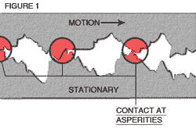
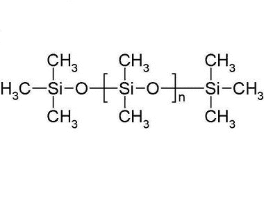

# 超越 WD-40:家庭商店的润滑剂

> 原文：<https://hackaday.com/2016/05/17/beyond-wd-40-lubes-for-the-home-shop/>

如果你的店和我的店一样，你会有一大堆五颜六色的罐头，声称里面有你需要的最好的，绝对唯一的润滑剂。我被市场营销吸引的次数比我愿意承认的还要多，我希望下一个产品能真正脱颖而出，神奇地解开我机械生活中所有的障碍。然而，这从来没有发生过，最后我发现自己几乎在每一份工作中都伸手去拿熟悉的蓝色和黄色的 WD-40。

但这是最简单的方法，而且并不总是——或经常是——最好的选择。考虑到这一点，我想探索润滑剂到底是什么以及它们是如何工作的，以便能够更明智地决定选择哪种润滑剂。

### 保持分开

Asperities. Source: [USS Bearings](http://ussbearings.com/bearings_site/research_article/948/)

那么为什么我们首先需要润滑剂呢？为什么两块打磨成镜面的金属不能互相摩擦呢？一句话:[凹凸不平](https://en.wikipedia.org/wiki/Asperity_(materials_science))。粗糙是覆盖在最精细表面上的微小波峰和波谷，当它们互相摩擦时，就会被卡住。克服由此产生的摩擦所需的力可以折断微小的峰，导致金属表面的磨损以及动能转化为热能时产生的热量。

润滑剂只是保持表面分离的物质。以我们抛光得很好的金属为例，润滑剂可能是一种液体，填充粗糙表面之间的空隙，减少阻碍。摩擦减少，产生的热量从表面传导出去，任何接触和断裂的粗糙表面都被润滑剂冲走。

当然，不是每种润滑剂都是液体，也不是每种液体润滑剂都是液体。干式润滑剂比比皆是，包括石墨、聚四氟乙烯、石墨烯和二硫化钼。不过，对于家庭商店来说，液体和半液体润滑剂可能是最方便的，所以我们将集中讨论它们。

### 厚和薄

大多数——但不是全部——家庭商店中常见的润滑剂是基于某种形式的矿物油，这只是一种高度精炼的石油馏出物。各种物质，包括粘度调节剂、清净剂和缓蚀剂，被添加到基础油中，以赋予润滑油不同的性能。

对液体润滑剂进行分类并为手头的工作选择合适的液体润滑剂的一种方法是观察粘度。润滑剂越薄，就越容易在表面之间流动和毛细，而较厚的润滑剂通常可以承受更高的压力和温度。在粘度谱的细端，我们发现渗透油。通常，当生锈的螺栓抗拒我们用扳手尝试时，我们接触的第一个产品是渗透油，它只是低粘度的油，可以渗入螺纹并润滑表面。常见的品牌有液体扳手，PB Blaster，Kroil，还有无处不在的 WD-40。每种产品都声称拥有溶解铁锈和释放冻结螺栓所需的秘密成分的正确混合物。

所有这些产品在某种程度上都有效，但是它们值得花费吗？也许不是。2012 年，德雷克塞尔大学的一群工程学生研究了商业渗透油的替代品，这种油在发展中国家通常很贵或很难买到。在[一系列受控实验](http://www.engineeringforchange.org/wp-content/uploads/2015/12/ENGR103-WD40Alternative-FinReport.pdf)中，他们确定植物油和丙酮的简单混合物在降低生锈螺栓螺母的断裂扭矩方面远远优于 WD-40。类似的比较表明，50-50 的自动变速器油(ATF)和丙酮的混合物以很小的成本击败了商业渗透油。

 [https://www.youtube.com/embed/2WuVBFTzoKc?version=3&rel=1&showsearch=0&showinfo=1&iv_load_policy=1&fs=1&hl=en-US&autohide=2&wmode=transparent](https://www.youtube.com/embed/2WuVBFTzoKc?version=3&rel=1&showsearch=0&showinfo=1&iv_load_policy=1&fs=1&hl=en-US&autohide=2&wmode=transparent)

我必须承认，当涉及到生锈的紧固件时，我总是对商业渗透油的性能感到失望，所以我渴望尝试一种装满 ATF-丙酮混合物的油罐。但我怀疑我会完全放弃 WD-40——毕竟，它是一种很好的粘合剂去除剂，我从来没有发现过比这更好的方法，可以在一天的工作后从我的手上和工具上去除树液。

### 油脂是这个词

沿着粘度的刻度往上走，我们发现了油脂。润滑脂是基础油和某种增稠剂(通常是肥皂)的半固体混合物。润滑脂表现出一种被称为*剪切变稀*的特性——当剪切力作用在润滑脂上时，其粘度会降低。这使得它又粘又厚，足以让你用指尖沾一点油脂捡起一个小坚果，但踩上一滴同样的油脂会让你滑倒。

用来稠化润滑脂的肥皂决定了润滑剂的一些特性。最常见的润滑脂之一是锂基润滑脂，由硬脂酸锂皂稠化基础油而成。锂皂增加了润滑脂的热稳定性和高负荷处理性能，以及与金属的良好结合。许多添加剂使其成为现代润滑脂，如抗氧化剂、腐蚀抑制剂，甚至固体润滑剂，如二硫化钼或特氟隆。与渗透油不同，商业制备油脂的 DIY 替代品可能比它的价值更麻烦，但这并不妨碍人们尝试。

由于润滑脂的选择高度依赖于应用，因此您应该根据自己的工作来储备。做大量汽车工作的商店需要几管钼润滑脂和一支黄油枪；专门从事电子产品的商店可能需要一管散热化合物，这是一种添加了氧化锌的高温硅脂。

PDMS structure. Source: [Wacker Chemie Ag](http://www.wacker.com/cms/en/products/product/product.jsp?product=13343)

硅酮是有趣的化合物。虽然大多数润滑脂中的基础油是基于石油中的烃类聚合物，但硅酮是以硅和氧为骨架的聚合物。聚合反应和单体的选择可以调整，以生产硅油或各种具有类似橡胶或塑料性质的硅树脂。

硅油，最著名的是聚二甲基硅氧烷(PDMS)，可以与蒸发石英砂或特氟隆等增稠剂混合制成硅脂。硅脂往往相当昂贵，因此它的使用仅限于少量涂抹就能解决问题的地方，如润滑 O 型圈或防止实验室玻璃器皿配件卡住。硅脂也经常用于汽车制动器，因为它具有抗热分解的能力。

### 像羊一样防水

家庭商店里需要的大多数润滑剂都是基于矿物油的。但是早在它们成为化石燃料之前，生物通常会找到一种方法来提供有用的润滑剂。羊毛是一种最有用的天然润滑剂的来源，这种润滑剂被称为羊毛蜡或羊毛脂。绵羊从皮肤中分泌蜡状物质，以防止它们的羊毛在暴雨中变成海绵。它在离心提取器中用热水和洗涤剂从羊毛中洗出，并纯化成熔点接近体温的固体蜡状物质。这使得羊毛脂成为化妆品和医疗产品的重要成分，但这并不意味着它不能在商店里使用。

一种非常有用但又有点被低估的润滑剂是一种叫做[液膜](http://www.fluid-film.com/)的产品。在农业和海洋贸易中，液膜基本上是液化羊毛脂。当羊毛脂喷洒或刷在金属上时，它会渗透并留下一层蜡状薄膜，使金属像绵羊一样防水。它在润滑联合收割机和收割机的刀杆时尤其重要，因为在收割庄稼时，烃基润滑剂会导致燃烧。我在任何地方都使用流体膜，尤其是在将暴露于自然环境的工具上。它确实有一种独特的香味，可能不会让它在封闭的空间里受到欢迎，所以在喷在前门吱吱作响的铰链上之前先检查一下。没有一种润滑油产品能做到这一切，但如果我有一个“荒岛”选择，它肯定是流体膜。