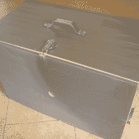
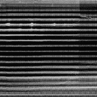
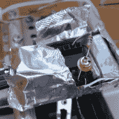
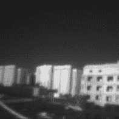

# 用导弹技术看起来像捕食者

> 原文：<https://hackaday.com/2016/05/18/using-missile-tech-to-see-like-predator/>

阿尔特姆·利特维诺维奇想通过热视觉看到，就像《掠夺者》《T2》电影《T3》中那样。自 2009 年开始努力以来，他不仅取得了成功，还使用一种非常独特的方法继续观察彩色、中波红外、短波红外和紫外线。

他从一个基于基本针孔摄像机概念的盒子开始。盒子里是一个物理的 X-Y 数字化仪，它移动一个光电二极管来收集创建一张图片所需的数千个点。首先，由于高信号放大，他得到的是弥漫在我们生活中的 60 周期的嗡嗡声。盒子周围的法拉第笼有所帮助，但传感器和放大器周围的金属箔最终消除了噪音。现在他有了近红外照片。

  The Box  Noisy Image  Sensor with Faraday Shield  Infrared Image

几年过去了，他制造了一台 3d 打印机，并更新了机械装置和盒子。使用过滤器，他的系统现在可以检测颜色和近红外光谱。但这对(Artem)来说还不够。随着项目的继续，他增加了观察紫外线和短波红外线的能力。

真正的挑战是观察中波红外线(MWIR)。由于这些是热寻的导弹使用的传感器，日本供应商想要大量的文件证明他没有建造像导弹这样邪恶的东西。

住在莫斯科的[Artem]向当地一家供应商寻求俄罗斯导弹中常用的传感器。传感器漂移现在引起问题，针孔不再足够。他在 3D 打印支架中添加了 ZnSe 镜头，解决了漂移问题。他想解决长波红外问题，但这需要传感器的液氮冷却。嘿，导弹传感器问题并没有阻止他，所以我们不会惊讶地看到他在这里取得成功。

这是一个大规模的黑客攻击，需要数年时间来发展，有多条学习曲线。一个令人印象深刻的壮举和一个值得一读的项目记录。鉴于他的创造力和决心，我们预计他将很快解决冷却问题。

【感谢 Nils Hitze 的提示。]