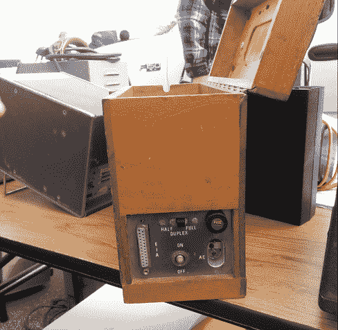

# Hackaday At Hamvention

> 原文：<https://hackaday.com/2016/05/14/hackaday-at-hamvention/>

下周末将有几个有趣的黑客日聚会。第一个是湾区创客集会。Hackaday 和 Tindie 的大部分工作人员下周末将会在圣马特奥，我们将会免费赠送*嘉年华的*门票-*价值 70 美元，对 Hackaday 的读者免费*。Hackaday 周六晚上会去一家酒吧。周日还有一个超级秘密聚会。不要告诉任何人。

在这个国家的另一边，对于建筑工人来说有一个更好的传统..这是北美最大的业余无线电聚会。我会去的。找到我，拿些日常用品。整个周末我都会在[黑客日推特](https://twitter.com/hackaday)上发帖。

A wooden modem and proof I can find cool stuff.

我此行的主要目的是记录这次巨大的交易会。将有一千多个小贩在兜售他们的商品，从古董收音机到仪表和其他电子设备。这是对干预的最大吸引，据我所知，不可能面面俱到。

也许不可能面面俱到，但显然我非常擅长在火腿掉期交易中区分小麦和谷壳。在我最后一次去雷东多海滩的 W6TRW 旧货交易会时，我发现了一台 UltraSPARC 笔记本电脑(！)，还有一个 60 年代中期的*木制调制解调器。*周五、周六和周日，我的工作将是记录所有的怪事。

取决于我在展会上遇到多少人，可能会有一个半官方的聚会。[赖特帕特森](http://www.nationalmuseum.af.mil/Home.aspx)的美国空军博物馆会很酷，但是 Ihop 或者 Denny's 会更现实。找一个穿着哈卡代帽衫，挂着哈卡代旗帜的人，他会给你一些甜蜜的贴纸和礼物。