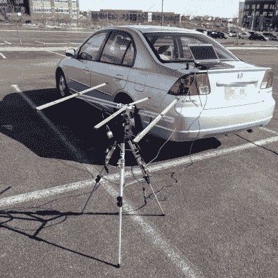

# 25 美元的卫星追踪器号称“有用可选”

> 原文：<https://hackaday.com/2016/05/19/25-satellite-tracker-boasts-usefulness-optional/>

[保罗]非常坦率地介绍了他的 [$25 卫星跟踪器](http://www.paulschow.com/2016/05/25-satellite-tracker.html)的实际情况，它将一个[卷尺八木天线](http://theleggios.net/wb2hol/projects/rdf/tape_bm.htm)瞄准一颗选定的卫星，并在卫星在头顶移动时保持跟踪。有用吗？*是的！*便宜吗？*当然！*有用吗？嗯……我们有没有提到它很有效而且很便宜？

当[Paul]发现自己想看看他能以多低的成本制造一个卫星跟踪器时，他已经有了一个 RTL-SDR(我们已经看到[在](http://hackaday.com/2015/08/21/decoding-satellite-based-text-messages-with-rtl-sdr-and-hacked-gps/)之前用于卫星通信)和一个由卷尺制成的八木天线，但希望有某种方法在卫星穿过天空时自动将天线指向卫星。他也想看看如何经济地做到这一点。事实证明，有了来自中国的一些部件和来自 [SatNOGS](https://satnogs.org/) (开源卫星跟踪网络项目和 2014 年[黑客奖](https://hackaday.com/2014/11/13/satnogs-wins-the-2014-hackaday-prize/)的获得者)的代码，你就拥有了你所需要的大部分东西！仍然需要一些修改，[Paul]详细描述了它们。

 那么一个 25 美元的卫星追踪器有用吗？正如[保罗]所说，“可能不会。”他解释说，“大多数人想要卫星追踪器，这样他们就可以把它们放在外面，然后从里面控制天线，有人可能无法用我的卫星追踪器做到这一点，除非他们住在一个非常好的地方或建造一个天线罩。[……]开车去某个地方，正确设置它(这涉及到为每个卫星重新编程 Arduino)，然后坐在那里几乎是有用的反面。”

这可能不是最实用的，但很有效，很酷，他学到了很多，他写下了整个过程，供其他人学习或复制。如果这没有用，我们不知道什么是有用的。

卫星追踪是一些有趣项目的重点。我们甚至看到了一个项目，通过向天空发射激光来指出卫星的位置。