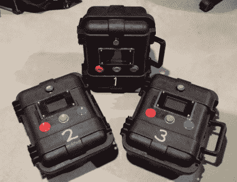
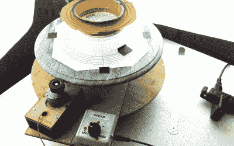

# 为什么我会经历这么多 Arduinos

> 原文：<https://hackaday.com/2016/05/23/why-i-go-through-so-many-arduinos/>

我为那些不能从货架上买到的人制作东西，在过去的几年里，我已经经历了许多 Arduinos。越来越多的时候，它们只是工作*和客户*的合适工具。情况并非总是如此。什么变了？

我今天的客户仍然包括初创公司和其他小企业，但他们越来越多地是艺术家、敢于创业的爱好者，或者是像你在博物馆或科学中心看到的互动展示一样进行一次性制作的人。我为之工作的人的类型已经改变，正因为如此，他们工作的合适工具几乎总是 Arduino。

## 如果不是 Arduinos，是什么？

我在当地的一个黑客空间和一些新人聊天，我们在谈论我们的工作。我告诉他们，我花了很多时间为那些知道自己需要什么，但又买不到现成产品的人制作一次性设备、原型或小批量生产。我提到过我因此使用了大量的 Arduinos。

“如果不是 Arduino，你会用什么？”有人问我。

我想了一会儿，回答了一些关于我可能如何在我设计的板上使用 AVR，并在我需要微控制器做事情时推出它。我这样说是因为当我自己的项目需要一些东西时，这个板是我的首选解决方案。有人点了点头，谈话继续进行，但在思考了一会儿后，我意识到我必须改变我的答案。

如果我不用 Arduino，我会用什么呢？大概 ***没什么*** 。因为这份工作就不存在了。

## Arduino 是他们工作的合适工具

Prototypes for a mesh wireless client project. Arduinos inside.

我的很多工作看起来是这样的:客户带着一个想法进来，但它还没有完全成型，在它成为产品之前需要一些开发。首先，我构建一个概念证明，但之后我们通常会转向迭代原型，在那里我们会做大量的测试和测量。从一个原型中学到的东西会在一个连续的学习和改进流程中滚动到后续的原型中。(下面这句话适用于这个过程:“开发硬件就像开发软件一样，只是每次点击‘编译’都要花费数周时间和数千美元。”)

最终，我们到达了 Arduino 和现成组件的极限。接下来是工程师设计解决方案的时候了:直接围绕所发现的东西，以最少的浪费。该工程解决方案不太可能包含 Arduino。

但是在我们把工作交给工程师之前，Arduino 是解决方案的一部分。一个很大的原因是客户在这个迭代细化阶段的舒适度。许多客户会对 AVR-ISP 或十六进制文件束手无策，但他们知道什么是 Arduino。他们通常乐于上传草图并对其进行修改，甚至按照线路图进行操作。他们甚至可能用 Arduino 来原型化他们的想法。使用 Arduino 可以让他们亲自动手开发他们的想法，即使他们将一些工作外包给顾问。

## 客户变了

坚持客户所知道和期望的通常是正确的举动，但还有另一个更深层次的原因，Arduino 甚至被放在首位。如果没有 Arduino 和与之一起成长的开放和可访问的硬件和工具的整个生态系统，我的许多客户可能永远不会开始发展他们的想法。他们肯定不会雇佣我来帮忙。

Custom ultra-slow speed turntable used to capture high magnification video for [Broken Sound](http://www.creativeapplications.net/environment/broken-sound-gary-james-joynes-contemplates-silence-and-fragility/) by Gary James Joynes

观察到我使用了很多 Arduinos 也让我意识到我的客户已经改变了。我现在更多地与艺术家合作，这些艺术家正在以几年前还无法实现的方式将电子产品融入他们的工作中，地下室的发明家正在冒险尝试他们的想法是否会实现，在一个“小”往往意味着成千上万的世界里需要小规模生产 10-100 的人，以及需要有人帮助他们实现下一个伟大魔术的舞台魔术师。(我没想到最后一个，但你最好相信市场是存在的。)

所有这些客户都需要有人来处理他们原本掌握的一些困难或耗时的部分，或者有人来为他们制作一些他们可以插入到其余工作中的东西。他们并不总是有很多预算，但他们有热情，他们知道自己想要什么。他们是有想法的人，卷起他们的袖子，弄脏他们的手，他们没有像现在这样的数量。

与这些类型的人一起工作还有一个好处:当人们有开发自己的解决方案的经验和遇到障碍的经验时，他们通常也会对开发中的时间、工作、细节和成本有所了解和欣赏。你们当中从事过专业开发工作的人会意识到这是多么大的恩惠。

多年来，我为许多人做过定制工作，但变化是不断的。这是一个很大的世界，我只是在其中工作过，看到过我的一部分。你有没有发现事情和我描述的一样，或者不同？我的经历有什么独特之处吗？在评论里发帖吧！