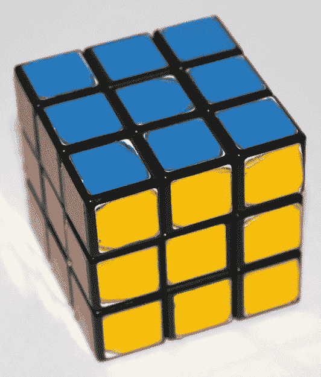
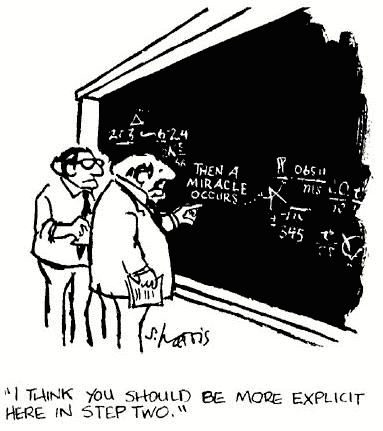
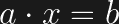

# 初学者的对称性——魔方

> 原文：<https://hackaday.com/2016/05/24/symmetry-for-beginners-the-rubiks-cube-needs-art/>

对称在我们的自然世界中无处不在。看看你的手，一只蝴蝶，或者一朵向日葵。人们很容易把对称和对称结构的概念当成一种简单的生存怪癖，并不太在意。如果这是你的观点，我可以向你保证在这个系列的结尾它将不再是。如果我们强迫自己超越对称性在小学的应用，我们会发现一个通过许多不同类型的对称恒等式有着丰富联系的世界。其中最有趣的是规范对称性，它是量子电动力学或 QED 的核心(我们将在本系列的稍后部分讨论)。高等数学的几个分支对对称性进行了详细的研究，使得从物理到化学的许多科学从不同的角度来看待困难的问题和理论。

《对称性》中所探讨的思想主题是复杂的，在学术界和理论科学之外并不为人所知。这一系列文章的目标是简化支撑对称性研究的一些概念，以便普通黑客能够对这一令人着迷的知识体系有一个基本的(我指的是基本的)理解，并在未来的项目中使用它。我们将从一台多次穿越 Hackaday 服务器的机器开始——那些漂亮的魔方解算器。到底*怎么做*那些事情？

## 魔方

当[Erno Rubik]在 70 年代末发明他著名的谜题时，他很快发现试图通过随机扭曲来解决它是一项不可能的任务。他说得很对，因为在一个 3×3 的魔方上可以有超过 43 万亿个状态，或**种排列**。很难想象当他看着一台机器在一秒钟内解决了他的发明[时，不会发出咯咯的笑声。我们都知道那东西是怎么运作的。我们知道网络摄像头和步进电机如何工作，以及如何将它们与运行某种解决算法的 SBC 联系起来。但是算法本身呢？它是如何解决这个难题的？](http://hackaday.com/2016/01/27/robot-solves-rubiks-cube-in-just-one-second/)



[Source](http://cubemeister.com/puzzles/cube-puzzles/magic-cube-series/rubiks-cube/)

一种方法是把魔方网站上的[指令变成源代码。事实上，这就是这些解算器的工作方式。此过程在您指定的层中进行，方法是定向立方体，使顶层朝上，底层朝下。顶层的解决方法是首先对齐中间的立方体(做“十字”)，然后是角落。一旦顶层解决了，中间层也就解决了。最后是底部来完成拼图。只需按照网站上的说明就可以解决每一层。](https://www.rubiks.com/blog/how-to-solve-the-rubiks-cube)

这种方法的问题是，它遵循了塞尔的中文房间论点——一个表明计算机永远不可能“智能”的思想实验它包括一个人在一个房间里遵循指示。一个人输入一些问题，这个人按照指示回答问题，即使他不明白问题本身。它们是用中文写的。他输出他的结果。这个人读取输出，并宣称这个房间是智能的。但是这个人只是简单地按照指示去做…他不知道他写的是什么意思。有了我们的魔方算法，我们只是简单地按照指示去做，而没有丝毫关于它如何或为什么工作的线索。

另一种更适合本文的方法是，根据一个叫做抽象代数的数学分支来考虑魔方，就像这个算法所做的那样。这将让我们走出塞尔的房间，真正了解我们在做什么。

## 抽象代数

现在，这是我们进入简单化模式的地方。抽象代数是一门研究生水平的数学课程，我不会假装理解或解释它。我的目标是给你一个基本的定义，让我们对对称和对称结构有更多的了解。



[Source](https://www.geneseo.edu/~heap/courses/330/330.html)

让我们考虑这个等式:


我们很多人会提供 x = 2/5 的答案。这是因为我们做了一些隐含的假设，例如 5x 意味着“5 乘以 x ”,实数是允许的答案。从这一点开始，我们不再被允许做那些假设。

让我们将上面的等式推广为:



我们必须问自己以下问题:

“a”和“b”是什么对象？它们不一定是数字。它们可以是任何东西，包括魔方的排列。

什么是允许的 x？

“”操作是做什么的？

你应该能看出抽象代数中的‘抽象’是从哪里来的。让我们进一步推进这个想法，看看当我制定一些新的规则来回答这些问题时会发生什么。

## 群论

让我们考虑由**元素**组成的特定**集合**。元素可以是任何东西…数字，魔方排列，Arduinos，任何东西。集合只是不同对象(我们的元素)的集合。一个众所周知的例子是整数集合。每个整数都是集合中的一个元素。想想一盒电阻。包含所有电阻器的盒子是一组，并且每个电阻器是该组中的一个元件。你明白了。

现在让我们对我们的集合应用一些规则，也称为公理(我用‘规则’是因为它听起来不那么吓人)。如果一组元素通过了我们所有的规则，它将被认为是一个**组**。

### 规则 1–结束

```
If a and b are in our group, then a • b is also in the group
```


Symmetry in Nature. [Click here for more](http://www.boredpanda.com/geometry-symmetry-plants-nature/)

请记住,“”并不意味着乘法。它叫做二元运算符，可以是任何东西。一个例子是，如果 a 和 b 是我们的魔方的排列，并且‘’运算符意味着翻转顶部、侧面、底部等。在这种情况下，一个魔方通过了闭包规则，因为在我们执行二元运算后，产生的排列存在于我们的集合中(魔方本身)。

### 规则 2——关联性

```
If a, b and x are in our group, then (a • b) • x = a • (b • x)
```

只有实数的加法和乘法是结合律。减法和除法不是。因此，当与群体一起工作时，我们必须加上一个负数，而不是减法。对于除法，我们乘以倒数。在抽象代数中，这些被称为逆。

对于我们的魔方来说，转动一个面两次，然后一次将产生与转动一次面，然后两次相同的结果。我们的立方体通过了结合律。

### 规则 3–身份

```
There exists an element of our group, that we shall call 'e', such that for any element a of our group, a • e = e • a = a
```

现在这个看起来有点棘手，但一旦你看到一些例子，它就简单了。它也与规则 4 密切相关，在阅读了规则 3 和规则 4 之后可能会更有意义。如果我们的集合被认为是一个组，必须存在一个单位元素。这个元素是中性的，当用集合中的任何元素对 identity 元素执行二元运算时，结果将是未修改的元素。如果我们的二元运算符是加法，那么单位元素将为零。如果我们的二元运算符是乘法，那么单位元素就是 1。

同一性规则对于识别对称性很重要，因为它在一个结构(或组)中寻找某种类型的不变性。不变性意味着即使当组的元素经历一个操作也不改变的组的部分。

我们的魔方的身份元素基本上是什么都不做。这在看完规则 4 后会更有意义。

**规则 4–逆**

```
For any element a of our group, there is an element a-1 such that a • a-1 = e and a-1 • a = e
```

正如广告所说，规则 4 与规则 3 相关，因为它涉及我们的身份元素。它说，为了使我们的集合被认为是一个群，集合中的每个元素必须存在一个逆，这样当我们的二元运算符应用于元素及其逆时，结果将是该群的单位元。

对于我们的魔方来说，逆是与所做的相反的移动。所以如果我把顶面向右，反过来就是把顶面向左。这将给我们留下一个不变的立方体，这就是我们将从 Identity 元素中得到的，因为反过来做就等于什么都不做。

## 例子

考虑整数集合，让我们应用加法的二元运算符。整数的集合是群吗？

**规则 1–关闭–通过**

整数集合中的任何元素与集合中的另一个元素相加都会产生集合中的一个元素。

**规则 2–关联–通过**

加法是联想的，所以这是一个不用动脑筋的问题。

**规则 3–身份–通行证**

零是单位元素，因为集合中的任何元素加到零都不会改变。

**规则 4–反向–通过**

集合中的每个元素都有一个负值的倒数，当加到元素上时，得到的单位元素为零…即 4 + (-4) = 0

看起来整数集是一个群。我们还证明了魔方的 42 万亿次排列可以看作一个组。因此，将群论应用于魔方并解决这个难题是可能的。

让这些公理的概念进入，在下一篇文章中，我们将展示群论如何让我们以一种新的方式理解对称性。看看下面的短片，回顾一下群论，它不仅适用于魔方，也适用于音乐。

 [https://www.youtube.com/embed/FW2Hvs5WaRY?version=3&rel=1&showsearch=0&showinfo=1&iv_load_policy=1&fs=1&hl=en-US&autohide=2&wmode=transparent](https://www.youtube.com/embed/FW2Hvs5WaRY?version=3&rel=1&showsearch=0&showinfo=1&iv_load_policy=1&fs=1&hl=en-US&autohide=2&wmode=transparent)


### 来源

(这个页面太旧了，可能会让你的浏览器崩溃)

苏格拉底