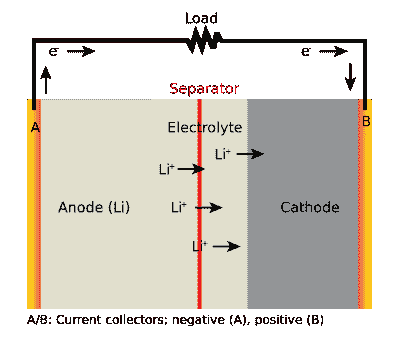

# 黑客字典:锂离子电池

> 原文：<https://hackaday.com/2016/05/20/hackaday-dictionary-lithium-ion-batteries/>

电池技术是物理定律和工程师让设备变得更小的愿望之间的持续化学战争。一方面，物理定律宣布电池内可以存储的能量是有限的，另一方面，工程师们正在寻找方法来绕过这些定律。对于许多设备来说，这两方面的最佳折衷是锂离子电池，通常缩写为 Li-ion。

## 化学

顾名思义，锂离子电池是基于锂的化学性质。锂原子是碱金属中最不活泼的，它又小又轻，带有一个渴望离开的电子，形成一个正离子。这种具有漫游癖的电子也给了它们高电极电势，这意味着注入锂的电极可以产生相对较高的电压:大约 3 伏。

How a Li-ion battery discharges, from Wikipedia Commons

锂离子电池由两个电极组成，电极之间有电解液。大多数情况下，负极由石墨制成，而正极涂有氧化锂形式的锂，通常与磷酸盐、锰或钴结合。它们之间的电解质通常是有机溶剂，锂盐溶解在其中，产生大量锂离子漂浮在两个电极之间。这两个电极还被一个可渗透层隔开，该层允许离子通过，但防止电极相互接触。

当电池充电时，锂离子移动到负极(称为阳极),被困在石墨的晶体结构中。当电池放电时，离子向正极(阴极)移动，产生电能流。给电池充电，离子就会流回石墨中。这个过程非常有效:你通常会将 80%到 90%的能量以电能的形式释放出来。

 [https://www.youtube.com/embed/QNWpNlcmB1w?version=3&rel=1&showsearch=0&showinfo=1&iv_load_policy=1&fs=1&hl=en-US&autohide=2&wmode=transparent](https://www.youtube.com/embed/QNWpNlcmB1w?version=3&rel=1&showsearch=0&showinfo=1&iv_load_policy=1&fs=1&hl=en-US&autohide=2&wmode=transparent)

这些优势意味着锂离子电池已经成为许多现代设备的首选类型，从智能手机到电动汽车。事实上，许多这些设备将使用完全相同的电池:[拆开一辆特斯拉电动汽车的电池](http://hackaday.com/2014/09/13/tesla-model-s-battery-teardown/)，你会发现数百个相同的 [18650 电池](https://batterybro.com/)用于便携式电池和电子烟等设备。

## 危险危险。

因此，电池重量轻，效率高，并能储存大量能量。为什么不是到处都用？问题是锂离子电池实际上是一场等待发生的化学火灾。

首先，这种化学反应需要小心控制。如果你给锂离子电池过度充电，它们可能会爆炸。为了防止这种情况，大多数锂离子电池都安装了控制器来限制能量的流入和流出。当电荷达到一定水平时，该控制器停止能量流动，关闭电池或充电过程。

其次，如果锂离子电池被刺破，或者出现机械故障，影响了两个电极之间的分离，两个端子就会短路，从而加热电池并释放锂。这开始发生反应，温度高达 500°c。这熔化了电池中的其他材料，暴露出更多的锂，锂变热，引起级联反应。换句话说，电池着火并自我燃烧。

当锂离子电池储存或运输时，这些问题会成倍增加。想象一个装满这些电池的仓库，或者一个装满电池的飞机货舱。如果单个电池出现故障，或者其他东西着火，使这些电池暴露在高温下，那么你就有问题了。

这种电池旨在通过将化学物质密封在难以撕开的坚韧聚合物袋中来防止这种情况发生，这也允许电池在充电时略微膨胀。(强调“略”。标题中的电池已经过了使用寿命。)这也产生了“锂聚合物”的名称，用于一些电池，特别是那些用于无人机和需要经得起粗暴对待的 RC 模型的电池。

 [https://www.youtube.com/embed/BLc74Qpvweg?version=3&rel=1&showsearch=0&showinfo=1&iv_load_policy=1&fs=1&hl=en-US&autohide=2&wmode=transparent](https://www.youtube.com/embed/BLc74Qpvweg?version=3&rel=1&showsearch=0&showinfo=1&iv_load_policy=1&fs=1&hl=en-US&autohide=2&wmode=transparent)

这也是锂离子电池有时难以运输的原因。航空公司已经不再接受它们作为客运航班的货物，联合包裹和联邦快递在 T2 推出了关于散装电池运输包装的新规定。任何包含八个以上电池的包装也必须特别标明为危险货物。

大多数航空公司不限制在随身行李中携带锂离子电池，只要它们相当小。例如，美国联合航空公司(United Airlines)允许在一个设备内安装容量高达 100 瓦时的电池(T1 ),或者两个包装得当以防止短路的额外电池。美国运输安全管理局允许在托运行李的设备中安装[小型电池，但限制散装锂离子电池。所以，如果你带着原型机或备用电池去旅行，最好把电池拿掉，随身携带。](http://www.faa.gov/about/initiatives/hazmat_safety/)

## 未来

Li-ion batteries are far from reaching perfection, though, as there are lots of companies looking to increase their energy density using technologies such as [nanowires](http://news.stanford.edu/news/2008/january9/nanowire-010908.html). There are also tweaks to the chemistry, such as the [lithium iron phosphate](https://en.wikipedia.org/wiki/Lithium_iron_phosphate_battery) battery, that holds a bit less energy, but which can be charged and discharged for more cycles before losing capacity and is significantly less likely to go up in flames when overcharged. That’s a big advantage for solar devices, and LiFePo batteries are available right now. The new [lithium-sulfur batteries](https://en.wikipedia.org/wiki/Lithium%E2%80%93sulfur_battery) also hold some promise, although they are not yet available commercially. So, the battle to jam more and more energy into a battery continues. Hopefully it won’t end in a big bang.(Thumbnail image of battery, with quarter for scale, courtesy [Sparkfun](https://www.sparkfun.com/products/12895).  Headline photo of expanding iPhone battery CC BY-SA 3.0 by [Mpt-Matthew](https://en.wikipedia.org/wiki/File:Expanded_lithium-ion_polymer_battery_from_an_Apple_iPhone_3GS.jpg).)