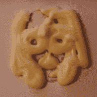
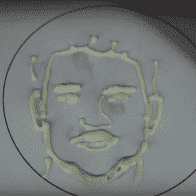
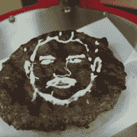
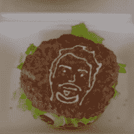
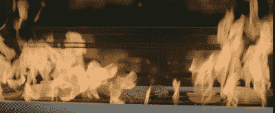

# 纳维德·戈纳尔吃自己的脸

> 原文：<https://hackaday.com/2016/05/18/navid-gornall-eats-his-own-face/>

纳维德·戈纳尔是伦敦一家广告公司的创意技术专家，这意味着他可以玩很酷的玩具，拍电影。这也意味着他花了所有的工作时间试图向非技术观众解释技术。这就是为什么他非常乐意在 Hackaday 贝尔格莱德会议上给硬件爱好者们做演讲。

在对他过去一年半从事的项目进行了旋风式的模仿之后，他开始关注细节，这些项目包括引人入胜的 delta 打印机、舞动的火焰烤架，以及散热器和食品的奇怪组合。随之而来的是一半的技术展示和讲述，另一半是在幕后窥视赤裸裸的广告业。你可以在下面的视频后阅读我们的精彩评论。

 [https://www.youtube.com/embed/damqtQ_1lpE?version=3&rel=1&showsearch=0&showinfo=1&iv_load_policy=1&fs=1&hl=en-US&autohide=2&wmode=transparent](https://www.youtube.com/embed/damqtQ_1lpE?version=3&rel=1&showsearch=0&showinfo=1&iv_load_policy=1&fs=1&hl=en-US&autohide=2&wmode=transparent)

## 切碎蛋黄酱

客户走过来对他们说，我们怎样才能让蛋黄酱变凉？所以纳维德的工作是想出一堆新奇的方法让夏季烧烤会更有趣。他们从混合一堆潮流开始，并提出了“汉堡自拍”——一种可以给你拍照并在汉堡上画出你的脸的 3D 打印机。

如果你以前从未打印过蛋黄酱自拍照，你还没有遇到 Navid 遇到的一半困难。这个问题始于获得一个适合蛋黄酱肖像的人脸轮廓。你知道你如何花费所有的时间来调平你的 3D 打印机的床，并获得第一层 Z 轴的高度刚刚好吗？纳维用汉堡肉饼做这个。他们的目标是基于应用的全自动解决方案。他们最终得到了一个半自动系统，熟练的操作员可以在这个过程中进行一些调整。

        

不用说，你不能只是出去买一个蛋黄酱挤出机头。所以纳维不得不自己动手(在几周内！).原来蛋黄酱是一种非牛顿流体，当你试图把它挤过一个小喷嘴时，它会变得越来越粘。吸取教训，更广泛的粘贴输出解决了这个问题。

他们选择了 delta-bot，因为它以客户的蛋黄酱瓶子死点为特色。毕竟，这是一个广告。大量的调整和学习工作与材料随之而来。为了获得一致的打印效果，纳维德每天做 10 个汉堡，并重复使用其中最平的汉堡作为他的打印表面——在浴室的水槽中清洗，然后在两次尝试之间重新润滑。(你认为时不时用丙酮擦床不好。)

随着每一次迭代，这些脸变得越来越像脸。机器人被安装在一辆食品卡车上，他们拍摄了下来。所有这些都是为了一个 30 秒的广告。但是看起来很棒。

## 罐子-BQ

然后，他们有三天时间来制作一个定制迷你烤架的演示，它可以在烹饪时将制造商的标志烙在一个汉堡上。从喷漆的 3D 模型开始，安装一个看起来像铜管的定制烤架，他们制作了一个貌似真实的赝品。客户买的，拍的。不过，最终，这个项目更像是伪造的，而不是制作的——烤架为拍摄而烧香，汉堡上喷涂了标志。但不管怎样都行，对吧？作为一个奇怪的命运转折，他们最终可能会生产小型烤架。

## DJ BBQ

 受[烟火板](http://hackaday.com/2014/04/19/the-pyro-board-a-two-dimensional-rubens-tube/)的启发，鲁本斯的[管](https://en.wikipedia.org/wiki/Rubens'_tube)的一个变种，他们决定好好利用甜蜜的火焰显示，并自然地烧烤一些汉堡。通过多个电磁阀驱动火焰射流，一些过滤和一个 Arduino，他们得到了反应火焰，并得到了他们的镜头。

当然，火焰对于合理的烧烤来说太高了。虽然它可能看起来很棒，但它“烧掉了你放在上面的任何东西”。当然，没有什么是训练有素的食物造型师不能处理的，他们有源源不断的非燃烧的“英雄玉米”可以在拍摄时扔出去。一切都不是看上去的那样，但一切看上去都很好。那是广告！

## 外卖

我们不知道为什么突然饿了。也许这个广告终究还是有点道理的。无论如何，感谢纳维德让我们看到了幕后。在 30 秒广告中看起来光鲜亮丽、过于完美的东西，实际上却有着不光彩的一面。谁知道呢？