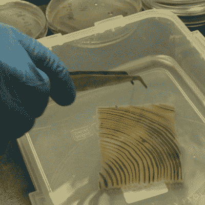

# 星际迷航材料科学终于成真:透明木材

> 原文：<https://hackaday.com/2016/05/19/star-trek-material-science-is-finally-real-transparent-wood/>

确切地说，它不是透明的铝，但它可能更好:透明的木头。马里兰大学的科学家设计了一种方法来去除它所有的颜色，留下一块基本上透明的木头。

 将木块放入 NaOH 和 Na [2] 中煮沸，这样化学浴持续几个小时，木材会失去木质素，而木质素赋予了木材颜色。这里的主要警告是，木质素也给木材强度；剩下的无色纤维素结构本身就非常脆弱。解决方案是用环氧树脂浸渍透明木材，使用大约三个真空循环，这导致比原始木材更坚固的复合材料。

这种材料有一些真正有趣的应用。它确实会呈现一些雾状，因此不如玻璃透明，但在以光线而非视觉为目标的情况下，如建筑玻璃砖，这是一个赢家。任何传统上基于木材的机械性能而建造的东西都将能够在可用选项中添加一个 alpha 颜色通道。

下一步是找到一种方法来扩大这个过程。在这一点上，该过程仅在厚度达 1 厘米的样品上成功。同时，如果你想用这种材料建造一艘星际飞船，你最好的选择仍然是透明铝。我们仍然想知道是否有一种方法可以消除对环氧树脂的需求。