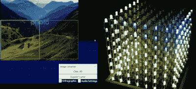

# 利用 Unity3D 实时驱动 RGB LED 立方体

> 原文：<https://hackaday.com/2016/05/22/real-time-driving-of-rgb-led-cube-using-unity3d/>

RGB LED 立方体很棒，但构建立方体只是成功的一半——它们还需要驱动。立方体越大，你锻炼行为艺术的画布就越大，数据可视化的头痛就越严重。这个项目通过使用 Unity 实时驱动 RGB LED 立方体解决了这个问题。

我们不只是在谈论驱动 led 本身在一个低水平，但~~你如何~~ *你想在这 512 个像素中的每一个显示什么*。

在视频中，您可以看到[TylerTimoJ]使用 Unity 引擎实时驱动 8x8x8 立方体的演示。演示了各种方法，从打开和关闭单个 led，像用画笔一样给立方体着色，甚至让立方体实时显示源图像数据(如左图所示)。)

 [https://www.youtube.com/embed/d37UqHZDKM4?version=3&rel=1&showsearch=0&showinfo=1&iv_load_policy=1&fs=1&hl=en-US&autohide=2&wmode=transparent](https://www.youtube.com/embed/d37UqHZDKM4?version=3&rel=1&showsearch=0&showinfo=1&iv_load_policy=1&fs=1&hl=en-US&autohide=2&wmode=transparent)

使用 Unity3D 驱动 8x8x8 RGB 立方体可以显示结果，但确实需要计算机来完成繁重的工作。过去，我们已经看到了一些来自 RGB 立方体的漂亮动画，例如由 Arduino MEGA 驱动的这个 [LED 立方体，但是它们没有这种方法提供的灵活性。](http://hackaday.com/2013/01/31/7x7x7-led-cube-driven-by-arduino-mega/)

立方体本身就是你所期望的。在[他的项目解释视频](https://www.youtube.com/watch?v=WYV7LMoqW80)的结尾，【TylerTimoJ】走过硬件，这是一个多路复用的系统。每层都有公共阳极，阴极向下延伸到底部。192 个连接由通过 USB 接收 Unity 流的 Arduino 驱动。

你可能认识[TylerTimoJ]的用户名。我们刚刚报道了他一直在做的另一个惊人的项目:[一个非常精致的零起点电磁星形发动机](http://hackaday.com/2016/05/20/scratch-built-radial-solenoid-engine-is-polished-and-professional/)。

感谢[supershwa]的提示！