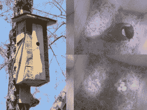

# 森林深处的网络化太阳能鸟舍

> 原文：<https://hackaday.com/2016/05/20/making-solar-powered-networked-birdhouses-putting-them-in-the-middle-of-the-woods/>

德国的[Oitzu]写信给我们，让我们了解一系列简短但内容丰富的博客帖子，他在其中描述了建造一系列[太阳能、联网的鸟舍](http://blog.blackoise.de/category/nesting-box/)的目的是窥探其中的生活。他一开始只做了一个，然后扩大到一个小型网络。它们工作得非常好，[Oitzu]的文档将对任何希望实现任何相同元素的人有很大帮助——其中包括在一个单元中作为主网关的 Raspberry Pi，在其他鸟舍中的多个远程单元拍摄照片并通过基于 nRF24L01+的无线电网络将照片发送到 Pi，并让 Pi 通过访问移动网络来管理上传这些图像。全靠太阳能。

Original Raspberry Pi based unit with Pi Noir camera

需要在树林中保持自身运行的硬件与挂在你后院附近的硬件相比，需要解决一系列不同的问题。令人高兴的是，[大津]带领我们走过了整个过程。在第一部分中，他概述了一个建立多个网络鸟舍的计划，每个鸟舍都能够报告它们的居住者，但每个鸟舍都不需要树莓皮。[第二部分](http://blog.blackoise.de/2016/04/building-a-connected-nesting-box-network-part-2/)描述了摄像系统。[第 3 部分](http://blog.blackoise.de/2016/04/building-a-connected-nesting-box-network-part-3/)详述了单元之间的通信，以及整体硬件设计。 [Part 4](http://blog.blackoise.de/2016/04/building-a-connected-nesting-box-network-part-4/) 盖 PCB(他的第一个！)和附件，最后[第 5 部分](http://blog.blackoise.de/2016/05/building-a-connected-nesting-box-network-part-5/)讲的都是结果。这些箱子在森林里愉快地运行着，很少出现问题。Raspberry Pi(配备了 UMTS 棒——一种经济的移动网络数据网关)可以缓存来自远程的图像，并在获得移动信号时上传它们——除非天气恶劣，否则它通常可以相当迅速地做到这一点。

这些鸟舍目前是空的，所以现在除了等待没有别的事可做。最后一篇博客文章有每个鸟舍被占用时的图片链接。人们希望北方猫头鹰会出现。

向生活在森林中的无头硬件供电是一个问题，而[Oitzu]采取了类似于这个[太阳能供电的鸣叫喂鸟器](http://hackaday.com/2013/12/10/solar-powered-tweeting-bird-feeder/)的方法:也就是说，一个大型太阳能电池板和一个沉重的可充电电池。但是随着最近一些项目的进展，比如这个[电池备份和树莓 Pi](http://hackaday.com/2016/03/17/battery-backup-for-the-raspberry-pi/) 电源管理解决方案，也许更容易和更好地控制森林中无头硬件的选项会增加。