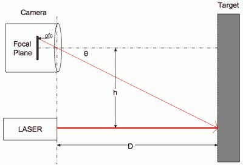

# 在苏俄，DIY 激光测距仪扫描你！！

> 原文：<https://hackaday.com/2016/06/05/in-soviet-russia-diy-laser-rangefinder-scan-you/>

雅科夫·斯米尔诺夫曾经说过，“在美国，你总能找到派对。在苏联，党找到了你！!"只有这里，是激光测距仪。

在[这个项目](https://geektimes.ru/post/275442/) ( [自动翻译](https://translate.google.com/translate?hl=en&ie=UTF8&prev=_t&sl=ru&tl=en&u=https://geektimes.ru/post/275442/))【伊利亚萨姆】自制扫描激光测距仪，就像我们在花哨的吸尘器里看到的那种。但他是从零开始的。

 虽然如果你有一个网络摄像头和大量的处理能力，这种事情很容易，但【伊利亚萨姆】采取了艰难的方式——通过线性图像传感器上的透镜测量反射点的视差(在俄语翻译中呈现为“光电探测器线”)。

线性图像传感器很像 CMOS 数码相机中的元件，只是这些元件排列成一条线，而不是一个平面，而且它们更容易与微控制器接口。将数据线保持在高电平以进行曝光，然后记录与照射在线阵列中每个单元的光量相对应的(模拟)电压值。虽然[伊利亚萨姆]为他的支付了大约 18 美元，但我们发现它们在易贝上要便宜得多。如果你拆开一个扫描仪，它通常有一个线性传感器，通常是 RGB，并配有驱动电路。如果你节俭的话，只需要几块钱就可以做到。

构建的其余部分包括一些信号调理和(做得非常好的)硬件构建。[伊利亚萨姆]将扫描仪安装在 Roomba 的顶部，并启动它来探索他的公寓。结果非常专业，你可以在下面的视频中亲眼看到。

我们已经介绍了 Neato 真空吸尘器中同样设备的商业版本。但是从零开始建造一个将游戏带到了另一个层次。

 [https://www.youtube.com/embed/4vZgepiK1K4?version=3&rel=1&showsearch=0&showinfo=1&iv_load_policy=1&fs=1&hl=en-US&autohide=2&wmode=transparent](https://www.youtube.com/embed/4vZgepiK1K4?version=3&rel=1&showsearch=0&showinfo=1&iv_load_policy=1&fs=1&hl=en-US&autohide=2&wmode=transparent)

