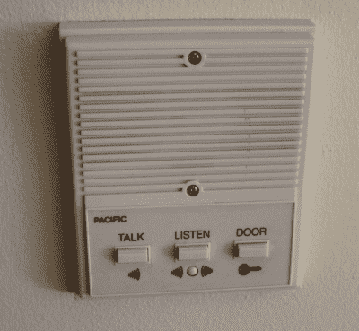
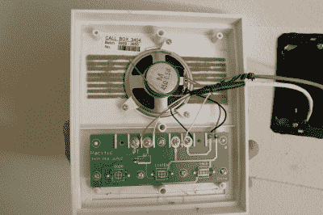
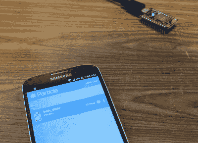
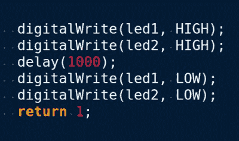
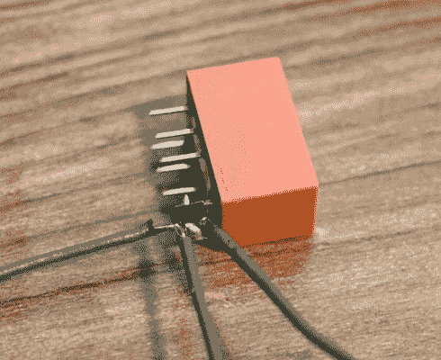
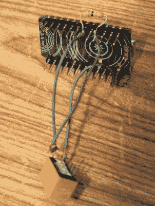
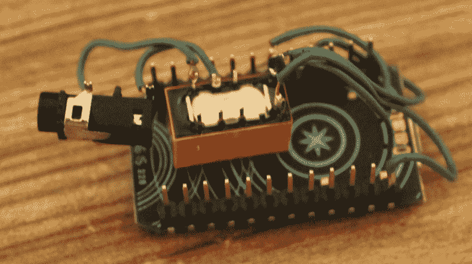
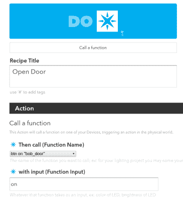
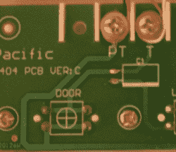
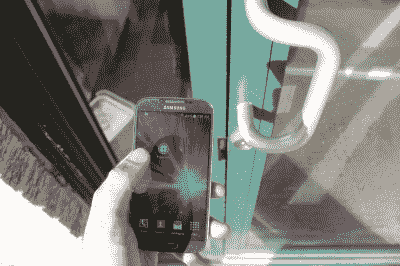

# 入侵你的公寓:不费吹灰之力实现无钥匙进入

> 原文：<https://hackaday.com/2016/05/26/keyless-apartment-entry-with-relatively-little-effort/>

A typical buzzer for an apartment complex.

如果你去过前门上锁的公寓，你就会看到蜂鸣器系统。你按下你想要的公寓的相应按钮，就可以和住户通话了。他们可以按一个按钮来短暂地打开门，然后你去他们的公寓，他们不必下来让你进去。但是，如果你是住院医生，你想出去跑步而不让你的钥匙在口袋里叮当作响，该怎么办呢？如果你想只用你的智能手机打开它呢？

我知道这是一个愚蠢的问题，我告诉过的每个人都认为这样可以节省大量的时间和精力，不值得。

接受挑战。

我只用公寓里的零件能多快组装好？结果大约两个小时。

## 研究

ALL of the necessary details are right here. Thank you, Pacific, for making this so easy.

最关键的一步是入侵蜂鸣器系统。两个螺丝和一个刀片之后，盘子就从墙上分离了。PCB 上的标记使其很容易在互联网上找到。看着印刷电路板和在线原理图，没有 DC 电源可以使用，但我知道开关连接了两根电线，导致门嗡嗡作响。这是一个低电压继电器的工作，当你想按下一个按钮，但不知道这两根线是做什么的，并希望尽可能少地干扰电子设备时，正常的解决方案。

## 无线的

The Photon successfully connected to the WiFi network.

接下来是无线组件。我有一个粒子光子躺在我的开发板盒里，这非常方便。我用 Play store 的粒子应用程序设置了这个。然后我安装了 IFTTT，它最终会让我控制它。然后我建立了一个粒子账号和一个 IFTTT 账号。我插上 Photon，从我的手机连接到它，并告诉它如何连接到我的无线网络。几秒钟后，它重新启动，并显示在线。现在，我可以在粒子网络应用程序中编写代码，并通过 WiFi 将其发送到我的光子上，我准备好了。

## 密码

我从一个示例 blink 应用程序(web-connected-led.ino)开始，并将其闪现到我的光子上，以确保它能够工作。然后我只需要让它打开一秒钟，然后关闭，所以我创建了一个函数来专门做这件事。完成了。整个代码部分只花了几分钟。

## 电子学

我找到了一个继电器。继电器需要很大的功率来切换，这个在 5V 下切换，但是 Photon GPIO 在 3.3V，我不能直接从输出引脚驱动继电器。没问题，这是 N 沟道 MOSFET 的工作。我只有一个表面贴装，但我也有疯狂的烙铁技能。

我连接了 MOSFET 和继电器，并加入了一个下拉电阻，这样上电时就不会有任何奇怪的现象，MOSFET 将保持低电平，不会意外切换。最后，我放了一个 1/8 英寸的音频连接器，这样我就可以很容易地将其连接到墙板的电线上(这是一根重新使用的音频电缆)。

  relay with MOSFET attached  soldered to the photon  a connector added to the relay to allow for disconnecting from the wall

## 晚餐和网络中断

出于某种原因，我的网络中断了一个小时，这是吃晚饭的最佳时间。

## 综合

回到工作中，在 IFTTT 中，我将其连接到粒子通道。我创建了一个食谱，每当我给自己发短信说“opensesame”时，它就会调用我写在光子上的函数。粒子通道与我的光子上的代码交互得如此之好，真是令人惊讶。我可以刷新固件，IFTTT 配方创建将立即知道哪些功能可用。

然后我注意到 Do，它是 IFTTT 的一部分，但是去掉了 IF 部分。快速下载后，我的主屏幕上有了一个快捷按钮，当按下它时，将调用我的光子上的功能。没有更多的短信，只是一个快捷方式。

一个快速的测试和过程工作。我能听到继电器开关的咔嗒声。当我把它插入蜂鸣器时，我确信这个解决方案会起作用。

## 钓鱼线

不幸的是，我的墙壁蜂鸣器附近没有电，我也不想定期更换电池。我花了一段不必要的时间来弄清楚如何将电线穿过干墙，向下到达墙的另一侧，在那里它进入另一个房间，这个房间靠近一个插座。最后，我在壁橱底部的干墙上打了一个直径约 1/2 英寸的洞。这是公寓唯一的损坏，很容易修复。

## 最终布线

Terminals PT and T clearly connect to the door button

电线断了，我只要把它拧进墙板上的接线端子就行了。这是 PT 和 T 端子，可以清楚地看到，这两个端子在开关的两侧都有迹线，标记为“DOOR”。

## 测试

我把我的手机(和钥匙以防万一)带到前门，按下按钮，大约 5 秒钟后，有嗡嗡声让我进来。第二天早上，我去跑步，没带叮当响的钥匙。

Pressing the DO button to open the door

## 最终注释

我不担心安全问题。光子通过加密 WiFi 连接到我家路由器，IFTTT 和粒子集成使用 OAuth。

在我按下按钮和光子收到信息并按门铃之间有一些延迟。结果对我来说用钥匙打开它可能会更快。

是的，这依赖于互联网的开通，所以当我在做这个项目的时候出现了中断，这有点让人担心。我不会一直靠这个，但这是个不错的噱头。

我以前从来没有使用过 IFTTT，所以我真的很高兴这个工具能这么快地组合在一起，而且这么容易做到，尤其是粒子通道。

多年来，我们已经有了其他蜂鸣器黑客，如[莫尔斯电码蜂鸣器、](http://hackaday.com/2015/10/08/hacked-apartment-intercom-barks-at-you-or-buzzes-in/)但这一次是在快速实施和与现有服务集成方面的一次练习，表明将任何东西变成物联网是多么容易。