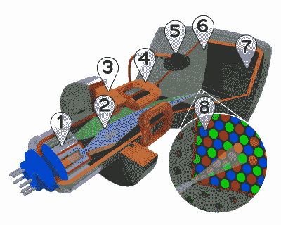
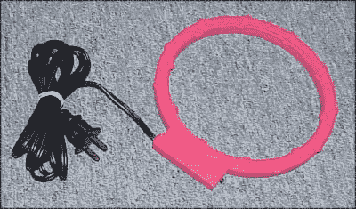
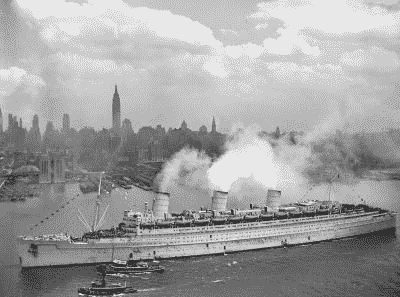

# WTF 在消磁？

> 原文：<https://hackaday.com/2016/05/25/wtf-is-degaussing/>

现代办公室已经变成了液晶显示器的海洋。很难相信，仅仅几年前，我们还坐在阴极射线管(CRT)后面。人们已经忘记了热量、灰尘和反激式变压器发出的可爱的高频尖叫声。

Image by Søren Peo Pedersen via wikipedia

这些旧显示器有一个似乎不太为人所知的特点。低低的消磁按钮。在某些显示器上，这是一个物理按钮。在其他情况下，它是屏幕显示(OSD)上的磁铁图标。按下它，用户会得到大约 5 秒钟的波形显示，并伴有一声响亮的嗡嗡声。

但是这个按钮到底做了什么？似乎很多人从来不知道那个愚蠢的小按钮的用途，除了声光表演。事实是消磁相当重要。不仅用于 CRT，而且用于许多其他电子和工业应用。

### 荫罩和孔栅

Close up of a shadow mask by Rauenstein via Wikipedia

一个 CRT 有相当多的组件。在显像管的后部(磁轭)有三个电子枪以及控制和会聚线圈。显像管的前端有一块涂有荧光粉的玻璃板，构成了荧光屏。就在玻璃后面是一个叫做荫罩的金属网格。如果你有足够的钱购买索尼屏幕，荫罩就会被著名的 Trinitron 孔径格栅所取代，这是一种具有类似功能的精细金属网。荫罩或孔径格栅的作用是确保正确的电子束击中屏幕前面的红色、绿色或蓝色荧光涂层。

这都需要非常精确的对准。任何印在荫罩上的杂散磁场都会导致电子束在穿过电子管时发生弯曲。磁场太强，你的电视或显示器会开始出现彩虹，就像 20 世纪 60 年代的迷幻之旅电影一样。甚至地球自身的磁场也会被印在阴影掩膜上。简单地将电视从北转到东可能会引起问题。它的官方术语是“色纯度”。

这些问题在彩色电视机出现的早期就已众所周知。为了解决这个问题，制造商们在电视机上增加了消磁线圈。一个线圈缠绕在管的前面，就在电视机的挡板后面。当电视机接通电源时，线圈就会得到电源电压。当你第一次打开旧电视机和显示器时，它们会发出众所周知的“嗡嗡”声。50 赫兹或 60 赫兹的交流电会产生强大的移动磁场。该磁场将有效地擦除荫罩或孔格栅上的印记磁场。

让大电流流过薄消磁线圈会很快导致火灾。set 通过在线圈中使用正温度系数(PTC)热敏电阻避免了这种情况。电流本身(或一个小加热线圈)会加热 PTC，导致电阻增加，通过线圈的电流下降。大约 5 秒钟后，线圈完全关闭，屏幕(希望)消磁。

随着时间的推移，显示器变成了嵌入式系统。PTC 装置被监视器主微控制器控制的晶体管所取代。显示器制造商知道他们的电视机比普通电视机分辨率高，因此对磁场更敏感。用户在使用显示器时也更有可能移动显示器。这使得制造商在电视机前面增加了一个消磁按钮。按下按钮将在软件控制下给线圈通电几秒钟。一些显示器还会限制用户按下按钮的次数，以确保线圈不会太热。

将磁铁放在黑白(或单色“绿屏”)CRT 的前面会产生可见的失真，但不会造成持久的损害。世纪中期的黑客们在他们的第一台彩色电视机上尝试了同样的伎俩，很快就发现彩虹效应在磁铁移开后仍然存在。在这种极端情况下，内部消磁线圈不足以清除荫罩。

Commercial degaussing coil

当其他方法都失败时，可以使用手持消磁线圈或消磁棒。实际上，在屏幕前挥动魔棒通常会把事情弄清楚。当然有可能永久损坏荫罩。早在 2007 年，我在一家雷达公司工作，该公司在转向液晶显示器方面进展缓慢。作为一个雷达商店，我们有几个强大的磁控磁铁躺在周围。其中一块磁铁在工程师中传阅。把磁铁放在你的显示器下过夜可以保证第二天早上会有彩虹，几天后会有一个闪亮的新液晶显示器。

Queen Mary, showing her degaussing coil

CRT 不是唯一使用消磁线圈的设备。该术语最初是由加拿大皇家海军志愿预备役(RCNVR)的查尔斯·f·古德夫(Charles F. Goodeve)于 1945 年创造的。德国的水雷能够探测到军舰钢壳中的磁场。线圈被用来屏蔽这个磁场。玛丽女王号是比较著名的装有消磁线圈以避免致命水雷的船只之一。

即使是机械手表也能从消磁中受益。经过磁化的手表通常走得快。通常这是因为钢制游丝变成了弱磁体。随着摆轮每秒钟的卷绕和松开，弹簧的线圈粘在一起。消磁线圈(或者在这种情况下，更恰当的说法是消磁器)可以快速解决这个问题。

如果不提到磁介质，关于消磁的故事是不完整的。手持或桌面消磁线圈可用于批量擦除软盘，磁带，甚至硬盘。人们不禁要问，在过去，是不是显示器中的消磁线圈导致了软盘的损坏。

所以你有它。神奇的消磁按钮揭秘！