# 预防措施:跳蚤市场

> 原文：<https://hackaday.com/2016/05/26/hamvention-the-flea-market/>

 上周末是 Hamvention，*五月的第三个周末你想去的*地方。这是世界上最大的业余无线电爱好者聚会，也是一个包含各种电子产品的超大型跳蚤市场。

ha vention 的展位包括一些著名的开放式硬件，但在大多数情况下，你会看到八重洲的几个大展位，这是一个专门展示 ARRL 一切的完整区域，还有一些常见的弹出式广告。Rigol 在那里展示他们的测试设备，并以远远高于其价值的价格出售 DS1052E 示波器。无论如何，Rigol Zed 是一个更好的选择。

和任何火腿聚会一样，天线无处不在。最大的是右边的塔。再多一点设备，这个天线就能实现月球弹跳。可惜这个周末月圆，大家都早早睡了。

尽管有巨大的天线和业余无线电商展，最大的吸引力还是跳蚤市场。你看到的是大约两个足球场大小的停车位，里面停满了汽车、帐篷、折叠桌和你见过的最奇怪的电子设备。那是什么感觉？请往下读。

## 成分

几乎任何你想要的东西都能在 Hamvention 找到。跳蚤市场，像参与者一样，还没有真正赶上数字时代，所以你不会发现裸露的 ATM 机和图片，甚至一些随机的 EPROMs。我找不到一管 74 系列的逻辑。如果你想要的是老式的，或者只是一些装在玻璃里的有趣的东西，那么 Hamvention 就是为你准备的。

 [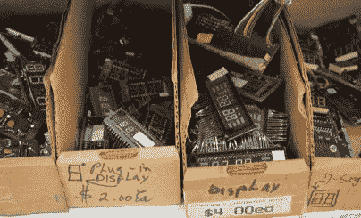](https://i0.wp.com/hackaday.com/wp-content/uploads/2016/05/dsc_0019.jpg?ssl=1)  [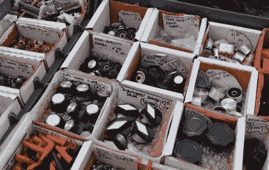](https://i0.wp.com/hackaday.com/wp-content/uploads/2016/05/dsc_0025.jpg?ssl=1)  [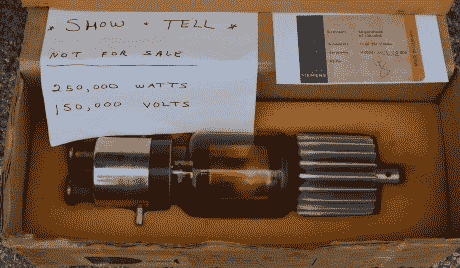](https://i0.wp.com/hackaday.com/wp-content/uploads/2016/05/dsc_0079.jpg?ssl=1)  [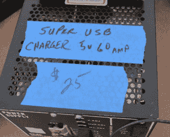](https://i0.wp.com/hackaday.com/wp-content/uploads/2016/05/dsc_0139.jpg?ssl=1) A USB charger   [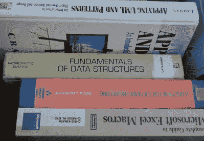](https://i0.wp.com/hackaday.com/wp-content/uploads/2016/05/dsc_0075.jpg?ssl=1)    [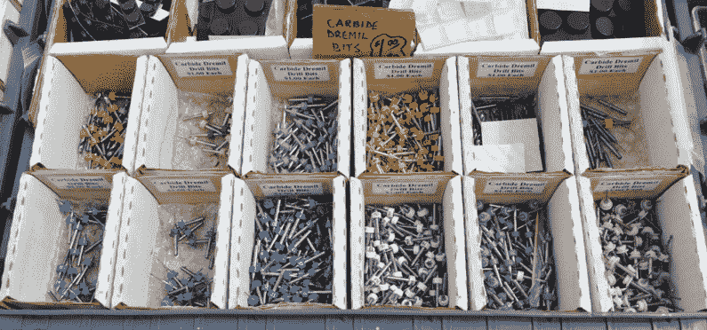](https://i0.wp.com/hackaday.com/wp-content/uploads/2016/05/dsc_0024.jpg?ssl=1)  [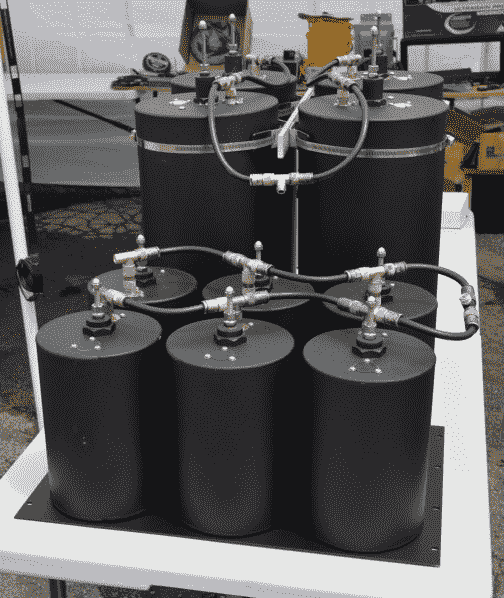](https://i0.wp.com/hackaday.com/wp-content/uploads/2016/05/dsc_0058.jpg?ssl=1)    [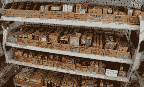](https://i0.wp.com/hackaday.com/wp-content/uploads/2016/05/dsc_0017.jpg?ssl=1)        [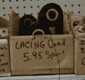](https://i0.wp.com/hackaday.com/wp-content/uploads/2016/05/dsc_0021.jpg?ssl=1)  [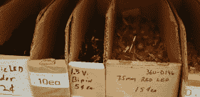](https://i0.wp.com/hackaday.com/wp-content/uploads/2016/05/dsc_0018.jpg?ssl=1)    [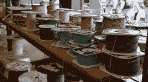](https://i0.wp.com/hackaday.com/wp-content/uploads/2016/05/dsc_0023.jpg?ssl=1) 

到目前为止，跳蚤市场上最大的一个摊位是门德尔松。Mendelsons 是一个代顿机构和巨大的商店，装满了剩余和清算库存。你可以得到任何东西，从交通信号到一托盘的洗衣液，当然门德尔松也带来了电子产品。几乎所有你想要的东西都在那里，而且组织得很好。

### 

## 测试设备和随机齿轮

如果你需要一个比 400 美元的 Rigol 更好的瞄准镜，你最好的选择是 Hamvention。这里应有尽有，从 20 世纪 70 年代的 Tektronix 465 到 80 年代的 Tek 2225，再到 80 年代末、90 年代初的一些疯狂的惠普设备。有数量惊人的频谱分析仪，和足够满足任何蒸汽朋克爱好者的模拟仪表。

价格呢？在星期五，他们是你所期待的。周六，价格开始下降，但随着更多的参与者，竞争加剧。Hamvention 周日下午 1 点关门，这些人不想把所有这些东西带回家。如果前两天所有东西都没有被抢购一空的话，那就是便宜货的地方。

 [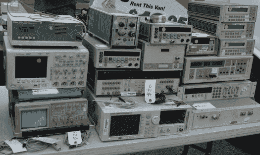](https://i0.wp.com/hackaday.com/wp-content/uploads/2016/05/dsc_0051.jpg?ssl=1)  [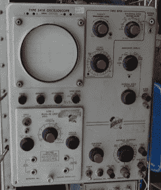](https://i0.wp.com/hackaday.com/wp-content/uploads/2016/05/dsc_0028.jpg?ssl=1)  [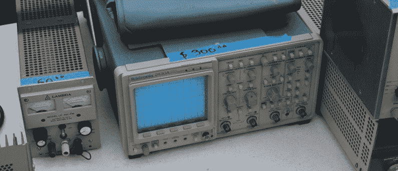](https://i0.wp.com/hackaday.com/wp-content/uploads/2016/05/dsc_0060.jpg?ssl=1)  [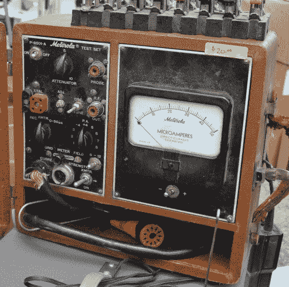](https://i0.wp.com/hackaday.com/wp-content/uploads/2016/05/dsc_0071.jpg?ssl=1)  [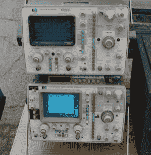](https://i0.wp.com/hackaday.com/wp-content/uploads/2016/05/dsc_0081.jpg?ssl=1)  [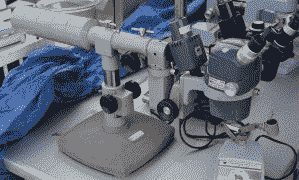](https://i0.wp.com/hackaday.com/wp-content/uploads/2016/05/dsc_0012.jpg?ssl=1)  [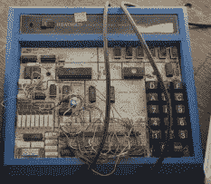](https://i0.wp.com/hackaday.com/wp-content/uploads/2016/05/dsc_0016.jpg?ssl=1)  [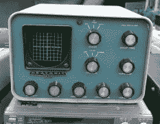](https://i0.wp.com/hackaday.com/wp-content/uploads/2016/05/dsc_0063.jpg?ssl=1)  [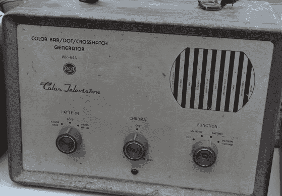](https://i0.wp.com/hackaday.com/wp-content/uploads/2016/05/dsc_0038.jpg?ssl=1)  [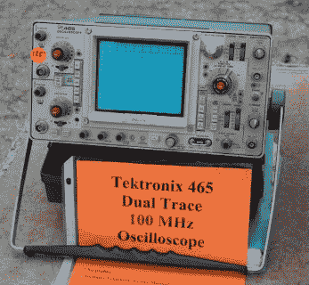](https://i0.wp.com/hackaday.com/wp-content/uploads/2016/05/dsc_0032.jpg?ssl=1)  [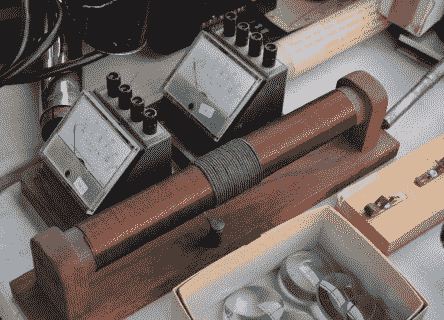](https://i0.wp.com/hackaday.com/wp-content/uploads/2016/05/dsc_0011.jpg?ssl=1)  [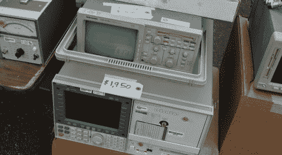](https://i0.wp.com/hackaday.com/wp-content/uploads/2016/05/dsc_0050.jpg?ssl=1)  [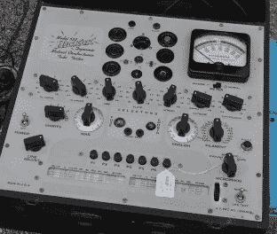](https://i0.wp.com/hackaday.com/wp-content/uploads/2016/05/dsc_0070.jpg?ssl=1)  [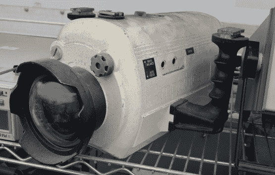](https://i0.wp.com/hackaday.com/wp-content/uploads/2016/05/dsc_0029.jpg?ssl=1)  [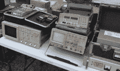](https://i0.wp.com/hackaday.com/wp-content/uploads/2016/05/dsc_0035.jpg?ssl=1)  [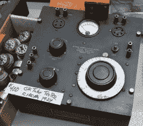](https://i0.wp.com/hackaday.com/wp-content/uploads/2016/05/dsc_0074.jpg?ssl=1)    [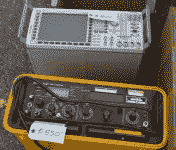](https://i0.wp.com/hackaday.com/wp-content/uploads/2016/05/dsc_0049.jpg?ssl=1)  [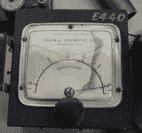](https://i0.wp.com/hackaday.com/wp-content/uploads/2016/05/dsc_0010.jpg?ssl=1)   

## 收音机和随身用品

你没想到汉默文特会有一吨重的收音机，对吧？所有的东西都在那里，从 20 世纪 20 年代用濒危木材制成的漂亮的接收器，到 40 年代奇妙的塑料接收器，到 70 年代的火腿装备。

   [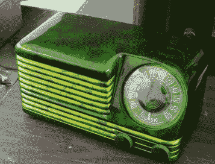](https://i0.wp.com/hackaday.com/wp-content/uploads/2016/05/dsc_0055.jpg?ssl=1)  [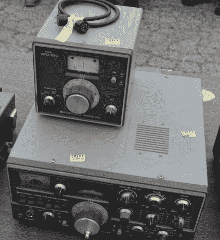](https://i0.wp.com/hackaday.com/wp-content/uploads/2016/05/dsc_0037.jpg?ssl=1)  [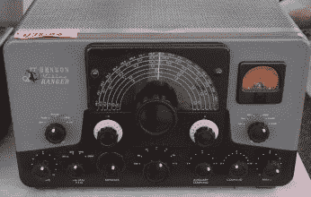](https://i0.wp.com/hackaday.com/wp-content/uploads/2016/05/dsc_0007.jpg?ssl=1)  [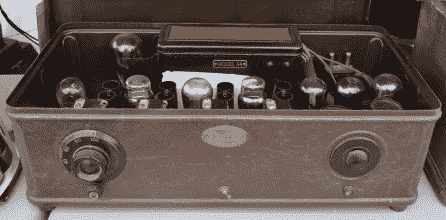](https://i0.wp.com/hackaday.com/wp-content/uploads/2016/05/dsc_0098.jpg?ssl=1)  [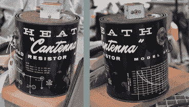](https://i0.wp.com/hackaday.com/wp-content/uploads/2016/05/cantenna.png?ssl=1)  [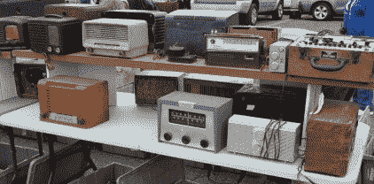](https://i0.wp.com/hackaday.com/wp-content/uploads/2016/05/dsc_0054.jpg?ssl=1)      [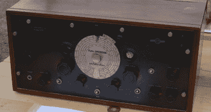](https://i0.wp.com/hackaday.com/wp-content/uploads/2016/05/dsc_0045.jpg?ssl=1)  [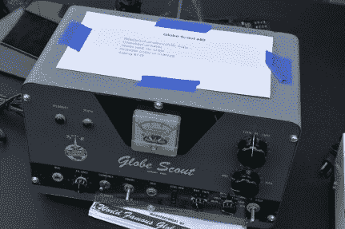](https://i0.wp.com/hackaday.com/wp-content/uploads/2016/05/dsc_0042.jpg?ssl=1)  [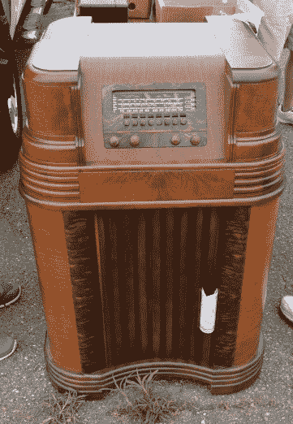](https://i0.wp.com/hackaday.com/wp-content/uploads/2016/05/dsc_0052.jpg?ssl=1)    [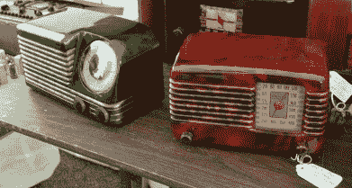](https://i0.wp.com/hackaday.com/wp-content/uploads/2016/05/dsc_0056.jpg?ssl=1) 

## Hamvention 外卖

Hamvention 是首屈一指的业余无线电聚会，也是世界上最大的聚会，那些把自己的皮卡停在停车位上，从棚屋里卸货的人是这个星球上最有知识的人。他们有最好的东西，他们正试图摆脱它。需要一个不是 12AX7、6L6 或 EL34 的管子吗？它在汉默文德，可能价格公道。

Hamvention 很棒，是一个很棒的交易会的完美例子，也很有趣。如果你在代顿附近，你需要去看看。开几百英里的车去一个价格昂贵的酒店房间是值得的。所有最好的东西都在这里，而且都是待售的。