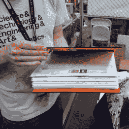
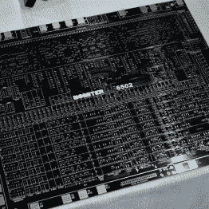
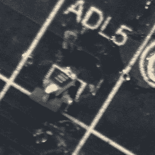

# 6502 是如何被分解的

> 原文：<https://hackaday.com/2016/05/24/how-the-dis-integrated-6502-came-to-be/>

在今年的湾区创客节上，我特别为一个摊位做了一条蜜蜂线；我们的朋友[Eric Schlaepfer]展示了他的[MOnSter 6502](http://monster6502.com/)。如果你上周错过了，[由分立晶体管制成的 6502](http://hackaday.com/2016/05/16/a-dis-integrated-6502/) 的发布点燃了互联网。那时，电路板还没有完全投入使用，但(Eric)的坚持得到了回报，因为在他的展位上显示验证码没有任何问题。

我在下面的视频中就设计过程采访了[Eric]。听到他最初试图证明这是不可能的，这并不奇怪。由于做不到这一点，他别无选择，只能用将近六个月的空闲时间来完成设计、布局和组装。

    Unpopulated PCB  resistor fix

我印象最深的是(除了最初的成功之外)他的设计达到了完美的程度。他几乎没有任何错误。在视频中，你将听到他讨论上拉/下拉元件的问题，这些元件确实会使一些晶体管冒烟。解决方案是在每个替代晶体管上串联一个电阻。这很难拍照，但你可以看出上面的焊接技巧，其中 3 引脚 MOSFET 用它的一对腿支撑在板上，单腿在空中。为解决这一问题，增加了一个电阻，将该悬空引脚连接到其 PCB 焊盘。除此之外，没有其他路线可以修正。难以置信。

 [https://www.youtube.com/embed/FzWwUPkSEvs?version=3&rel=1&showsearch=0&showinfo=1&iv_load_policy=1&fs=1&hl=en-US&autohide=2&wmode=transparent](https://www.youtube.com/embed/FzWwUPkSEvs?version=3&rel=1&showsearch=0&showinfo=1&iv_load_policy=1&fs=1&hl=en-US&autohide=2&wmode=transparent)

巨大的图解活页夹包括一个插页——毫不夸张。这个难题中最难的一块是破解只读存储器的解码。这个活页夹折出来的东西，乍一看甚至不像是示意图，但是[仔细看](https://hackaday.com/wp-content/uploads/2016/05/decoderom-huge.jpg)(警告，8 MB 图片)。网格中的每个组件都是手动放置的。

我一直期待今年能从[Eric]那里看到一些基于 tube 的优点。这是因为我喜欢他 2014 年在绿色显像管上拍摄的《Flappy Bird》和去年在带手动发条轭的电子管上拍摄的《T2 战场》。但我很高兴他离开了电子管，创造了这个不可思议的工程标本。