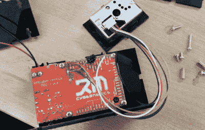

# DIY 空气质量计和排放测试仪

> 原文：<https://hackaday.com/2016/05/27/diy-air-quality-meter-and-emissions-tester/>

手持测量设备是很好的 DIY 项目。只需将传感器与用于显示传感器输出的 LCD 一起绑在备用开发板上，就可以了解传感器或传感器技术的很多信息。【理查德的】 [DIY 空气质量测量仪和排放测试仪](http://www.rmcybernetics.com/projects/DIY_Devices/diy-emissions-tester.htm)就是这样一个项目，除了带有定制的激光切割外壳和大图形液晶显示屏，他的测量仪显得已经相当专业了。

在建造过程中，[理查德]使用了一个锋利的[gp2y 1010 au0f](http://www.rmcybernetics.com/files/pdf/GP2Y1010AU0F-Datasheet.pdf)灰尘传感器。这个 11 美元的设备有一个小洞，空气中的灰尘颗粒可以通过。在内部，红外 LED 和光电二极管的排列方式不允许直射光，而只允许灰尘颗粒经过时反射的光到达光电二极管。传感器封装内的精确调整放大器将二极管的光电流转化为与灰尘密度成比例的模拟输出电压。借助一点软件魔法，甚至可以通过分析输出电压的脉冲模式来区分室内灰尘和烟雾。

 本项目使用的开发板，一块 [PDI-1](http://www.rmcybernetics.com/shop/cyber-circuits/programmable-usb-device-pdi1) (代表可编程设备接口)是【理查德】自己设计的。在英国制造，它不是最便宜的，但它的一部分，使这种建设轻而易举。它基本上是一个 Arduino Nano，带有许多板载外围设备，包括一个大型图形 LCD，一些按钮，一个扬声器，大量的 H 桥，等等。

在将灰尘传感器连接到电路板上，并将外壳从激光切割机中取出后，这个项目的硬件部分就差不多完成了。添加了一个小风扇以确保气流通过传感器。最终[Richard]编写了一个基本的固件来在 LCD 上显示传感器读数的图表。在他的汽车废气流中进行的第一次测试，如标题图所示，通过空转和加速循环，表明仪表按预期工作。当然，空气质量和排放测试依赖于更多的参数，而不仅仅是灰尘密度，但是如果您想要复制和扩展这个构建，[Richard]为您提供了所有 Arduino 兼容的源文件。