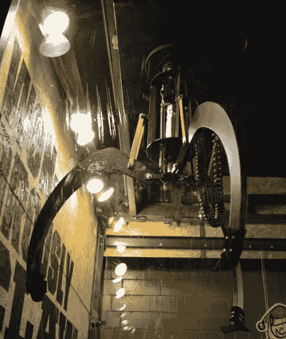
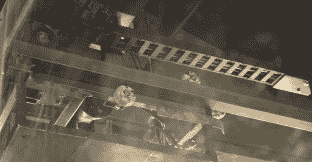
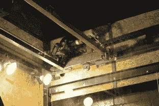
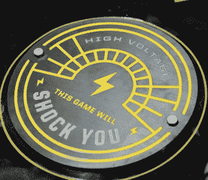
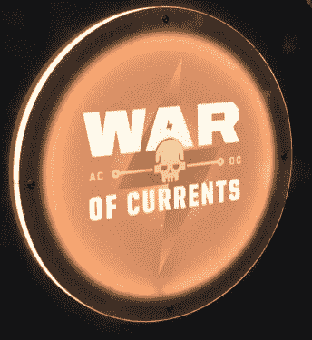
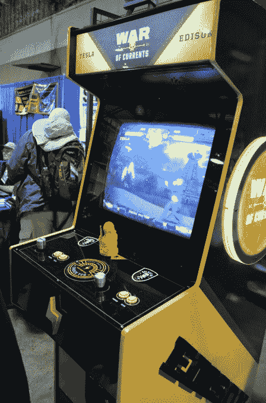
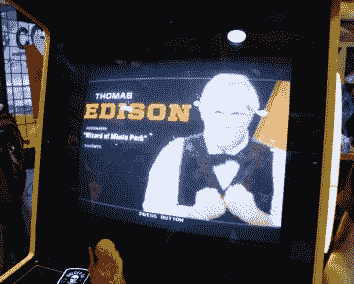
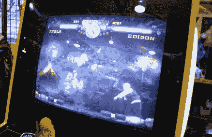

# 集街机酒吧和黑客空间于一身

> 原文：<https://hackaday.com/2016/05/30/an-arcade-bar-and-hackerspace-all-in-one/>

Hamvention 是在上周末，就像 [Hackaday 的 Maker Faire](http://hackaday.com/2016/05/25/how-to-have-a-beer-with-every-electronics-person/) 的探险一样，找到一群 Hackaday 的粉丝并接管一个酒吧才是合适的。这是在俄亥俄州的代顿，你可能会认为这里的夜生活严重匮乏。并非如此，因为代顿市中心[是 Proto BuildBar](http://www.protobuildbar.com/) 的所在地，它集酒吧、拱廊和黑客空间于一体。

几年前第一次开放的时候，我们就听说过 Proto BuildBar [。想法比较简单；Proto BuildBar 首先是一个酒吧，有 3D 打印服务，几个焊接工作站和几个街机游戏，而不是有一个黑客空间，旁边有酒和视频游戏。这是即兴聚会的最佳场所。](http://hackaday.com/2014/10/27/the-proto-buildbar-is-exactly-what-it-sounds-like-and-it-sounds-awesome/)

### 一个非常大的爪形机器

俄亥俄州代顿市中心的某个角落里有一个世界纪录保持者。这是世界上最大的起重机游戏。那些带操纵杆的街机，装满填充动物玩具的箱子，还有一个小小的起重机？是的，最大的一个。一次 5 美元，奖品要么是大型充气球，要么是里面有 t 恤的罕见大型仓鼠球。

    The claw rides along a fairly standard steel track, using skateboard bearings    An electric wheelchair motor

对于一项世界纪录来说，世界上最大的抓爪机出奇的简单。真的只是角铁，一个电动轮椅电机，几个大电机驱动器。操纵杆虽然很大，但使用标准的街机按钮开关。这是一个非常令人印象深刻的构建，但你会立即被复制它的容易程度所震惊。

### 3D 打印和焊接

Proto BuildBar 装载了 3D 打印机，主要是 Makerbot，包括一个实际工作的单个东西-O-Matic *。这本身就非常罕见。任何人都可以从街上走进来打印一些东西。价格约为每小时 10 美元——如果你把它用作工具的话，这有点贵，但对于普通大众迫切需要的“3D 打印入门”来说，这正合适。*

### 拱廊

周六晚上显然是 Proto BuildBar 的游戏之夜，为此他们用卡车运出了几台经典游戏机放在几张桌子上。这是 SNES，创世纪，世嘉光盘所有的方式，和一些多卡带 bartop 和单口相声单位。迄今为止，最令人印象深刻的街机是*水流之战*，这是一款定制街机游戏，以*街头霸王*风格再现了有史以来最伟大的战役:爱迪生大战特斯拉。

*水流之战*是你的标准格斗游戏。不过，它确实有一个锦囊妙计:失败者感到震惊。字面上，通过一个导电操纵杆。

          

*电流之战*在临时的黑客日聚会上没有出现在 Proto BuildBar。它在安静地睡觉，而干预措施被关闭。我和 Proto BuildBar 的一些人一起玩过，是的，这是一个真正的、令人震惊的*街头霸王*克隆体。

Proto BuildBar 是什么样的？太好了。如果你在这个地区，你应该去看看。如果 Hackaday 明年去参加 Hamvention，我们知道在哪里计划我们的聚会。