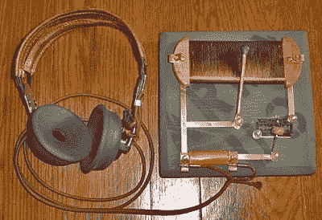
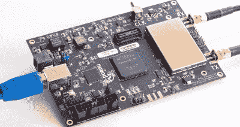

# 黑客字典:软件定义无线电(SDR)

> 原文：<https://hackaday.com/2016/05/30/hackaday-dictionary-software-defined-radio-sdr/>

我们正在进入无线电技术的新时代。一种制造无线电的新方法使得多波段手机和无处不在的 USB 电视接收机等设备能够无缝地从一个频率转移到另一个频率。这项技术就是软件无线电，简称 SDR。

理想化的收音机包括一系列的阶段。首先，天线接收无线电信号，将其转换为电信号。这个信号被馈入调谐到特定频率的调谐谐振器。这就放大了所需的信号，然后将信号发送到解调器，解调器是一种从载波信号中提取所需信息的设备。在简单的收音机中，这是由发射机编码的音频信号。最后，这个信号通常被输出到扬声器或耳机。

A replica foxhole crystal set. Photo: [Bill Jackson](http://s203.photobucket.com/user/jgj6331/media/DSC01629.jpg.html)

这就是你的基本晶体收音机的工作方式:更复杂的收音机将增加一些功能，如滤波器，以消除不想要的频率，或增加处理信号的阶段，以产生你想要的输出。例如，在调频收音机中，解调器后有一级可以检测信号是否是立体声信号，如果是，则分离两个立体声信号。

要改变这台收音机接收的频率，你必须改变谐振器调谐到的频率。这可能意味着移动晶体上的导线，或转动控制可变电容器的旋钮，但电路中必须有物理变化。改善信号的附加混频级也是如此。这些电路可能深深地嵌入了收音机的内部，但它们仍然存在。这是普通接收器的局限性:无线电无法接收谐振电路可调谐范围之外的信号，也无法改变信号的解调和处理方式。如果您想要接收多个频段或不同类型的信号，您需要为每个频段或每种类型的信号提供单独的路径，在它们之间进行物理切换。这就是为什么收音机上有物理 AM/FM 开关:它们将信号从 AM 收音机处理路径切换到 FM 路径。

软件定义无线电消除了这一要求。在这些器件中，无线电的谐振器和解调器部分被计算机化的电路取代，例如模数转换器(ADC)和从 ADC 捕获的数据流中提取信号的算法。他们可以通过简单地改变算法寻找另一个频率来改变频率:不需要电路本身的物理变化。因此，SDR 无线电可以调谐到 ADC 能够采样的任何频率:它不受谐振器调谐范围的限制。同样，提取所需最终信号的解调器可以通过改变算法进行更新，改变信号在输出前的处理方式。

这一想法最早出现在 20 世纪 70 年代，但直到 20 世纪 90 年代才真正成为现实，当时~~灵活的~~现场可编程门阵列(FPGA)芯片的发展意味着有足够的处理能力来创建单芯片 SDR 设备。一旦编程完成，FPGA 在单个器件中处理复杂的采样、解调和处理任务就不会有任何问题。

然而，大多数现代 SDR 不仅仅使用单一芯片。他们不是直接将信号转换为数字信号，而是使用模拟前端接收原始信号，对其进行滤波，并将其下变频至固定频率(称为中频或 IF)，以便 FPGA 中的 ADC 更容易进行数字化处理。这使得构建成本更低:通过将信号的频率转换为这个中频，可以使用更简单的 FPGA 和更便宜的 ADC，因为它们不必直接转换你想要接收的最大频率，只需转换 IF。只要前端能够将一个频段的信号下变频到 FPGA 能够数字化的中频，SDR 就能与之配合工作。

The BladeRF, a modern SDR device that can receive and transmit signals between 300 MHz and 3 GHz

这种灵活性意味着 SDR 设备能够以相对较低的成本处理大范围的信号。例如，420 美元的 BladeRF T1 可以同时接收和发送 300 MHz 到 3.8 GHz 的信号，而 300 美元的 T2 HackRF One T3 可以处理 1 MHz 到令人难以置信的 6 GHz 的信号。BladeRF 的接收和发送能力意味着你可以用它来[建立你自己的 GSM 电话网络](http://hackaday.com/2016/04/08/build-your-own-gsm-base-station-for-fun-and-profit/)，而 HackRF One 的低成本使它成为无线电黑客的最爱，他们想做像[制造便携式无线电分析仪](http://hackaday.com/2014/08/17/defcon-22-the-hackrf-portapack/)这样的事情。大规模生产的型号甚至更便宜:通过黑掉一个 20 美元的包含 SDR 的 USB 电视接收器，你可以得到一个收音机，它可以通过合适的天线做类似于跟踪飞机或接收卫星天气图像的事情。所有这一切之所以成为可能，是因为软件定义无线电的理念。

[主图片来源:[维基百科 CC-BY-SA 上 Dsimic 的 DVB 加密狗](https://en.wikipedia.org/wiki/Software-defined_radio#/media/File:DVB-T_USB_dongle_with_RTL2832U_and_R820T.jpg)