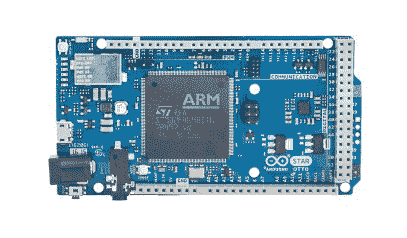
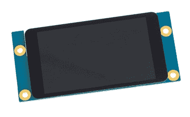

# Arduino SRL 公司的 Federico Musto 展示基于 ARM 的新型 Arduino 主板

> 原文：<https://hackaday.com/2016/05/27/federico-musto-of-arduino-srl-shows-new-arm-based-arduino-boards/>

在 2016 年湾区创客大会上，我采访了 Arduino SRL 公司的总裁兼首席执行官 Federico Musto。他们公司正在展示几款准备最早在下个月发布的新主板。他们与 Nordic Semi 和 ST Microelectronics 合作，推出了一些非常强大的产品，我们将在下面的视频中讨论这些产品。

 [https://www.youtube.com/embed/OTjQdQGnhzA?version=3&rel=1&showsearch=0&showinfo=1&iv_load_policy=1&fs=1&hl=en-US&autohide=2&wmode=transparent](https://www.youtube.com/embed/OTjQdQGnhzA?version=3&rel=1&showsearch=0&showinfo=1&iv_load_policy=1&fs=1&hl=en-US&autohide=2&wmode=transparent)

这些新主板被称为 Arduino Primo、Arduino Core、Arduino Alicepad 和 Arduino Otto。

第一款是 Primo T1，这是一款符合 UNO 外形的主板。这个装了一个有趣的潘趣酒。主微不是 Atmel 芯片，而是北欧 nRF52832 ARM Cortex-M4F 芯片。除了具有浮点支持的高速 CPU 之外，Nordic IC 还内置蓝牙 LE 和 NFC 功能，并且该板内置 PCB 天线。

在 UNO 上，这是硅片的终点。但在 Primo 上，你可以获得两个以上的控制器:一个 ESP8266 和一个 STM32F103。前者显而易见，它为聚会带来了 WiFi(包括空中编程)。STM32 芯片提供外设控制和调试。调试是一项有趣的开发，在 Arduino 领域很难实现。这将使用 OpenOCD 标准，将[platformio.org](http://platformio.org/)作为推荐的 GUI。

同样的 nRF52 微控制器也出现在 Arduino 内核和 Alicepad 上，它们的目标是可穿戴电子设备。Alicepad 的圆形外形模仿了 Lilypad 常见的可缝合形式。

  Arduino Star Otto  Arduino Star LCD

Arduino 的其他产品是马力真正变得疯狂的地方。Otto 板拥有一个巨大的 STM32F469:一个 169 引脚的 ARM Cortex-M4F，时钟频率为 180 MHz。该芯片有一个荒谬的内置外设分类，你不太可能用完引脚或 CPU 周期。它也有一个硬件图形加速器，所以毫不奇怪，Otto 背面有一个 DSI-IF 连接器，旨在插入在活动中展示的 LCD 屏幕[:一个 480×800 的电容式触摸显示器。奥托还包括一个 ESP8266 来提供 WiFi(为什么不呢？).](http://www.arduino.org/products/accessories/arduino-star-lcd)

我对这一点有一些疑问。首先，Otto 和 LCD 有一个产品系列代号“Star ”,它将被分配给所有具有 STM 控制器的主板。这似乎有点令人困惑(星奥托，星液晶显示器等)，但我猜他们想区分他们从“正常”的 Arduini。但是这些设备会不会变得太复杂而不适合 Arduino 这个名字呢？也许吧，但是 UNO 会一直陪着你，新的主板会给你更新更强大的功能。这种复杂性能否被轻松利用将取决于软件库和 IDE。毕竟，我认为唐纳德·帕普在本周早些时候提出了一个很好的观点，即 Arduino comfort 在定制电子工作中的价值。

### 诉讼

最后，我问费德里科是否有任何关于 Arduino 对 Arduino 商标诉讼的消息。他在大约一年前就这个话题和我们谈过，但是目前他没有新的信息给我们。(美国法院的案件最早可能在今年 7 月做出裁决，所以他*可能没什么可说的，但我不得不试一试。)*

费德里科谈到了两个 Arduinos 之间的冲突，并表示早在他到公司之前，这种冲突就已经在公司内部酝酿了。这两家自称 Arduino 的公司似乎都在试图通过新的董事会和新的举措来超越对方，并朝着不同的方向前进。如果有光明的一面，那就是这场竞争最终可能会为我们打造出比单一公司更好的硬件，因为两家公司都在押注什么会让他们在这场游戏中领先。