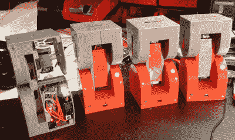
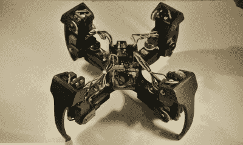
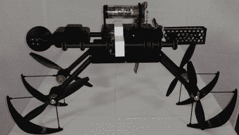

# hacklet 109–复杂的 3D 打印项目

> 原文：<https://hackaday.com/2016/05/28/hacklet-109-complex-3d-printed-projects/>

如果你看不出来，这个月我们正忙于 3D 打印机和打印项目。到目前为止，我们已经介绍了[打印机](http://hackaday.com/2016/05/14/hacklet-107-3d-printing-projects/)，以及[简单功能的 3D 打印](http://hackaday.com/2016/05/21/hacklet-108-simple-functional-3d-prints/)。本周，我们来看看 Hackaday.io 上一些令人惊叹的复杂 3D 打印项目。

复杂的 3D 打印项目包括机器人、四轴飞行器、卫星跟踪系统等等。所以让我们跳进来看看 [Hackaday.io](https://hackaday.io) 上一些最好的复杂 3D 打印项目吧！

 我们先从【阿尔贝托】和 [Dtto v1.0 模块化机器人](https://hackaday.io/project/9976)说起。Dtto 是【Alberto 的】2016 年[黑客日奖](https://hackaday.io/prize)的参赛作品。Dtto 的灵感来源于李小龙著名的水之语录，是一个模块化的蛇形机器人。Dtto 的每个部分都是双铰链接头。当两部分靠在一起时，磁铁会帮助它们对齐。一个伺服控制的闩锁牢固地对接这些部分，然后它们协调工作。Dtto 可以自动连接和分离网段，无需人工干预。[Alberto]看到了像[Dtto]这样的机器人在搜救和太空行动中的应用。

下一个是【Szabolcs Lőrincz】带着 [Broke Hackers 的模型铁路](https://hackaday.io/project/2250)。读过史蒂文·利维的经典著作《黑客》的人都知道，模型火车和硬件黑客齐头并进。不幸的是，模型火车已经贵得令人望而却步。Broke hackers 的模型铁路是完美的解决方案。几乎每个部分都是 3D 打印的。走线是带有铜带导体的 3D 打印部分。机车有一个 3D 打印的框架。自动化轨道开关使用 3D 打印线轴上的手绕线圈。这也不是一条愚蠢的铁路——一个树莓皮控制着行动，确保火车准时到达。

 接下来我们有【Rob】跟 [Quadrup3D](https://hackaday.io/project/8336) ，他的 3D 打印四足机器人。Quadrup3D 使用 12 个结实的遥控式伺服系统来移动它的四条腿。带蓝牙的 Arduino 负责车载处理。这个机器人是由 25 个独立的 3D 打印部件组成的。从中间的框架到腿，几乎每一个主要的结构件都被一台 FDM 台式打印机打印出来了。[Rob]使用他的 SpaceMouse Pro 作为遥控器。笔记本电脑处理来自鼠标的命令，并将它们发送给机器人。使用这样的控制方案可以让[Rob]快速轻松地为他的四条腿的朋友试验不同的步态和姿势。

 终于有了【tlankford01】与 [LOKI 4G(定位观察克拉克隔离)第四代](https://hackaday.io/project/4049)。谁说不能 3D 打印自己的无人机？LOKI 的大部分主要部件都使用 3D 打印零件。碳纤维棒充当四轴飞行器的脊柱。骑在这些杆上的是 3D 打印的螺旋桨护罩、电池座和电子外壳。最有趣的部分之一是 3D 打印的万向节，用于稳定空中视频。洛基被用作[项目伊卡洛斯](https://hackaday.io/project/1336)、【tlankford01】偷猎者狩猎 3D 打印固定翼无人机的测试骡子。

如果你想看到更多令人敬畏的复杂 3D 打印项目，请查看我们新的[复杂 3D 打印项目列表](https://hackaday.io/list/11919)！如果我错过了你的项目，不要害羞，只要[在 Hackaday.io](https://hackaday.io/adam) 上给我留言。这就是本周的 Hacklet。一如既往，下周见。同样的黑客时间，同样的黑客频道，带给你最好的 [Hackaday.io](https://hackaday.io/) ！