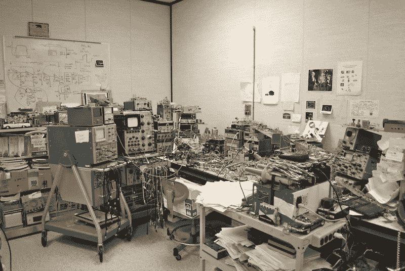
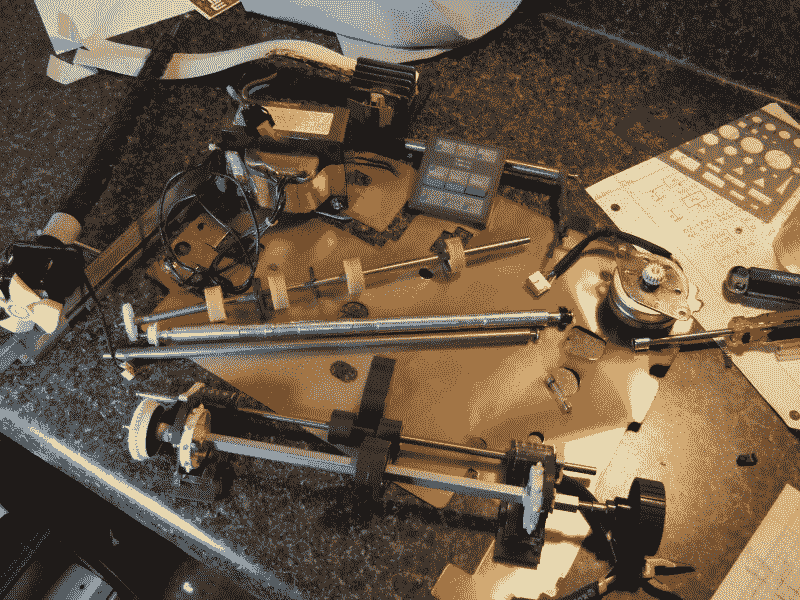
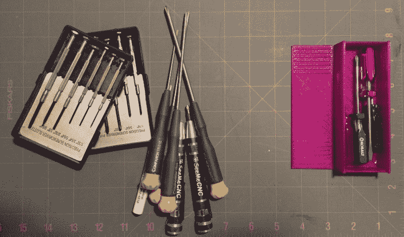
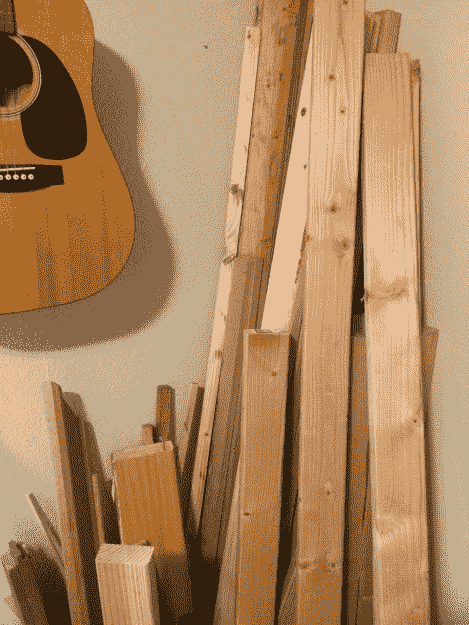
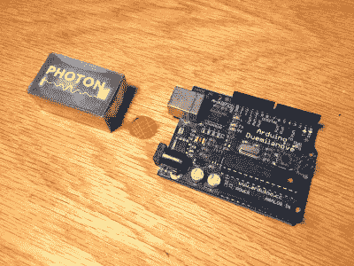

# 工艺之路:扔掉它的艺术

> 原文：<https://hackaday.com/2016/05/31/path-to-craftsmanship-the-art-of-throwing-it-away/>

一些黑客在他们周围建立尖锐的、轻度有毒的零件、组件和廉价物品的巢穴。这些鸟巢虽然不舒服，但确实很舒适。他们允许黑客的精神居住在一个和他们的思想一样混乱的地方。在这些堆满东西和杂物的墙内，令人震惊的黑客们在一片咒骂声中蜂拥而出。这篇文章不适合他们。

Very few of us can actually function in a workplace such like that of the venerable [Jim Williams](http://www.computerhistory.org/atchm/an-analog-life-remembering-jim-williams/) (photo from linked article). Thanks to the commenters for mentioning him in the previous [article](http://hackaday.com/2016/05/12/safety-cleanliness-documentation-and-more-habits-that-make-your-work-better/).

对于我们其余的人来说，杂乱是一个破坏禅宗的，似乎不可征服的怪物，它从我们头脑的黑暗角落嘲笑我们糟糕的纪律和组织能力。然而，有一个容易的解决方案经常被忽视。有些明显的是，大多数组织问题可以通过简单地不用组织东西来解决。

我花了很长时间才意识到我杂乱的根源。我的第一个策略是责怪自己没有能力跟上混乱的局面。一个更高级的人肯定能够运用他们毫不费力的纪律来保持一个空间的有序。然而，杂乱是一个问题的症状，与我保持空间整洁的实际能力完全无关。

当一个雇主雇佣了一个质量控制人员时，我第一次意识到扔掉东西的力量。质量控制人员做的第一件事就是在工作场所四处走动，采访人们，并做细致的笔记。最大的抱怨是工作区的不可用性。我们有各种各样的箱子和归档物品的程序，但我们就是无法掌控它们。

所以，他做的第二件事是主持一个 [5S 活动](https://en.wikipedia.org/wiki/5S_(methodology))。5S 中的第一个“S”是“排序”。当“分类”时，一个人做的第一件事就是从工作空间扔掉或移走所有不必要的物品。在第一次活动中，在一个我称之为七人小办公室的地方，我们扔掉了一集装箱的东西。我们通过捐赠或出售来处理掉第二个集装箱的东西。我从这件事中得到了一件重要的东西。

> 哇！在一个没有无用垃圾的地方工作真的是一件很棒的事情！

当然，意识到这一点之后，“等等，为什么文件系统一致性检查要在我的房子里保存所有无用的垃圾？”

所以，东西必须被处理掉，但是怎么处理呢？囤积东西不仅有经济方面的原因，肯定还有心理方面的原因。理解这两件事的真正影响是掌控你的空间的第一步。下面是一张幻灯片，展示了随着时间的推移，我的工作空间越来越整洁，因为我养成了更好的习惯，但也以一种戏剧性的方式减少了我拥有的东西的数量。

此幻灯片需要 JavaScript。

## 为什么我拥有我所拥有的无用的东西？

理解为什么我们一开始就不应该把它带进我们的空间，这将有助于我们适应分离焦虑，克服它，并扔掉这该死的东西。

## 不要赌博。

我花了很长时间才弄明白，为什么我会因为买了打折时多出来的一盘《蓝色画家》的录像带或者车库拍卖时发现的很酷的东西而感到愚蠢。我是说，这是笔好交易。对吗？为什么我觉得我只是用我的钱玩吃角子老虎机然后输了？

任何时候你购买或持有你现在不需要的东西，你都是在赌“未来的你”需要它，以至于现在锁定资本并利用空间储存它的成本低于未来的回报。这个赌注很少会有回报。这违背了黑客思维的自然状态。难道不应该把它放在手边，这样黑客攻击就能尽快发生吗？俗话不是说，“一旦你扔掉它，你就会需要它。”

I found this cool stuff in an IBM dot matrix printer. I moved it through three different apartments and two states before I admitted it was garbage and threw it away.

## 你心里全是重量。

至少以我的经验来看，保留我不需要的东西更多的是为了让自己感觉良好，而不是为了真正完成工作。我喜欢手头上最酷的部分，并坚持幻想，赌博，我会在未来这样做。扔掉那部分就是放弃已经完成这个项目的我的幻想版本。我喜欢抓住可能性。然而，我发现做一个项目是值得的，坚持许多未完成的项目是令人沮丧的。

储存物品需要付出实实在在的精神、金钱和物质代价。一旦东西开始从一个空间移走，采购习惯会得到更多的控制，精神压力会减轻；头脑开始想要走向成本最低的道路。

## 我应该保留什么？

这篇文章的前面已经提到了，但是空间中唯一应该存在的东西是工作继续进行所必需的。很难说这些东西到底是什么，因为每个黑客的需求都是不同的，但是我会试着列出一些我认为应该遵守和不应该遵守的例子。请记住，这份清单是为我的需求量身定做的，你的需求可能完全不同。

#### 示例保持:

1.  一套 M3 螺母和螺栓。我存有这些。我总是在我的各种建筑中使用它们，我每周至少把盒子拿出来一两次。
2.  工具:我认为工具是工作的推动者。如果可能的话，我不会扔掉工具。但是，我确实会扔掉多余的工具。比如说。我有一把尺子，不是两把。
3.  胶水、胶带、润滑剂和化学品:我有两盒胶水、胶带和有用的化学品。我每周至少打开一次盒子。偶尔我会整理盒子，扔掉很久没用过的东西。

Here’s a pile of screwdrivers I removed from my toolbox recently. The purple box on the right covers the entire range of small size screw turning I need.

#### 范例不保留:

1.  春季系列。几年前我买了一套春季服装。到目前为止，我已经把它搬过了五个居住空间，打开了五次盒子。我本应该为我需要的弹簧支付更多的钱，而不是储存一堆我不需要的弹簧。
2.  粉丝。我有一大包粉丝。我一直觉得粉丝是有用的，但是我很少使用它们，而且有些很奇怪，实际上，我甚至看不到它们的用处。
3.  木材。我开始做木工，在一些橡树上发现了很多东西。现在我有了许多形状奇怪的橡木块。我还以为我会造更多的桌子，所以我有很多多余的 2x4s。它占据了大量的空间。由于我不是一个普通的木工，我最好为一个项目购买木材，然后在完成后扔掉废料。事实上，如果我最终放弃或出售木材，它将主要是亏损的，我从大量购买中得到的任何节省都将失去。

Okay, so I haven’t learned my lesson yet. Don’t do this to your workspace. Destined for a Craigslisting soon.

## 良好的计划比保持备用更好。

自从我开始减少身边的东西，我注意到了一个有趣的副作用。因为我不是为我手头的零件设计，所以我为我能订购或获得的零件设计。这意味着我将使用正确的 spring，或者最新的开发板。例如，通过购买那台布满灰尘的 Atmega168 Arduino，我基本上锁定了 30 美元到 2009 年的科技高峰。然而，如果我没有买下并保存它，当我开始构建我的项目时，我会简单地订购那里最好的。只要花五分之一的价钱，我就能买到一块 ESP8266 板，并拥有 WiFi 功能。如果我想对此感到费解，通过不在库存中保留不必要的物品，我已经升级了我的项目并获得了利润。

除此之外，它迫使我慢下来。周末度假有很多乐趣，但两个周末的度假通常会更好。三个周末？诺贝尔奖，最低。一个周末来设计、规划和订购。又是一个集合的周末。

## 我应该如何买东西？

有几件事我总是习惯于做，感觉像是好的实践，但从长远来看，实际上是浪费金钱或制造混乱。一个很难克服的心理问题是购买“超值”的东西。举个愚蠢的例子，你不会买一桶五加仑的牛奶。你知道在你拿到它之前它会变坏。水桶甚至放不进你的冰箱。然而，购买一卷三磅重的焊料或两卷相同颜色的打印机灯丝确实很容易，但这完全是一回事。如果世界很快就会出现焊料或灯丝短缺，那么可能会有更大的问题需要解决。比如外星人入侵，或者发型不好的总统。

Bought many years apart. The photon is 15 dollars less than I paid and way more capable. The Arduino was on sale, so I thought it would be a good thing to have around. Still haven’t used it. Disclosure: The Photon was given to me by Particle to evaluate.

如前所述，不要购买项目不需要的东西。如果我需要两个弹簧，我总是倾向于买三个。我发现这是错误的方法，除非我完全打算在项目完成后扔掉所有多余的东西(这是在废物中建造的)。相反，我应该带着纪律和目的的头脑来处理我的项目，并着手建立它而不失去一个春天。同样，如果我需要两罐喷漆，我也不会买三罐。除非我打算马上把第三罐退回商店。拿着一罐喷漆以备不时之需没有任何好处。我有一个装满东西的盒子，它很快就要离开我的家了。

精心管理和妥善保管的钱比锁在缓慢贬值的资本中的钱要好。我有一些在 Arduino 出现之前买的 Atmel 168s。贴纸发黄了，我可以保证我永远不会用它们。我宁愿要二十美元，也不要那些薯条。

最后，我不会毫无目的地去旧货店。我有一份我正在寻找的工具的清单。如果我去车库拍卖，看到一套漂亮的水龙头出售，我不会买。它不在我的清单上。最主要的是，这导致我不怎么去旧货店，但是我的钱包和周围的环境感谢我。

## 分类:去掉不必要的。

我开始写一个很长的段落，讲述一旦我决定需要删除，我如何从我的工作空间中删除项目，但是我意识到我正在尝试打出一个决策树。所以我做了一个流程图，展示了我处理物品时的心理过程。

The best that free flowchart software can provide.

## 结论

最后，扔掉东西是很难的。这是需要练习才能擅长的事情。确实有关于这个主题的书。科学一点就好。我真的用这个吗？如果没有这个我该怎么操作？我会在盒子上写下日期，如果六个月后它还在积灰，我会把它扔掉。

我的经验是越少越好。管理工作空间中的物品是控制他们的思想和工艺的人的行为。而那些随心所欲的人不太可能把日常工作做到他们满意的程度。除非他们是吉姆·威廉姆斯。