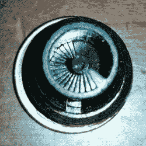

# 这个 DLP 3D 打印机构建进行得非常顺利

> 原文：<https://hackaday.com/2016/06/06/this-dlp-3d-printer-build-is-going-really-well/>

我们假设[丹·比文]有一天起来说，“我要做我自己的树脂 3D 打印机，有树脂管理和先进的分离机制！”这是一个建造日志，显示了如何有可能推出自己的树脂打印机。

Prints on a dime!

这台机器还没有完工，但它印出的样片已经给人留下了深刻的印象。[丹]中途停止打印，以获得这张照片的细节在楼梯上的标准车酷刑测试。

[Dan]想从他的机器中得到许多功能，而一些更精致的商业打印机现在才提供这些功能。一个非常好的方法是滑动和扭转分离，而不是倾斜。这将使打印过程中各层之间的分离更干净，故障率更低，打印时间也更快。

他还用蠕动泵增加了树脂管理。这减小了构建槽的尺寸，并且较少的树脂将暴露于自然环境并被浪费。这也意味着打印机可以无人值守运行。在打印机的树脂处理区，他还添加了一个碳空气过滤器。这让他可以运行更高性能的树脂，而不会让他的房子和家里充满气体。

我们喜欢[丹]跑在前面把打印机组装起来的方式。他甚至指出，这台机器上的组装部件让他有足够的时间为 3D 打印机打印出功能更强的零件——在 3D 打印机上。我们期待下一期。