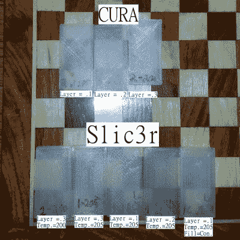
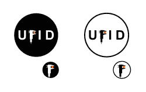

# 问黑客日:材料数据库

> 原文：<https://hackaday.com/2016/06/09/ask-hackaday-material-databases/>

随着越来越多以前的工业过程在家庭商店中上线，人们发现获得以前由十万美元机器的制造商为他们的三百美元深圳特餐提供的信息并不容易。

Some early work from UFID shows how even different Slic3rs can change the expected material properties of a filament.

一个常见的例子是，一名黑客从亚马逊购买了一台全新的 3D 打印机，价格高得令人难以置信。经过一个星期的修补，一个小火，和一些更换零件后，他们让它工作。在他们按照制造商推荐的设置烧穿打印机附带的几百克灯丝后，他们会对不同的灯丝进行小批量订购。现在麻烦来了，每台打印机都有点不同，每根灯丝都有不同的属性。大多数人发现他们放入打印机的第二卷灯丝根本不工作。为您的打印机配置获取正确的温度、冷却和进纸设置的最快方法是什么？

这对于昂贵的机器来说不是问题。激光切割机制造商 Epilog 为你可能切割的每种材料提供了一个设置网格，根据他们出售的每种激光切割机的不同属性进行调整。昂贵的工业 3D 打印机也是如此，每个(非常昂贵的)材料卷轴都位于外壳的芯片中。当线轴插入机器时，它会读取设置并相应调整。所有的调音工作都是在某个实验室完成的，理论上，打印是有保证的。

Your Oshpark order would get delayed, your Lulzbot support case would be dropped, Teensies would ship late, and the Amp Hour would just be the EEVBlog Podcast if this bar burnt down, but it was a great event!

当我们在 2016 年湾区 Makerfaire 展会上时，我们有机会与[Gauthier de Valensart]交谈，并在[hack aday 聚会](http://hackaday.com/2016/05/25/how-to-have-a-beer-with-every-electronics-person/)上为他买了一瓶啤酒。[Gauthier]来自比利时，他是一家初创公司的创始人，该公司拥有一个花哨的新顶级域名:filaments . directory。[filaments . directory](http://filaments.directory)的目标是创建一个 3D 打印机材料数据库，并将其与用户的 3D 打印机设置联系起来。最终目标是，就像工业打印机一样，用户可以简单地扫描条形码，或者在 RFID 阅读器上挥动卷轴，将所需的设置输入到他的切片软件或打印机中。

这听起来对我来说很熟悉，不仅仅是因为我已经开始做它，作为 repables.com 的扩展，那是我生活中更大的焦点。事实上，我记得，当我在 [MRRF](http://hackaday.com/tag/mrrf/) 向人们谈论这个想法时，他们一直告诉我有人在做一个类似的项目。我想把[Gauthier]介绍给当时参与这个项目的人。因为我在一个满是业内人士的酒吧，我有点无助地在我的位置上旋转，试图找到一个可能记得的人。我发现了 MRRF 的一位普通与会者，并向他询问。好的，这很简单，[谁知道]告诉我们这是他的项目…介绍完毕。向你展示了买一堆书呆子啤酒是多么好的社交活动。

They got a pretty okay logo while they were at it.

该项目被称为“[通用细丝识别系统](https://plus.google.com/communities/107859862288161234107)”，它提出“……消除猜测工作”，通过“……开发一种方法，用于标记、跟踪和识别机器可读格式的 3d 打印细丝……”该项目现在似乎基本上已经死亡，其领域只是一个占位符。我认为它遭受了标准开源特性的侵蚀，但是这个想法是合理的。

这就引出了一些问题。创建这样一个系统有很多困难。首先是数据收集。谁应该负责测量细丝、激光切割材料或任何其他需要调整设置的过程？当然，对于制造商来说，理想的轨道是让他们自己负责并报告他们灯丝的设置。然而，许多灯丝制造商依靠用户的无知来销售不可靠的产品，这样做只符合少数高质量产品的利益。如果用户这样做，那么如何审查所提供的信息？你肯定不希望有人对故障热敏电阻的无知促使你在 280℃下运行 PLA。

越来越多的困难出现了。信息应该如何传递等。甚至应该记录哪些属性？UFID 甚至使用颜色传感器来跟踪 3D 打印机制造商批次之间的颜色。最终，它是关于通过使用众包在一个没有标准的行业中创造标准。无论哪种方式，看看[Gauthier]在做什么(并给他发送一些反馈)，阅读 UFID 的积压，想想上次使用激光切割机时获得正确的设置是多么烦人，并在评论中让我们知道你的想法。