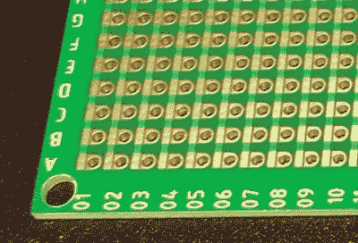
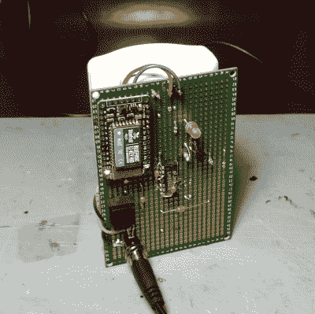

# 评估独特创新的 Perf+原型板

> 原文：<https://hackaday.com/2016/06/16/evaluating-the-unusual-and-innovative-perf-protoboard/>

早在 2015 年，[王贲]试图用 Perf+重新发明原型板。不久之后，一些改进(更方便的孔尺寸和更好的阻焊膜等)产生了我购买的更新版本[。这是一个有趣的概念，在用它制作了我的第一个板后，这里是我对它做得好的地方，它的使用感觉，以及它在研讨会中的位置的想法。](https://www.crowdsupply.com/ben-wang/perf-2)

## 性能+概述

One side of a Perf+ board. Each hole can selectively connect to the bus next to it with a solder bridge. These bus strips are vertical. The ones on the back are horizontal.

Perf+是双面带扭曲的 perfboard。在左边的图像中，每列单独的孔旁边都有一辆公共汽车。每个孔可以通过焊料桥选择性地连接到其相邻的总线。这些总线走线相互独立，在图示一侧垂直延伸，在背面水平延伸。

因此，默认情况下，每个孔都是隔离的，但可以连接到电路板任一侧的一条、两条总线走线，也可以不连接。由于这些走线一端垂直，另一端水平，因此电路板上的任何孔都可以连接到电路板上的任何其它孔，只需两个焊桥，无需一根跳线。

这是一个创新的想法，但它是 perfboard 或 busboard 的合理替代品吗？我用它组装了一个简单的原型。

## 选择测试项目

Laziness Defender Prototype, made with a Perf+

我选择了一个有趣的想法，组件数量很少，我称之为**懒惰卫士**。这是一种现代的自动化[老板钥匙](https://en.wikipedia.org/wiki/Boss_key)。

懒惰卫士是一个运动传感器，一旦装备，当它感应到运动时，就会向配对的计算机无线发送一个`alt-tab`。用户将它放在蓝牙范围内的任何地方，将其对准他们工作区域的入口点，按下“arm”按钮，然后享受自动(和静音)`alt-tab`在有人入侵他们的个人空间时将他们的纸牌游戏切换到视野之外。

不需要一只手悬停在`alt-tab`上方，一只眼睛盯着走廊！保持警惕需要做很多工作，如果一个人想要工作，他们会去工作而不是在网上看视频。

Demonstration. The unit on the left only requires power. It sends an `alt-tab` wirelessly via Bluetooth HID when motion is sensed.

## 硬件要求

Screw terminals left to right: Normally closed trigger, +9-12V in, normally closed tamper switch. Click to enlarge.

运动感测由一个多余的 PIR 传感器处理，该传感器接受 9-12V DC，并提供一个常闭开关，当感测到运动时打开。(这些在安全系统中很常见，其中警报是一个常闭回路，任何一个传感器都可以通过打开它来触发。)无线发送`alt-tab`是用一个 [Adafruit EZ-Key](https://learn.adafruit.com/introducing-bluefruit-ez-key-diy-bluetooth-hid-keyboard/overview) 完成的，它接受 3-16V，充当蓝牙键盘。我将其配置为当输入引脚被拉低时发送`alt-tab`。

还需要一个控制器，因为简单地将 PIR 传感器耦合到 EZ-Key 无法完成这项工作，原因有二:一是 PIR 传感器的输出脉冲太长；它导致触发的按键自动重复。第二个问题是，该单元不应该在传感器每次看到运动时都发送一个`alt-tab`*；这会导致行为失控。硬件必须只被允许在它被明确地给予许可时触发。此外，为了避免不得不摆弄不同的电压水平，一切都应该运行在 9-12V DC。*

如果我是为知道 Arduino 是什么的人建造这个东西，而不是其他人，那么[我可能会使用 Arduino](http://hackaday.com/2016/05/23/why-i-go-through-so-many-arduinos/) 来让他们轻松地调整和微调原型的行为。但事实并非如此，因此 LM556 将完成所需的一切。556 是一个 DIP 封装中的两个 555 定时器。第一个 555 配置在双稳态模式，像一个设置复位锁存。这用于让 PIR 传感器仅触发一次，并要求在再次触发之前通过按下“arm”按钮手动重新装备。另一个 555 配置为单稳态模式，作为单次定时器；一旦由 PIR 传感器通过第一个定时器触发，它就可以将 EZ-Key 的输入拉低大约四分之一秒，从而避免整个自动重复按键问题。触发后，在再次按下“arm”按钮之前，不会发生任何事情。

This circuit allows a PIR sensor with an indeterminate pulse time to reliably trigger the EZ-Key input once only, and only when armed. A falling edge on pin 4 causes pin 9 to be pulled high for a quarter second. Re-triggering is not possible until pin 6 is brought low again by pressing the “arm” button momentarily. Click to enlarge.

## 使用 Perf+的程序集

EZ-Key at top left. “arm” button directly below. Barrel jack connector for power under that, with leads bent out and soldered direct to Perf+ board pads. (Click to enlarge)

Perf+板上安装了:

*   一个 2.1 毫米中央正极电源插头，用于从墙壁适配器输入 9-12V 电压
*   一个 LM556 和各种电容和电阻(为简单起见，大多数为 0.1uF 和 10k)
*   一个 Adafruit EZ-Key(作为蓝牙 HID 键盘)

PIR 传感器通过 4 根电线连接(两根用于电源，两根用于常闭激活开关。)Perf+板像“背包”一样安装在 PIR 传感器上。

原型懒惰防御者是通过直接潜入组装的；换句话说，在试验板上测试，然后像垃圾盒项目一样从原理图中拼凑出来，就好像我在使用普通的性能板或总线板来快速完成工作一样。我尝试将 Perf+用于所有信号路由，除了两个电容直接焊接到 LM556 引脚之外，我这样做了，因为到那时，我必须进行一些非常复杂的连接才能使它们工作，而且我已经在跟踪 Perf+板上的东西时遇到了问题。

有一个名为 [Perfy](https://github.com/Myndale/Perfy) 的开源工具，它允许可视化和布局连接，以生成在 Perf+板上何处焊接、桥接和切割的计划，但我不认为它对以特定方式组装项目非常有用。

## 我学到了什么

*   

    Back of the populated Perf+ board, hardly looks used at all. Click to enlarge.

    Perf+确实允许我在不使用一根跳线的情况下构建一个原型。电线会占据很大的空间。没有电线意味着电路板更小、更整洁。

*   通过 Perf+进行的连接不是很直观，因此我发现电路板很难排除故障。与使用 perfboard 或 busboard 相比，直观跟踪信号路径的工作量要大得多。
*   跟踪信号路径有时会因为看不到任何已安装组件的下面而受到影响。
*   我发现在黑板上标出一些常见的信号很有用。我做的第一件事就是用记号笔连接并标记+V 和 GND 公交线路，以便以后识别。我会喜欢在识别号码/字母旁边有一个小的白色丝网印刷方块，我可以用少量的记号笔进行颜色编码。
*   我将 DIP 安装在水平走线侧，我希望在焊接 DIP 之前切断 DIP 下方相对引脚之间的水平走线，或者至少将 DIP 安装在垂直总线走线侧。由于 DIP 相对两侧的引脚几乎不需要相互连接，因此使用 14 条较短的总线走线(每个引脚一条)比引脚对之间的 7 条长总线走线更有意义。一旦我将 DIP 焊接到水平总线侧，我就无法再触及总线走线来切割它们，因为它们位于 DIP 下方。这也是我最终将两个小电容直接焊接到 DIP 引线上的原因之一，这样更简单。这本身就是一个学习点。
*   手边有良好的照明和放大倍率是非常重要的。当我需要一个焊接桥时，我从来没有遇到过问题，但我的眼睛已经不像以前那样了，我经常需要放大才能确保焊盘只在需要的地方桥接。
*   手边有焊芯来移除桥是非常宝贵的。仍然需要放大来验证桥被完全移除。
*   对孔的一侧施加过多的热量会使另一侧的焊接跳线无法桥接。
*   只要有可能，就要使要直接连接的元件相互正交，这样两者之间的连接就可以用一条总线来完成。沿着一条总线线路直观地跟踪连接还不算太糟糕，但是一旦你需要翻转电路板以跟随它到另一边，就很难跟踪了。
*   用一把锋利的美工刀切割公交线路就足够了。放大倍数对于确认痕迹被干净彻底地切割是非常宝贵的。

## Perf+适合哪里？

Perf+可作为 PCB 的替代品，用于不需要任何更改或返工的少量成品单元。结果是没有电线，看起来很干净，这可能值得用像 [Perfy](https://github.com/Myndale/Perfy) 这样的工具来规划布局和连接。

Perf+也可用作直接的 perfboard 替代产品，其额外优势是可以非常轻松地实现简单的总线连接。知道何时远离 Perf+上的复杂布线，支持偶尔的跳线(或直接与引线的点对点焊接)绝对会使以后的故障排除或修改变得更加容易。

我喜欢看到原型工具的创新。Perf+和它的系统简单而有效，但是给你足够多的绳子去上吊。利用 Perf+的内置走线和焊桥实现电路板的所有连接是可能的，但即使在我相对简单的电路板上，也很快变得太复杂，难以实现。只有当 Perf+对您和您的设计明显有益时，发挥它的优势才更有意义。