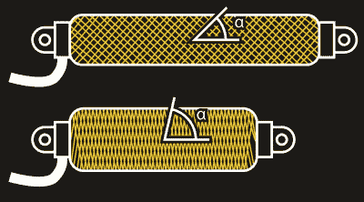
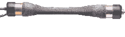
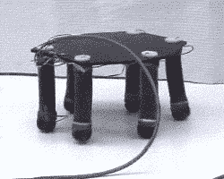
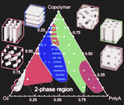
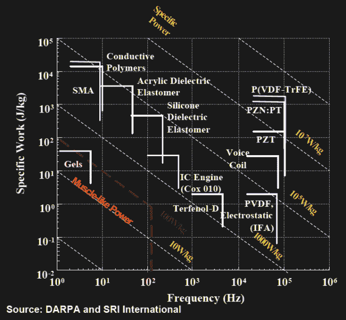
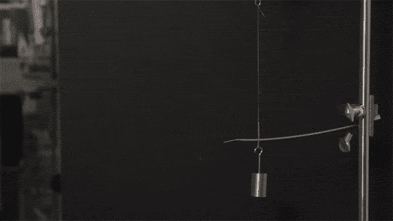
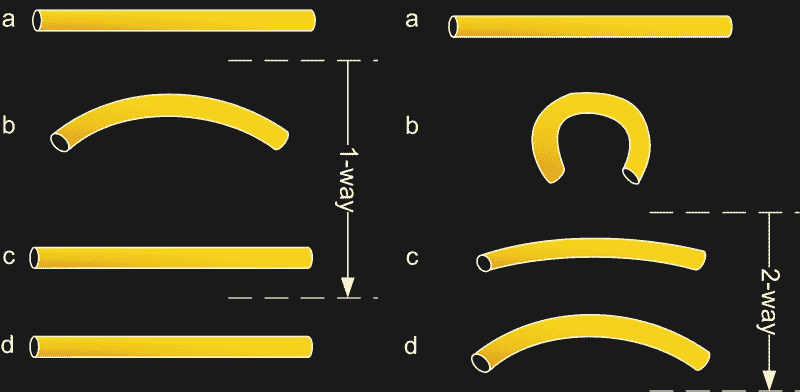
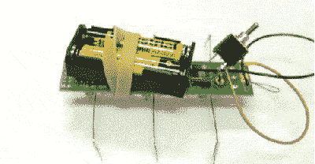
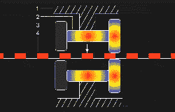
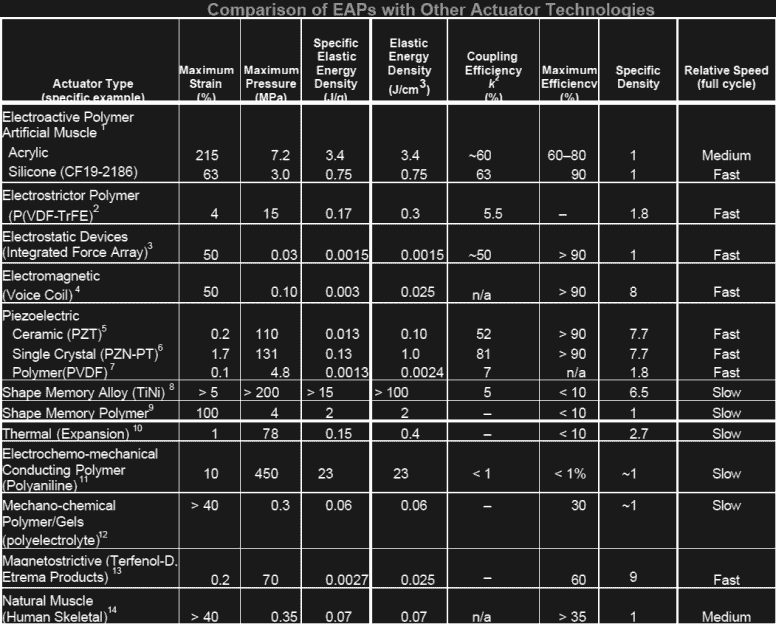

# 缓解机器人紧张的人造肌肉

> 原文：<https://hackaday.com/2016/06/06/artificial-muscles-to-bring-relief-to-robotic-tenseness/>

定制的机器人假肢正在兴起。在许多项目中，黑客和制造商已经接受了挑战。从 Enabling The Future、Open Hand Project、OpenBionics 到 Hackaday.io 上的无数[假肢项目。然而，为它们中的大多数提供动力的机电一体化系统仍然来自上个世纪。一天结束时，你只能在一只塑料手里安装这么多微型马达和齿轮，在它变成一个缓慢而沉重的砖块之前，只能在一只手臂或腿上安装这么多液压装置——弊大于利。如果我们有几个额外的这种轻便、快速和强大的驱动器来帮助我们度过一天就好了。要是我们有人造肌肉就好了。](https://hackaday.io/search?term=prosthe*)

根据普遍接受的定义，人造肌肉是一种能够响应外部刺激可逆地改变其形状的装置或材料。然后，这种形状变化可以用于驱动，模仿自然肌肉。从这个意义上说，一个简单的液压缸不符合人造肌肉的条件，主要是因为它的两个部分都不会在运行中改变形状。相比之下，一根根据温度改变长度的钓鱼线确实可以称为人工肌肉。几十年的研究带来了有前途的技术，那么我们什么时候可以开始安装它们呢？

## 气动人工肌肉

它们有许多名称，如 McKibben muscles(以其发明者 J. L. McKibben 命名)、air muscles 或气动人工肌肉(PAM)。原则上，它们由一个可充气的橡胶囊组成，囊内有一个~~中国手指夹~~圆柱形螺旋缠绕编织物。当空气压力施加到气囊时，气囊在约束编织物内部膨胀，约束编织物通过改变其编织角度将膨胀力重定向为收缩力。然而，肌肉收缩得越多，编织角变得越陡，并且沿着肌肉的长度轴传递的力越小。这也给编织材料施加了压力，编织材料必须承受数倍于肌肉施加的收缩力。

Animation of a PAM in operation (by [Rocketmagnet](https://en.wikipedia.org/wiki/Pneumatic_artificial_muscles#/media/File:Sam_animation-real-muscle.gif) CC-BY-SA 3.0)

此外，膀胱内的压力必须比肌肉在收缩方向上所能承受的压力高几倍。即使使用了非常坚固的编织材料，并且忽略了编织角度的影响，肌肉仍然会抵抗其内部气压而收缩，从而限制了收缩率和收缩力。肌肉收缩得越多，它能发挥的力量就越小。对于未加载的肌肉，典型的收缩率可以在 25%和 35%之间。当然，基于 PAM 致动器的假肢或机器人需要一个强大的压缩机来给肌肉加压，同时还需要大量的控制阀。它们发明于 20 世纪 50 年代，当然不是最新的突破，但 PAM 仍在机器人领域实验性地使用。它们便宜、轻便、易得，也是 DIY 机器人的一个很好的起点。

This “Pneupard” is actuated entirely by PAMs ([Video source](https://www.youtube.com/watch?v=wpQyvufTswQ)).

## 电活性聚合物(EAP)

基于聚合物的人工肌肉避免了气动人工肌肉的许多缺点。这些材料通常响应于通过附着在材料上的电极传递的高压电场而经历形状变化。

EAP actuated hexapod [Video source](https://www.youtube.com/watch?v=7Qxvyw5tUko)

Phase diagram of EAP blends. [Image source](https://www.youtube.com/watch?v=VPrdPRFrKMs&t=15m17s)

大多数 EAP 是聚合物、共聚物和油的混合物，以复杂的 3D 几何形状组装。混合比决定了材料的分子结构和性质。铁电或压电材料用于获得它们的电活性特性。就应变比、强度和效率而言，EAPs 是目前最有前途的人造肌肉技术之一。

然而，经过几十年的研究，EAPs 的根本障碍仍然存在:功率输出。有压电聚合物、介电致动器(DEAs)、电致伸缩接枝弹性体、液晶弹性体(LCE)、铁电聚合物等等。它们的工作原理完全基于分子内、分子间或静电力。这些力作用在很短的距离上，并随着变形的增加而不成比例地减小。此外，EAP 在单个循环中运行，在该循环中，完全收缩的全部机械功输出必须被传递:一旦 EAP 完全收缩或膨胀，它就不能再次执行相同的分子相互作用来进一步收缩或膨胀。

This diagram of specific power output for various artificial muscle types shows that, in theory, some electroactive polymer actuators can deliver a performance similar to natural muscles (left lower corner), however, practical values can still be 10 to 100 times lower. (Source: [nasa.gov](http://ndeaa.jpl.nasa.gov/nasa-nde/lommas/eap/actuators-comp.pdf))

Electroactive expansion and contraction of carbon nanotube aerogel bundle ([Video source](https://www.youtube.com/watch?v=xMGXqT0LWUI)).

解决这个问题的一个办法可能在于碳纳米管。它们的高导电性、强度和存在于从致密束到气凝胶的大范围密度中的能力可能在未来开启新的 EAP 材料。已经发现扭曲的碳纳米管束的电活性膨胀超过 200%，同时还提供 50 W/kg 范围内的比功率，这使它们与天然肌肉处于同一联盟。

然而，尽管各种各样的 EAP 已经可以在市场上买到，并获得了广泛的应用，从无噪音的阀门致动器到声学换能器，基于碳纳米管的人造肌肉仍然是一个研究课题，并不是一种你可以购买和使用的材料。

## 热驱动人工肌肉

类似于 EAP，热致动材料根据温度改变它们的形状。钓鱼线实验是这种装置的一个很受欢迎的例子。这表明一根普通的聚乙烯线，基本上是钓鱼线，已经是某种肌肉:只要加热，它就会收缩百分之几。通过扭曲和盘绕绳子，有可能创造出一种热驱动的人造肌肉，它可以收缩大约 50%，并产生高达 4 千牛/厘米 ² 的压力。不幸的是，钓鱼线肌肉在负荷下收缩得很少。尽管如此，它们的重量轻，响应时间快——考虑到快速的主动加热和冷却系统——导致比功率输出甚至可能超过天然肌肉的性能。

The fishing line muscle experiment carried out by its original discoverers from the University of Texas at Dallas ([Source video](https://www.youtube.com/watch?v=1A2LUbJjDQ0)).

形状记忆合金(SMA)是钓鱼线更强的替代品。形状记忆合金是一种金属合金，可以根据温度改变形状。这是可能的，因为形状记忆合金与其他合金不同，可以以两种相共存:马氏体和奥氏体。在其冷却状态下，SMA 保持在马氏体相中，并且可以塑性变形。如果 SMA 随后被加热到其转变温度以上，它将改变到其奥氏体相，该奥氏体相“记忆”并恢复其原始形式。即使在它再次冷却后，它仍将保持其原始的、未变形的形状。这种操作模式被称为单向形状记忆，在这种模式下，SMA 仅记得其初始状态。在其他训练方法中，双向形状记忆可以通过使 SMA 在其冷却状态下严重变形来实现。当加热到转变温度以上时，它仍然会返回到其原始状态，但是一旦再次冷却下来，它又会回到变形状态。

The procedures are very similar: starting from martensite (a), adding a reversible deformation for the one-way effect or severe deformation with an irreversible amount for the two-way (b), heating the sample (c) and cooling it again (d) (caption and images by [Wikipedia](https://en.wikipedia.org/wiki/Shape-memory_alloy), image [source 1](https://en.wikipedia.org/wiki/Shape-memory_alloy#/media/File:SMAoneway.jpg), [source 2](https://en.wikipedia.org/wiki/Shape-memory_alloy#/media/File:SMAtwoway.jpg) CC BY-SA 2.5)

This little robot “Stiquito” is actuated by tiny nitinol muscles ([Video source](https://www.youtube.com/watch?v=znPM2Ssb920)).

SMAs 在许多行业中具有多种应用，并且由于它们的强度和寿命，它们也被考虑用作人造肌肉。然而，它们也不是没有缺点。例如，与其他材料相比，它们的运行速度非常慢，这限制了它们的总功率输出。此外，由于高纯度钛是高性能 SMA(例如镍钛诺)的主要原材料，这些材料仍然非常昂贵。

## 天然肌肉

天然肌肉响应电刺激，将化学能直接转化为机械能。它们的效率可能很低，大约 25%“从食物到脚”，但考虑到它们兼作临时能量储存，并实际上将输送给它们的化学能的 50-65%转化为可用的机械功，它们很好地为我们服务。

在微观层面上，肌肉看起来更像微机械组件——与当今应用中的机器和技术没有太大区别。事实上，“肌肉收缩的滑动细丝模型”显示了与位置型直线运动致动器的许多相似之处。

Myosin filaments with myosin motors (green), Actin filaments (red) ([Source video](https://www.youtube.com/watch?v=CepeYFvqmk4))

在天然肌肉的收缩过程中，纤维状蛋白质分子的头部，可以被称为肌球蛋白马达，反复执行冲程运动，这被称为动力冲程。重复的击打导致爬行运动，这使得肌球蛋白纤维主动将自己拉入肌动蛋白丝之间。这个过程由富含能量的 ATP 分子提供燃料，ATP 分子在这个过程中被分解。

这种非常微小的线性马达被称为肌节，它的主要机械部件是肌球蛋白和肌动蛋白丝，以及将一切联系在一起的膜。每一条天然肌肉纤维都是由无数的这些肌节组成的。

Piezo “inchworm” motor animation: Just like the myosin motors crawl along the actin fibers, piezo motors “walk” along a surface. (Animation by [LaurensvanLieshout](https://en.wikipedia.org/wiki/Piezoelectric_motor#/media/File:Piezomotor_type_inchworm.gif) CC BY-SA 3.0)

在任何肌肉的核心，机械功是由无数肌球蛋白分子的动力冲程传递的，这种冲程是化学诱导的形状变化。然而，肌肉的实际收缩是通过重复冲程实现的——类似于一些压电马达的爬行运动——以及相关组件在彼此之间滑动的能力——类似于液压缸组件。通过将分子形状变化和分子间结合力的好处与复杂的微观力学相结合，自然肌肉可以在收缩约 30%的同时产生高达 33 N/cm ² 的力。它们的功率输出达到每公斤肌肉质量 100 W 左右。因此，作为基准，天然肌肉仍未得到满足，但电活性聚合物，尤其是基于碳纳米管的化合物，正在迎头赶上。在他们找到进入机器人领域的方法之前，可能还有很长的路要走。尽管如此，潜力还是存在的，而且现在是开始尝试无障碍技术的好时机，比如空气肌。

EAPs are on the way – be prepared. (Source: [nasa.gov](http://ndeaa.jpl.nasa.gov/nasa-nde/lommas/eap/actuators-comp.pdf))