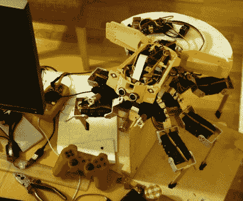

# 六足坦克从幽灵的外壳中复活了

> 原文：<https://hackaday.com/2016/06/03/hexapod-tank-from-ghost-in-the-shell-brought-to-life/>

时不时有人会受到很大的启发，这种冲动不会消失，直到有东西被创造出来。对[Paulius Liekis]来说，这导致了[根据电影*幽灵在壳中*T5]创建了 T08A2 六足“蜘蛛”坦克的大约 1:20 比例版本。正如他所说，“这是我很久以来就想做的事情，我必须把它从我的系统中清除出去。”它使用了两台 Raspberry Pi 计算机、28 台伺服电机，并需要超过 250 小时的 3D 打印来完成所有精心建模的作品，甚至还需要更多时间来完成打印后的抛光、锉磨、绘画和其他收尾工作。油漆工作是壮观的，有着好看的磨损。如果能看到它在运动，那就更好了——请看下面嵌入的视频。](http://gits-tank.com/)

 坦克使用定制软件来处理步态控制，还有一个 Unity 3D 管道，用于建模和回放从 3D 模型导出的姿势(动画)序列。坦克可以通过 PS3 操纵杆控制，但它也有一定程度的自主权，因为它可以检测和跟踪面部。

网站上的信息没有深入到本质的技术细节，但有大量关于建造过程的精彩照片。

这不是第一次有人受到《蛋壳里的幽灵》的启发；我们还看到了一个用乐高制成的[工作机器人，它可以像节目中一样驾驶和行走。](http://hackaday.com/2012/04/03/working-tachikoma-brings-the-manga-to-life/)

[https://player.vimeo.com/video/168164892](https://player.vimeo.com/video/168164892)