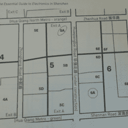
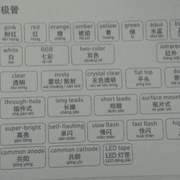
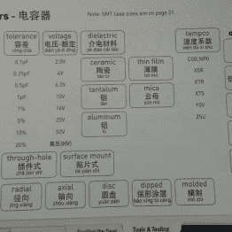

# 黑客日链接:2016 年 6 月 5 日

> 原文：<https://hackaday.com/2016/06/05/hackaday-links-june-5-2016/>

欧洲粒子物理研究所正在举办黑客马拉松。是的，是在 10 月份，但是注册将在 6 月 15 日截止。他们每年都这样做，这次黑客马拉松产生的项目多种多样，包括无基础设施导航、宇宙射线探测器和充气冰箱。

有没有那种焊料烟雾提取器？[这里有一个明显的改进](https://www.flickr.com/photos/24125157@N00/26713348174/)。[多国语言]把一条发光二极管放在他的焊料烟雾提取器的框架周围，为主体提供更多的光线。

几个月前，[邦尼]开始写一本书。这是深圳电子产品的基本指南。它是为硬件黑客设计的，使用简洁明了的界面，让他们知道如何在深圳买东西。这些书现在正被运往世界各地。我有一个，下面是迷你评论:太棒了。是完整的旅游指南吗？不，但是如果你让我在香港国际机场下车，我可能 1)到深圳 2)买随机发光二极管 3)找一家旅馆 4)喝一杯啤酒 5)不死。下图。

      

你们是黑客，这意味着你们是为那些“制造者”建造东西的人。没有 MBA？没问题，[【达夫·琼斯】支持你](https://www.youtube.com/watch?v=UwrkfHadeQQ)。他重做了几年前销售硬件视频的经济学。这是 25 分钟长，给你足够的信息，所以你不是一个完全的商业设计白痴。

就像塞在东西里的覆盆子尿？[这是一个被塞进大容量磁盘盒的 Pi 0](https://hackaday.io/project/11955-mega-pi)。现在有人拿起 Sonic 和 Knuckles cart，构建一个 ROM 阅读器，并做一个适当的 cart-reading 模拟器。

如果你对 R/C 感兴趣，你应该知道 Flite Test。他们是用美元树泡沫板制作疯狂的模型飞机的人，已经让数百人迷上了这个爱好。再过一个多月，Flite Test 将举办他们自己的 con，[飞行节](http://flitefest.com/)。这是在俄亥俄州，从去年对该事件的报道来看，这似乎是一个非常酷的时间。

所以，[无人区](http://www.no-mans-sky.com/)快出了。这是一个以程序生成的无限星系为背景的太空游戏。有人知道如何组建黑客部落吗？应该有人成立一个黑客部落/联盟/什么的。我在核心处等你们。