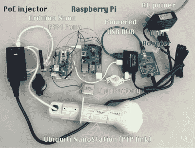

# 网络安全剧场

> 原文：<https://hackaday.com/2016/06/20/network-security-theatre/>

夏天快到了，随之而来的是全球最大规模的安全研究人员聚会的准备工作。8 月初，研究人员、极客、书呆子和其他非常酷的人将来到内华达州拉斯维加斯的沙漠，讨论软件的漏洞、硬件的漏洞和政府实体的可疑活动。这是黑帽和 DEF CON，合在一起是这个星球上最大的安全会议。

这些会议有一个非常重要的目的。与学术界不同，安全专业人员不会通过在期刊上发表文章来出名。安全世界的等级秩序是在这些会谈中决定的。最好的谈话和最好的媒体报道需要更高的咨询费。这是一个经济体，当然总会有人准备好利用这个系统。

像学术界一样，这些演讲都是同行评议的。会谈前发布的新闻稿不是，安全研究人员的知识和技术新闻之间是网络安全剧场。在这个网络安全舞台上，你不需要有趣的漏洞、技术或设备，你只需要让合适的人相信你有。

### ProxyHam

安全研究人员使用媒体和生活博客来增加他们在安全会议上的存在的最明显的例子是 ProxyHam。这个为 DEF CON 23 计划然后取消的演讲，为一个在线匿名框奠定了基础，这个匿名框将使任何人免受美国国家安全局的窥探和戴巴拉克拉法帽的敌人的攻击。

犀牛安全公司(Rhino Security)的本·考迪尔(Ben Caudill)创造的 ProxyHam 最初是通过一篇连线文章向世界发布的，这篇文章承诺使用现成的 900MHz 网桥提供一种保持在线匿名的简单方法。通过将网桥的一端放在公共场所，例如星巴克或公共图书馆，任何人都可以在几英里外接入 WiFi 信号。“克格勃不是在踢你的门，”文章承诺，“他们是在踢 2.5 英里外的图书馆的门。”

仅仅两个星期后，[Ben Caudill]宣布 ProxyHam 将不会在 DEF CON 上展示。演讲被取消，发布被取消，源代码被销毁。互联网随后陷入疯狂。猜测的范围从国家安全信件，落入邪恶的联邦通信委员会官员手中，禁言令，到联邦检察官的模糊威胁。

一些人在迫害情结中找到安慰，没有什么比含糊地提到政府压制言论更有趣的了。ProxyHam 的案例要有趣得多:本·考迪尔没有黑掉几个 900MHz 的网桥和一个树莓 Pi，而是黑掉了媒体。【本】非常小心，没有给任何人任何理由来解释他为什么取消了他的演讲，这让各种猜测在推特和博客世界里蔓延开来。

ProxyGambit — Samy Kamkar’s superior take on ProxyHam

更简单，更合理，也是唯一可能的原因是为什么 ProxyHam 会谈被取消了，这是非常平凡的。ProxyHam 太烂了。你可以在 Newegg 上自己建一个。它不会让你有安全感；一次性笔记本电脑比四英尺长的天线更能让你在网上匿名。

就在 ProxyHam 被取消的消息向急切的媒体公布几天后，[Samy Kamkar] [发布了一个版本的 ProxyHam，它实际上可以通过 2G 蜂窝连接工作](http://hackaday.com/2015/07/16/proxygambit-better-than-proxyham-takes-coffee-shop-wifi-global/)。在一次取消的 DEF CON 会谈之后，勘误表安全公司的[戴夫·梅诺]和[罗伯特·格拉汉姆]一起制作了[proxy ham 的代理，它在噪音层](http://hackaday.com/2015/08/07/def-con-the-proxy-for-proxyham/)下工作。

在两周内，几个独立的研究人员复制了 ProxyHam，并创建了两个改进的实现。两者都是研究和工程的杰出成就。现在问问你自己:谁得到了最多的媒体关注，在谷歌搜索他们的名字时有更多的搜索结果，现在可以收取更高的咨询费？这是网络安全剧场，也是魅力不再是垃圾的世界的必然结果。

### 等等，app 有权限？

就在黑帽 2011 年的前几天，新闻在互联网上炸开了锅，称[智能手机容易受到流氓应用程序的攻击](http://www.forbes.com/sites/andygreenberg/2011/07/18/researchers-show-android-vulnerable-to-app-hijacking-attacks/)。来自 Privateer Labs 的[Riley Hassell]和[Shane Macaulay]将在 Black Hat 发表演讲，主题是即将到来的 Android 操作系统中应用和权限的勇敢新世界。

两次袭击将在黑帽剧院上演。第一个是 AppPhishing，它在第二个应用程序上插入了一个虚假的登录屏幕。如果攻击者想要您的脸书登录，攻击会检测到脸书应用程序何时启动，并显示一个弹出窗口要求用户登录。这些证书将被送到不知名的地区和个人手中。

第二次攻击，AppJacking，并不是针对某个 app 盗取登录。相反，自定义应用程序会劫持应用程序进行非预期的活动。任何下载到手机上的应用程序都可以发送短信、拨打电话，或者作为一个庞大的移动僵尸网络中的一个节点。可怕的东西。

尽管演讲“为盈利而入侵机器人”被安排在 2011 年的黑帽大会上，[莱利]和[谢恩]没有出现。为什么？官方理由是，“防止全球消费者面临不可接受的风险窗口，并保证到期的信贷。”根据谷歌的说法，“[被发现的漏洞并不存在于安卓系统中。](http://techcrunch.com/2011/08/12/mystery-android-vulnerability-not-detailed-by-prudent-hackers/)

虽然[赖利]在放弃 Black Hat 几个月后，在 2011 年的 Hack In The Box 上做了同样的演讲，但他的研究并没有对 Android 的架构产生影响。[同样的漏洞在 2014 年](http://www.modzero.ch/modlog/archives/2015/04/01/android_apps_in_sheeps_clothing/index.html)被重新发现，有力地表明全球消费者几乎没有风险。

### 我是斯巴达克斯

比特币于 2008 年发明，自那以后成为最受欢迎的加密货币。比特币的重要性不可低估——它是拜占庭将军问题的解决方案，区块链的想法将彻底改变几个领域，而且经济中的每一个货币单位和交易都可以被计算在内的事实提供了自魔兽世界和 T2 前夕以来最大的经济研究财富。

比特币是由[中本聪]发明的，他是某人的别名，但我们不知道是谁。因为每一枚单独的硬币都可以被追踪，而且因为[Satoshi]开采了第一批硬币，所以[Satoshi]有一个非常简单的方法来证明他的身份:要么炫耀比特币钱包，要么花掉几个第一批比特币。

就事实检查和确认而言，没有比这更简单的了。如果有人自称是[Satoshi]，他们需要做的就是往钱包里转几个比特币，或者用[Satoshi]的私钥签个什么东西。无论如何，保证信息来自特定的人几乎是比特币的全部意义。这并没有阻止任何人声称自己是[Satoshi]而不提供这种证明，也没有阻止记者让这些人。

最高调的声明来自*【新闻周刊】* ，他显然发现了一个生来就叫‘中本聪’的人。没有人努力去确认这个(聪)的身份——无论是通过区块链分析，还是通过询问采访对象他是否创造了比特币。

虽然(真实的，非化名的)[中本聪]陷入了他不明白的事情，但其他比特币内部人士非常愿意填补(比特币创造者)[Satoshi]的空缺。2015 年 12 月， [*《连线》*宣布比特币的创造者其实是澳大利亚学者【克雷格·史蒂夫·赖特】](https://www.wired.com/2015/12/bitcoins-creator-satoshi-nakamoto-is-probably-this-unknown-australian-genius/)，他在 2008 年写了几篇博文向世界介绍比特币。这就是用来将[赖特]归为[聪]的证据。这不可能，[因为大家都知道我在 2006 年](http://hackaday.com/2006/06/08/i-just-invented-bitcoin/)发明了比特币。

比特币社区再次翻白眼，等待(赖特)转移一些原始(聪)硬币，或者签署一项交易。来自 BBC 和《经济学人》的记者们确实目睹了一场演示，演示中[赖特]似乎用[聪史]，[的签名签署了什么东西，但这是一场骗局](https://dankaminsky.com/2016/05/02/validating-satoshi-or-not/)。[Wright]提供了足够的证据证明他是[Satoshi],足以进行三分钟的审查。再多一点，整个骗局就会被揭穿，但在此之前会有几篇文章发表，而且[赖特]会得到他渴望已久的名声。

### 我们应该把这个搬到百老汇

黑帽和 DEF CON 是声名鹊起的地方。有时发生在佩珀孔，有时发生在酒店。对于安全研究人员来说，声誉是通过演讲获得的。这可能会让你在一个技术博客中被提及。有一种方法可以保证覆盖率:保释谈话。你也可以简单地撒谎。

对安全漏洞、隐私设备或可怕的电子小玩意的迷恋不会停止，只要有让自己出名的动机，网络安全剧院就会继续下去。在接下来的几周里，你将会看到很多关于 DEF CON 和 Black Hat 计划会谈的媒体报道。不要注意那个。这两项活动的时间表将很快公布。读了这些你就没事了。