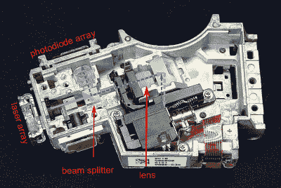
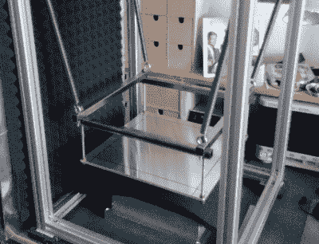
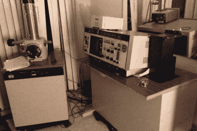
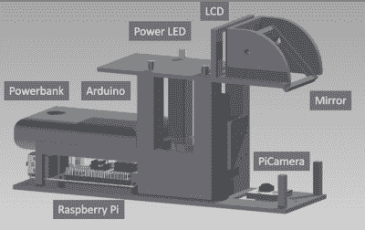

# hack let 111–高级显微镜项目

> 原文：<https://hackaday.com/2016/06/11/hacklet-111-advanced-microscopy-projects/>

上周在 Hacklet 上，我们报道了光学显微镜项目。这些是我们很多人在工作中甚至在家里的长椅上熟悉的望远镜。这些是你通常可以用你的眼睛或未改装的相机使用的观测镜。本周我们来看看让小东西看起来大的更极端的方法。电子流和单个原子的力量可以用来创建难以置信的放大图像。因此，让我们直接进入 [Hackaday.io](https://hackaday.io) 查看最先进的显微镜项目吧！

 我们先从【andreas.betz】和[blu beam——一种扫描激光显微镜](https://hackaday.io/project/9205)说起。[Andreas]的目标是创造一种扫描共焦显微镜。[衍射极限](https://en.wikipedia.org/wiki/Diffraction-limited_system)是标准光学显微镜的定律。虽然你不能违反法律，但你可以找到绕过它的方法。[共焦显微镜](https://en.wikipedia.org/wiki/Confocal_microscopy)是一种在医学和工业中经常使用的技术。共焦显微镜通常非常昂贵，远远超出了一般黑客的预算。[Andreas]希望通过使用 PlayStation 3 蓝光光驱的部件创建扫描共焦显微镜来打破这一障碍。光驱使用音圈来保持聚焦。[Andreas]必须创建一个带有音圈驱动器的定制 PCB 来操作 PS3 光学组件。他还需要驱动激光器。BluBeam 仍然是一项正在进行的工作，所以请继续关注它！

 接下来是【马蒂亚斯。]用 [DIY 扫描隧道显微镜](https://hackaday.io/project/11829)。开放大气扫描隧道显微镜在 Hackaday.io 上很受欢迎，我在 [Hacklet 103](http://hackaday.com/2016/04/09/hacklet-103-piezo-projects/) 中报道过【Dan Berard】的创造。受丹的启发，[马蒂亚斯]正在建立自己的 STM。

环境振动是高倍显微镜的一个大问题。[Matthias]正在通过使用挤压铝建造一个振动隔离平台来解决这个问题。他目前正在研究 STM 前置放大器，该放大器将纳安 STM 值放大并转换为可由数模转换器读取的电压。[Matthias]使用久负盛名的模拟器件 ADA4530 来完成这项任务。输入偏置为 20 毫微微安(！)应该是由任务决定的。

 接下来我们有【杰瑞·比勒】又名【麦康纳】带着[日立 S-450 扫描电子显微镜](https://hackaday.io/project/3281)。扫描电子显微镜必须是显微镜食物链的顶端。杰里得到了一台 20 世纪 80 年代的老式日立扫描电镜，它已经不能用了。这个问题原来是几年前用绝缘胶带做的一次不可靠的修理。几年的使用之后，[Jerry]对他的旧机器做了很多改进。他学会了如何用钨丝制作自己的灯丝。慢油扩散真空泵已被涡轮分子泵取代。扫描电镜现在放在[杰里]的起居室里，保持相对恒定的温度。

 最后，我们有【beniroquai】带[Holoscope——超分辨率全息显微镜](https://hackaday.io/project/11621)。全息镜是一种通过利用光的物理特性来提高标准照相机分辨率的装置。被放大物体的精确微小移动会引起反射图像的微小变化，这种变化被树莓 Pi 相机捕捉到。然后，Pi 可以使用相位数据重建更高分辨率的图像。[beniroquai]在这个项目上投入了大量的时间，甚至牺牲了一台昂贵的索尼连接相机来献给 ESD gods。我跟随着这一个。我迫不及待地想看到[beniroquai]的第一批图片。

如果您想查看更多先进的显微镜项目，请查看我们新的[先进显微镜项目列表](https://hackaday.io/list/12173-advanced-microscope-projects)！如果我错过了你的项目，不要害羞，只要[在 Hackaday.io](https://hackaday.io/adam) 上给我留言。这就是本周的 Hacklet。一如既往，下周见。同样的黑客时间，同样的黑客频道，带给你最好的 [Hackaday.io](https://hackaday.io/) ！