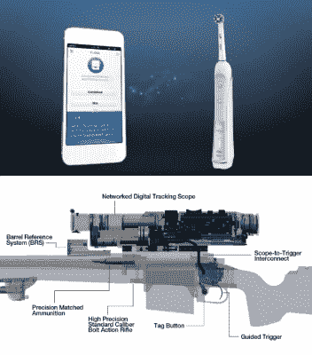
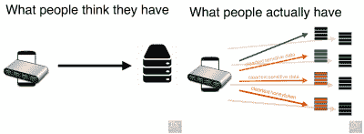
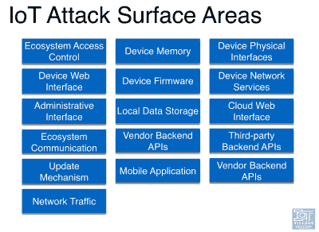

# “物联网安全”是一个空洞的术语

> 原文：<https://hackaday.com/2016/06/13/iot-security-is-an-empty-buzzword/>

用时髦的话来说，“物联网”非常聪明，同时也非常令人厌恶，原因是一样的。“物联网”基本上可以指任何东西，所以这是一个大帐篷，包容性的趋势。如今，从美泰到菲亚特克莱斯勒，每家公司都需要物联网业务战略。但与此同时，“物联网”是空洞的——一个适用于一切的名称无法澄清任何事情。

这是一个问题，因为这些天“物联网安全”在新闻中无处不在。在喧嚣之外，有一些真正善良的安全专业人士正在勇敢尝试，以防止他们眼中的 20 世纪 90 年代 PC 安全惨败的重演。我为他们鼓掌。

但我要声明，一刀切的“物联网安全”政策注定要失败。好吧，这是一个稻草人的论点；任何一刀切的安全策略都注定会成为一堆废纸。更严重的是，我认为“物联网”一词弊大于利，因为它将完全不同的设备和不同的连接模式混为一谈，并暗示它们可以得到类似的对待。“物联网安全”是一个东西，但问题是它是一切，这意味着它一无是处。

从安全角度来看“物联网”这个说法有什么问题？只有两个字:“互联网”和“物”。

## 那东西

哪些东西构成了“物联网”是一个很容易的起点。如果你问 Mattel 它们是什么意思，他们会告诉你[你好芭比](http://hackaday.com/2015/11/24/hello-barbie-records-your-children/)。对于三星来说，它是你的冰箱。如果你问福特，他们会告诉你[是一辆车](http://www.telegraph.co.uk/finance/newsbysector/industry/engineering/11372205/How-connected-cars-are-driving-the-Internet-of-Things.html)。几年前，我参加了一个嵌入式电子产品交易会，有一家设计工厂机器人的公司告诉我他们的物联网战略。它变得[古怪](https://www.washingtonpost.com/investigations/cyber-search-engine-exposes-vulnerabilities/2012/06/03/gJQAIK9KCV_story.html):瑜伽垫、烤面包机、卫生棉条、[狙击步枪](https://www.youtube.com/watch?v=PEpuEprQ5VU)和[飞机](http://www.forbes.com/sites/ptc/2014/06/23/will-the-internet-of-things-revolutionize-the-aircraft-industry)。

One of these things is not like the other…

如果你能想出一个还没有在网上流传的东西，在评论中发表来测试你自己。或者更好的办法是，先寻求风险投资，然后再开发原型。(然后在交给客户后开始您的安全设计。)

关键是，如果不具体了解这些东西，就很难对安全性和物联网进行像样的讨论。你不需要或不想对一个会说话的儿童玩具采取和你对吉普车或特斯拉汽车一样的预防措施。一个人的恶意软件固件升级威胁到你孩子的隐私(可不是闹着玩的)，但后者的恶意升级威胁到你的生命。

如果在将一个东西连接到互联网时进行成本效益分析，那么应该根据不同的东西进行完全不同的分析。对事物进行某种分类是必要的。在我的脑海中，我看到“工业物联网”被用作一个术语，与消费物联网相比较。我想这是进步。

然而，出于安全目的，我认为根据它们的能力以及它们带来的潜在危险来考虑这些东西是合理的。“仅仅”记录数据的设备可能涉及隐私，而作用于现实世界的设备可能会对人造成身体伤害。设备的自主性也很重要。一些总是开着的东西，比如联网的冰箱，比一些不常使用的东西，比如联网的四轴飞行器，更有可能被滥用:在我的冰箱上植入木马，你可以窥探我的密码一整天，而四轴飞行器的电池在联网仅 15 分钟后就要没电了。

这只是一个开始。对事物进行严肃的、与安全相关的分类不是黑客作家的任务。然而，我的观点是，把玩具车和真车都称为“东西”并没有什么意义。起搏器这种东西比不上牙刷这种东西。

## 互联网

当你说你“在互联网上”找到了一个灯泡，你真正的意思是什么？是[防火墙](http://electronicdesign.com/communications/internet-things-needs-firewalls-too)吗？如果有，开放哪些端口？它连接到哪些服务器？通讯加密了吗？如果是这样，密码是由你控制的，还是内置的？他们对每件事都一样吗？光说“我们会放到网上”是没有意义的。这种联系的细节极其重要。

到目前为止，这是安全社区花费了大部分精力的地方，并且已经做了大量的工作。开放网络应用安全项目 [(OWASP)](https://www.owasp.org/index.php/About_OWASP) 有一个[物联网子项目](https://www.owasp.org/index.php/OWASP_Internet_of_Things_Project)，他们的[物联网设备安全测试清单](https://www.owasp.org/index.php/IoT_Testing_Guides)非常棒，如果不是(可能)详尽的话。

当你试图保护你的电脑，或者在互联网上运行服务器时，你有很大的优势。您可能知道您需要在防火墙中打开哪些端口，需要运行哪些服务，和/或您将与哪些目的地通信。即使是最便宜的家用路由器也能很好地保护其背后的电脑，因为人们的需求是可以预测的。我觉得我公公除了 80 之外没用过别的端口。物联网设备就不是这样了。

 【丹·米斯勒】去年夏天在 DEFCON(YouTube)上给[做了一次演讲，介绍了 OWASP 物联网项目，并详细介绍了物联网设备的攻击面。如果你感兴趣的话，它值得一看。任何认为互联网上的事情是单个设备与单个服务器对话的人都会大吃一惊。](https://www.youtube.com/watch?v=RhxHHD790nw)

[Dan]的演讲中最重要的一点是，至少对于像我这样的纸上谈兵的安全类型来说，物联网设备是一个生态系统，这意味着坏人可以攻击的面比你想象的或希望的要多得多。
 你的设备与服务器通信，确定，但那只是开始。这个东西可能也有一个基于网络的配置界面。它使用的任何服务(在“云中”)都有其应用程序接口，可能还有配置页面。为了方便起见，大多数设备还使用第三方 API，这意味着您的数据要到达比您想象的更多的目的地，通常是通过非标准端口。这东西的固件需要更新，所以这是另一个非常强大的攻击点。你的东西可能还会和你手机上的应用程序对话。(还有更多，不过你懂的。)

如果这些来源中的一些是可信的，你最好希望它们都是单独安全的，并且经过适当的认证。如果生态系统的任何部分不安全，那就是剥削者要利用的。事物与其他事物、服务或应用交织得越多，打破所有事物的途径就越多。

没有什么是不可能做到的——每一步都有最佳实践。事实上，这就是像 OWASP 和"[我是骑兵](https://www.iamthecavalry.org/)"和其他人正在努力做的事情。事实上，他们最大的贡献之一是指出了攻击面比银行服务器的攻击面要大得多。但如此笼统地定义这个问题，他们可能会将保护你的健身手表的任务变成保护“互联网”的任务。当然，现实中*可能*也有那么差。

## 物联网:物联网的名称

(明白我的意思了吧？甚至很难模仿“事物”,因为它已经很不精确了。)

从安全角度来看，“物联网”并没有描述太多有用的东西。一方面，它包括各种不同类别的设备，这些设备具有相应不同的安全需求。另一方面，它未能描述或界定需要保护的网络范围。说“物联网安全”除了警告听众他们可能需要担心一大类问题，以及不认为他们正在使用计算机的最终用户之外，并没有给仅仅说“安全”增加任何东西。

也许这个术语在其他地方也有用(它肯定对营销或从投资者那里获得资金有用)。但是当我在安全背景下听到这个消息，特别是来自媒体或者来自[政府](https://www.onthewire.io/ftc-warns-of-security-and-privacy-risks-in-iot-devices/)，我的眼睛转动了一下，我的胃有点翻——也许我应该为他们关注*感到兴奋，但是我很清楚他们不会说任何具体的事情。找出哪些描述性和有用的术语来取代“物联网”是留给读者的练习，但这可能会对该领域产生深远的影响。*

去死吧“物联网”！“联网的关键健康监测设备”和“带 WiFi 连接的汽车”万岁。