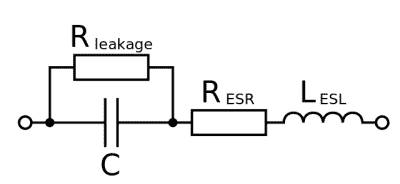
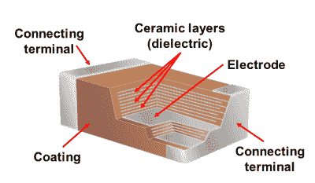

# 电容器以黑客的方式变得简单

> 原文：<https://hackaday.com/2016/06/21/capacitors-made-easy-the-hackaday-way/>

如果你经常构建电子电路，你可能会多次使用电容。它们和电阻器一样都是标准元件，电阻器的值是现成的。我们将它们用于电源平滑和去耦、DC 阻塞、定时电路以及许多其他应用。

[![Different capacitor applications. By Elcap (Own work) [CC0], via Wikimedia Commons](img/6c9357be179e679d31d2c99152311adf.png)](https://hackaday.com/wp-content/uploads/2016/06/capacitors-overlapping-applications.png) 

不同的电容应用。由 Elcap(自己的作品)[CC0]，via[Wikimedia Commons](https://commons.wikimedia.org/wiki/File:Capacitors-Overlapping-Applications.png)

然而，电容器并不仅仅是一个由两根电线和几个参数组成的斑点:工作电压和电容。有大量不同性质的电容器技术和材料。虽然在大多数情况下，几乎任何具有合适值的电容都可以完成这项工作，但您会发现，更多地了解这些不同的器件不仅可以帮助您完成这项工作，还可以尽可能做到最好。例如，如果您曾经不得不解决热稳定性问题或寻找这些额外 dBs 噪声的来源，您会喜欢这一点。

## 回归基础

最好从基础开始，先从基本原理描述电容，然后再看真正的电容。理想的电容器由两块导电板组成，中间由不导电的电介质隔开。电荷可以在极板上积累，但由于电介质的绝缘性质，电荷不能在极板之间流动。因此，电容器可以存储电荷。

电容以法拉为单位:一个 1 法拉的电容器在储存 1 库仑电荷时，电压保持在 1 伏。一法拉就像许多国际单位制单位一样，大小相当不切实际，因此在超出本文范围的超级电容器的狭窄领域之外，您更有可能遇到微、纳或皮法。你可以使用一个公式，从任何给定电容器的尺寸和电介质的属性中推导出它的电容，如果你感兴趣的话，这个公式可能值得[发到维基百科上](https://en.wikipedia.org/wiki/Capacitance#Capacitors)。除非你在准备高中物理考试，否则你不需要记住它，但它隐藏了一个重要的要点。电容与所用电介质的介电常数 *ε* [r] 成正比，这就产生了各种各样的商用电容器，它们使用不同的电介质材料来实现更高的电容范围或更好的电压处理特性。

Parasitic inductance and resistances of a real-world capacitor. User InductiveLoad, public domain, via [Wikimedia Commons](https://commons.wikimedia.org/wiki/File:Electrolytic_capacitor_model.svg).

在电容器中使用电介质材料有一个障碍，除了电介质的理想特性之外，还会带来许多令人讨厌的副作用。现实世界中的所有电容都有内部寄生电阻和电感，虽然很小，但有时会影响电容的工作。介电常数会随着温度或电压、压电或噪声而变化。不同类型的电容器可能有惊人的故障模式，甚至贵得令人瞠目结舌。接下来我们来看这篇文章的主要部分，我们将带您了解一些您可能会遇到的电容类型，并展示它们的各种特性，有好有坏。我们不会声称涵盖所有可能的电容技术，但是我们会浏览常见的电容技术，并检查您可能找到的任何子类型。

## 铝电解的

![A typical small aluminium electrolytic capacitor. By oomlout [CC BY-SA 2.0 ], via Wikimedia Commons](img/bfe288b66697d366b00d616f6cf9a47f.png)

典型的小型铝电解电容器。由 oomlout [CC BY-SA 2.0 ]，via[Wikimedia Commons](https://commons.wikimedia.org/wiki/File:CAPE-TH-X-UF470-VA_(16236695369).jpg?uselang=en-gb)

铝电解电容器使用铝片上的阳极氧化层作为其电介质，并将形成它的电化学电池的电解液作为另一个极板。因为它们是一个电化学电池，所以它们是极化的，换句话说，通过它们的任何 DC 电势必须总是与阳极板的方向相同。)，或者正极端子。

实际电解电容器的极板是铝箔夹层，卷成圆筒状，装在铝罐中。他们将有一个报价工作电压，这取决于阳极氧化层的深度。

电解电容的电容量最高，从 0.1 f 左右到几千 f 不等。由于电解电容是紧密卷绕的电化学电池，其等效串联电感较高，因此不适合在高频下使用。您通常会发现它们用于电源平滑和去耦，以及音频耦合。

## 钽电解

[![A surface-mount tantalum capacitor. By Epop [Public domain], via Wikimedia Commons](img/fe25afbc1826dbec61c51e3fa5d88606.png)](https://hackaday.com/wp-content/uploads/2016/06/618px-cms_tantalum_capacitor.jpg) 

表贴钽电容器。通过 Epop [Public domain]，via[Wikimedia Commons](https://commons.wikimedia.org/wiki/File:CMS_tantalum_capacitor.JPG?uselang=en-gb)

钽电解电容采用烧结钽阳极的形式，该阳极具有非常高的表面积，其上生长有厚的氧化物层，并且在其上施加二氧化锰电解质作为阴极。氧化钽电介质的高表面积和介电性质的结合意味着钽电容器具有非常高的单位体积电容，因此钽电容器比具有相同电容的相应铝电解电容器小得多。像铝电解电容器一样，钽电容器也是极化的，它们之间的 DC 电势必须总是同向。

钽电容的阻值约为 0.1 f 至数百 f，其泄漏电阻和等效串联电阻远低于铝制钽电容，因此可用于测试和测量、高端音频以及其他具有这些特性的应用。

钽电容有一种故障模式需要注意，它们以容易着火而闻名。无定形氧化钽是良好的电介质，而结晶形式的氧化钽是良好的导体。例如，对钽电容施加过大的浪涌电流会导致电介质从一种形式变为另一种形式，从而导致流经电容的电流大幅增加。令人高兴的是，并非所有的消息都是坏的，他们的火灾名声来自更早一代的钽电容器，改进的制造技术已经提供了更可靠的产品。

## 高分子膜

[![A variety of film capacitors. Elcap [GFDL], via Wikimedia Commons](img/d935ef2dcee0959914a9221177fcb4cd.png)](https://hackaday.com/wp-content/uploads/2016/06/640px-wiki-folkos-p1090317-1.jpg) 

各种薄膜电容器。Elcap [CC-BY-SA 3.0]，via[Wikimedia Commons](https://commons.wikimedia.org/wiki/File:Wiki-Folkos-P1090317-1.jpg)

有一整个系列的电容器使用聚合物薄膜作为电介质，薄膜要么夹在盘绕或交错的金属箔层之间，要么在其表面沉积一层金属化层。这些电容器的额定电压可以在 1000V 左右，但不具备高电容，从大约 100pF 到个位数 f 不等。所用的每种不同聚合物电介质都有其自身的特性，各有优缺点，但整个系列电容器的等效串联电容和电感都低于我们迄今讨论过的电解电容器。因此，您将看到它们被用于更高频率的应用，以及电噪声环境和通用应用中的电源去耦。

**聚丙烯**电容用于需要良好温度和频率稳定性的电路。您还会发现它们被用于电源抑制和其他电源电路，特别是用于高压交流的额定版本。

**聚酯**电容器不具备聚丙烯的温度和频率特性，但价格低廉，能够承受 SMD 焊接的高温。因此，你会发现它们被用作非关键应用中的通用电容。

**聚萘二甲酸乙二醇酯**电容器也没有稳定的温度和频率特性，但它们能承受比聚酯高得多的温度和电压。

**聚苯硫醚**电容器具有聚丙烯的所有温度和频率稳定性，并且能够承受高温。

你可能还会在旧设备中遇到聚碳酸酯电容器和聚苯乙烯电容器，不过这两种电介质现在已经不常用了。

## 陶器的

 

多层陶瓷电容器的构造由 Elcap(自己的作品)[CC0]，via[Wikimedia Commons](https://commons.wikimedia.org/wiki/File:MLCC-Construction.png)

陶瓷电容器有着悠久的历史，你会发现它们出现在从现在到上世纪初几十年制造的设备中。早期的陶瓷电容器是在任一侧金属化的单层陶瓷，而最近的例子还包括多层设计，其中金属化和陶瓷的交替层被构建以形成一组交错的板。它们取决于所用的电介质，电容从 1pf 到几十 F，电压到千伏。你会发现单层陶瓷盘和多层陶瓷表贴封装广泛应用于所有电子领域的多种小电容应用中。

考虑陶瓷电容时，最好根据所用的陶瓷电介质来考虑，因为正是这些电介质决定了它们的特性。陶瓷电介质被分类为[，用三个字母的代码表示它们的温度范围和温度稳定性](https://www.element14.com/community/docs/DOC-24189/l/ceramic-capacitor-dielectric-codes)，这里我们将根据这些代码来指代最常见的电介质。

**C0G** 电介质相对于温度、频率和电压具有最佳的电容稳定性。你会发现 C0G 电容用于谐振高频和其他高性能电路。

**X7R** 电介质不具有 C0G 的温度或电压特性，因此用于不太关键的应用。您通常会发现它们用于去耦和通用应用。

**Y5V** 电介质的电容比 X7R 高得多，但温度特性较差，最大电压较低。与 X7R 一样，它们也出现在通用电路和去耦电路中。

由于陶瓷通常也是压电材料，一些陶瓷电容也会出现颤噪。如果您使用高电压和可听频率，例如在电子管放大器或静电学领域，您有时可能会听到这种效果，因为电容器可能会“唱歌”。如果您使用压电电容器来提供频率稳定性，您可能会发现它是由周围环境的振动来调制的。

如前所述，本文并不试图涵盖所有电容技术。快速浏览一下电子用品目录，你会发现这里没有提到的几项技术，还有许多其他技术已经过时，或者它们的市场空间非常小，你很少会看到它们。相反，我们希望实现的是揭开你可能看到的一些常见类型的神秘面纱，并在你制作自己的设计时帮助你进行选择。如果我们已经吊起了你对更多元件下降的胃口，也许我们可以把你的注意力吸引到[我们关于电感器](https://hackaday.com/2016/04/14/most-of-what-you-wish-you-knew-about-coils-of-wire-but-were-afraid-to-ask/)的文章上。