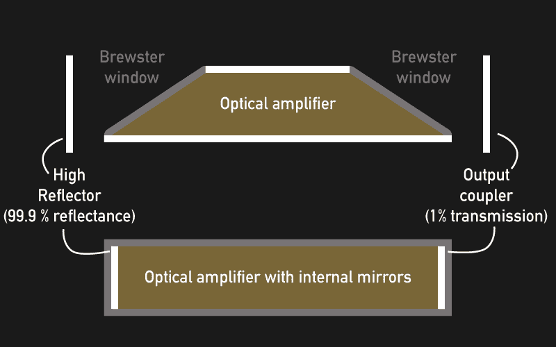

# 激光实际上是如何工作的

> 原文：<https://hackaday.com/2016/06/20/how-lasers-actually-work/>

激光是光放大器，光振荡器，在某种程度上，是有史以来发明的最复杂的光源。激光不仅非常有用，而且它们还是数量级的冠军:虽然不同的激光类型覆盖了来自辐射(<10 nm) over the visible spectrum to far infrared light (699 μm), their individual output band can be as narrow as a few µHz. Their high temporal and spatial coherence lets them cover hundreds of meters in a tight beam of lowest divergence as a perfectly sinusoidal, electromagnetic wave. Some lasers reach peak power outputs of several exawatts, while their beams can be focused down to the smallest spot sizes in the hundreds and even tens of nanometers. Laser is the acronym for **L**t**A**A**S**S**R**辐射的 **E** 任务的电磁频谱，这表明它利用了一种叫做受激发射的现象，但是，他们到底是如何做到的呢？是时候直视激光了(免责声明:不要！).

## 光学放大器

当我们谈论电信号的放大时，我们通常不太关心放大的信号是否实际上是原始信号——只是放大了而已。总线上微小的电子流可能会传输信号，但这个信号并不局限于精确的表示。我们可以通过变压器、光耦合器或压电传感器发送它，如果我们做得对，它就无关紧要了。如果一个放大的信号是一个好的、放大的拷贝，只要这个拷贝保留了我们感兴趣的原始信号的特性子集，我们就真的可以接受。

然而，光确实被束缚在它固有的电磁波形式上。为了理解光是如何被放大或复制的，我们需要看看光作为波和粒子的不同属性。作为一种波，它实际上只不过是通过空间传播的电场和磁场的同步振荡。为了放大它，我们会希望以某种方式增加这种振荡的振幅，同时保持其时间进程，如其相位和频率不变。然而，作为一个粒子，一个具有特定波长、方向和偏振的光子——我们所能做的就是增加更多。所以，如果拿这个光子，我们添加另一个具有完全相同属性的光子——可以说是一个副本——我们会看到电磁波的振幅也加倍了。它被放大了。

既然我们只能放大光，那么光放大器就必须包含某种光子复印机——只有这一个真的需要保持数字完整。在激光器中，复制光子的任务是由光放大器内部的特殊原子(或分子)完成的。它们被称为活性激光介质，例如在氦氖激光器中，它是氖气体。它所需要的只是一个容器，一个能源，以及某种让光线进出的窗户。从二氧化碳激光管上的激光二极管到光纤激光器，这个装置是所有激光器的关键元件。

## 如何制造光子

我们在日常生活中看到的大多数光子都源于一种叫做自发辐射的过程。原子和分子可以被刺激跃迁到比它们的基态更高的能量状态，其中外层电子离开它们的规则轨道，跃迁到更高能的状态。如果这种激发状态是长期存在的(亚稳态)，它们可能会在这种状态下停留相当一段时间，但总是保持一定的趋势，转化回较低的能量状态。迟早，它们会自发地这样做，同时以随机方向和随机相位发射特定频率的光子。这就是所谓的自发发射，发射光子的频率取决于高能态(E [2] )和低能态(E [1] )之间的能量差。紧凑型荧光灯~~，以及带有卤素填充物的白炽灯~~，都利用了这一现象。

## 如何复制光子

现在，如果一个确切频率为 f [21] 的光子与这样一个受激原子碰撞，它可以刺激原子立即跃迁回低能态，在它有时间自发这样做之前。这个原始光子的电磁场导致原子变成电偶极子，并随着外场振荡。这种深层的相互作用使得发射出的新光子与原来的光子具有相同的相位和方向，这使得它实际上是一个副本。关于激光的大多数特殊性质，如高单色性、相干性和衍射限制发散角，这种量子力学相互作用几乎是桶的底部。

然而，与受激发射相反，入射光子也可以进入处于低能基态的激光介质的原子中。这些光子将被吸收，激发原子到相应的高能态。除非另一个光子很快与同一个原子碰撞，造成受激发射，否则这个原子很可能会自动回到基态。它仍然会释放光子，但自发发射中释放的光子可以具有任何方向或相位，并且不会与吸收的光子的方向或相位对齐，这导致入射光的衰减。

## 人口反转

对于大量的增益介质原子，实际的放大过程变成了碰撞的统计和。如果处于低能态的原子比处于高能态的原子浓度高，我们将会经历光子的净损失，从而导致光的衰减。如果受激原子的数量大于低能原子的数量，我们将获得净增益。受激原子的这种失衡被称为粒子数反转，这是光学放大的基本要求。

然而，随着受激原子失去平衡，这样的二能级系统变得非常不稳定——几乎不可能维持。为了在稳定系统中实现粒子数反转，光放大器和激光器利用了相关原子的两个以上的激发能级。例如，通过将原子从基态 E [1] 激发到激发态 E [3] ，E [3] 和中间能态 E [2] 之间可能发生粒子数反转，即使基态 E [1] 中存在更多低能原子。只要原子从 E [2] 跃迁到 E[1]——例如通过二次自发发射——与原子从 E [1] 提升到 E [3] 的速率相同，在 f [32] 的光放大过程就可以发生。

## 将它泵（到）...

为了将激光介质的初级激发达到合适的高能状态，我们需要一种机制来提升它的原子。这个动作被称为抽吸。不同类型的激光器使用不同的泵浦方法，但除了以高效可行的方式保持它的运行之外，它对受激发射过程本身的影响很小。在某些情况下，泵浦本身是由次级光源完成的，例如放电管或发光二极管。在其他情况下，泵浦是电子和原子或分子的精心设计的桶链，将能量从高压源传递到激光介质的原子。

Energy levels of the Helium-Neon laser by Dr. Bob CC BY-SA 3.0 (edited, [image source](https://en.wikipedia.org/wiki/Helium%E2%80%93neon_laser#/media/File:Hene-2.png))

Energy levels of the Nd:YAG laser by Sawims (edited, [image source](https://de.wikipedia.org/wiki/Nd:YAG-Laser#/media/File:YAG2.svg))

Energy levels of the CO2 laser by Wisem (edited, [image source](https://de.wikipedia.org/wiki/Kohlendioxidlaser#/media/File:Co2_laser_energieniveau_schema.svg))

Energy levels of the ruby laser by Markus Köhler CC BY-SA 2.5 (edited, [image source](https://de.wikipedia.org/wiki/Rubinlaser#/media/File:Rubinlaser_termschema.png))

有史以来第一台激光器——红宝石激光器，利用氙闪光灯发出的光子来激发悬浮在人造蓝宝石中的铬离子。其他晶体激光器，例如 Nd:YAG 激光器，可以由弧光灯(或闪光灯)泵浦，通常是氙或氪，或者更有效地由发光二极管泵浦。通常，二极管泵浦的固态激光器(DPSSL)使用从半导体二极管结发射的光子来泵浦各种激光介质。

Helium-Neon laser by Tommy Markstein CC BY-SA-3.0 ([image source](https://en.wikipedia.org/wiki/Helium%E2%80%93neon_laser#/media/File:Henelaser.jpg))

Nd:YAG laser by Kkmurray CC BY 3.0 ([image source](https://en.wikipedia.org/wiki/Nd:YAG_laser#/media/File:Powerlite_NdYAG.jpg))

Powerful CO2 laser igniting target ([image source](https://en.wikipedia.org/wiki/Carbon_dioxide_laser#/media/File:Carbon_Dioxide_Laser_At_The_Laser_Effects_Test_Facility.jpg))

Components of the first ruby laser by Guy Immega CC0 ([image source](https://en.wikipedia.org/wiki/Ruby_laser#/media/File:5_Maiman_Laser_Components.jpg))

二氧化碳激光器使用电子碰撞在 N [2] 分子中诱发分子振荡，然后将它们的能量传递出去，并激发 CO [2] 激光介质。氦氖激光器利用电子碰撞来激发氦原子，然后氦原子与激光介质氖碰撞并激发激光介质氖。除了仍普遍用于激光切割机的 CO [2] 激光器之外，涉及特殊气体混合物和高电压的复杂泵浦机制越来越多地被基于二极管的固态替代品所取代。

## 光学振荡器

虽然光放大器在某种程度上可能已经被称为激光器，但是大多数光放大器本身不会产生激光。任何数量的光子在通过放大器时都会被放大，并以光速离开放大器。在途中，它们不一定会与激光介质的原子发生足够多的碰撞，以实现任何合理的激光作用。更糟糕的是，光放大器放大各个方向的光，这使它充其量只是一个 CFL 管。有几个技巧可以克服这一点:一个是，给光放大器一个非常长非常窄的形状，这样只有沿着放大器长轴的光子才会被放大。另一种方法是增加增益介质的密度。最终，可以在光放大器的两端安装反射镜，以方便地增加放大器的有效长度。

因为高密度增益介质带来了其他挑战，如气体介质的高击穿电压，所以镜子(通常是长管)是解决这一问题的方法。使用镜子，你也可以创造出所谓的光学振荡器。类似于弹簧、弹性弦或 LC 振荡器上的质量，它们以特定频率共振。光学振荡器甚至更容易设置，因为你需要的主要材料是一大块空间，两端各有两个镜子，以防止光射出和被吸收。在这个光学腔中，光子、光或电磁波(取决于你如何看待它)可以在两个镜子之间来回反弹，叠加成驻波。

你可能以前见过这个，它看起来像弦上的驻波。光学振荡器的行为非常相似:光学谐振腔的模式完全取决于波的传播速度(在这种情况下为光速)和谐振腔的长度 l。适合我们谐振腔的模式(或共振频率)主要取决于谐振腔的长度。如果我们选择与我们感兴趣的波长相比较长的腔，对于可见光为数百纳米，则该腔的频率响应显示出许多紧密且均匀间隔的模式。如果我们选择腔的长度更短，模式之间的间距 f [s] 增加。该间距对于工业多模激光器的功率输出是一个重要的因素，因此工业多模激光器通常具有比例如依赖于单频操作的光学驱动器中的二极管激光器更长的腔。

然而，所有的振荡器都有损耗，我们需要克服它们来保持振荡。在激光器中，这是通过——你可能已经猜到了——光放大器来实现的。光学放大器就在反射镜之间，如果它足够强，能够克服系统的损耗，主要是反射镜中的少量吸收，这个系统就会振荡。

这种振荡被称为激光发射，它实际上只不过是电磁波在镜子之间来回反弹，经历腔体的共振，并在穿过放大器时恢复其损耗。为了利用它们，通常只有一面镜子具有高反射性，通常为 99.9 %或更高。另一个反射镜，即输出耦合器，是部分透射的，并允许少量(约 1%)的辐射离开谐振腔。当然，放大器也要补偿这个量。

## 激光器如何开始发射激光

一旦我们把一切都放在一起，我们的光学腔与输出耦合器和光学放大器，我们会想要打开它。泵浦介质将开始将激光介质提升到其高能级，但是腔内还没有光被放大。尽管如此，即使没有入射辐射，激光介质中的一些受激原子也会随机转换到较低的能量状态，发射出波长恰到好处的光子，但相位随机，方向随机。我们只需要其中几个相位正确的光沿着光腔的轴被引导，就可以让雪崩发生。这些初始光子将在腔镜之间来回反弹，每次都被放大，激光器开始发射激光。

## 多模激光器

光腔支持反射器之间的所有模式，因此激光器产生的光的确切波长数主要取决于光放大器的带宽。如果它的带宽很窄，它可能只覆盖光腔的单一模式。如果它的带宽很大，腔的多个模式可以被放大，并且因为这通常允许更高的泵浦机制利用率，所以它自然具有更高的效率。大多数工业高功率激光器实际上不仅仅发射单一频率，而是许多频率。即使增益介质在其激发状态所定义的非常特定的频率下工作，这也是可能的，并且根据增益介质的其他特性会产生某些副作用。在气体介质中，光子与原子或分子的碰撞可以缩短衰减时间，根据这些碰撞的统计数据，这将放大器的带宽塑造成一条钟形曲线。此外，由于气体原子的快速运动导致的多普勒效应可以进一步加宽增益曲线。在多模激光器中有效使用的各种泵浦和受激发射过程中，有许多次要的缺陷。

## 脉冲激光器

通过脉冲激光，可以获得比连续工作更大的峰值功率输出。例如，这可以通过电子方式或者通过火花隙电路来实现，并且利用更短的脉冲，可以获得更高的峰值功率输出值。然而，功率输出和脉冲宽度的限制限制了这种方法的实用性。

多模激光器提供了在非常高的瞬时功率输出下实现极短脉冲的可能性，这仅仅通过组合光学腔的锁相模式来实现。通过在频域中组合一系列等间距的模式，模式的干扰导致输出成为时域中的一系列脉冲。

拍的[现象非常相似，拍](http://hyperphysics.phy-astr.gsu.edu/hbase/sound/beat.html)是一种声音的声学干扰，其中两个稍微偏离频率的音调会产生可感知的音量脉动。叠加的模式越多，脉冲变得越短越强，在多模激光器中，它们可以短至几飞秒(10 ^(-15) s)，同时产生几艾瓦(10 ^(18) W)的峰值功率。

为了实现这一点，光腔的模式需要有足够紧密的间隔，以便尽可能多地适合光放大器的带宽。此外，光放大器应该具有足够大的带宽来放大不止一个频率。

## 激光光学入门

我们仍然忽略了隐藏在激光器内部光学系统中的一些有趣的特征，主要是反射器。首先，反射器不需要在外部，它们可以直接蒸发沉积到光腔的抛光窗口上。尽管如此，为了使激光器的输出频率可调——这可以很容易地通过稍微改变腔的长度来实现——实际上可以在外部可调整地安装至少一个反射镜。如果一个或两个反射镜安装在外部，一些激光器将配备布鲁斯特窗口，这实际上只是一个将其表面切割成特殊角度的窗口。

这个角度——布鲁斯特角——是这样一个角度，在这个角度上，只有特定的线性偏振光可以无损耗地通过而不发生反射，而所有其他偏振都被反射离开谐振腔并从光束中过滤掉。这可以最大限度地减少反射并使激光束偏振。

此外，反射器不能是平面的。在一些应用中，使用凹面或凹面和平面甚至凸面反射器的混合是有利的。现在，从输出耦合器出射的光束不再是平行的，而是可以通过使用简单的光学器件转换成任意直径的平行光束。

我希望你喜欢这次近距离观察激光器和光放大器的内部工作原理。从这里到只是将一块胶合板扔进激光切割机，在光驱中写入数据，或者为硅片生产曝光光掩模，还有很多工程要做。然而，我们甚至看到了令人印象深刻的自己动手制作的红宝石激光器、T2 二氧化碳激光器和 T4 茶叶激光器。DIY 或工业级，它们都有相同的核心原理，克隆光子的量子力学雪崩。