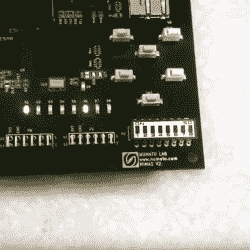

# 轻量级游戏控制台具有强大的冲击力

> 原文：<https://hackaday.com/2016/07/13/lightweight-game-console-packs-a-punch/>

任何有价值的制造商都会寻找新的方法来挑战自己。加州大学计算机科学专业的学生罗伯特·福蒂诺(Robert Fotino)正在这样做:设计并制作他自己的轻量级业余游戏控制台，他恰当地将其命名为 [Consolite](https://fotino.me/consolite-fpga/) 。

[Fotino]用 C++写了他自己的编译器，可以从类似 C 语言转换成定制的汇编程序，他称之为 Consolite 汇编。为了测试他的代码，他还编写了一个仿真器，然后将其加载到 Mimas V2 FPGA 板上。目前，Consolite 使用 64KiB 主存和 48 KiB 显存；未来的版本将支持 32 位，以更好地利用 Mimas 的 64 MiB 板载 ram，但当前的 16 位版本是一个功能性概念验证。

 一张 SD 卡的功能是永久存储多达 256 个程序，可以使用 Mimas 上的硬件开关进行访问，并计划以保存游戏进度、存储在主存储器之外等形式添加用户访问。—也将在未来的更新中包括音频支持。

目前，【Fotino】已经写了他自己版本的[突破](https://fotino.me/breakout-in-assembly/#play)、俄罗斯方块和[创](https://fotino.me/consolite-fpga/#emulation)来展示他的项目。

不想勤奋，【Fotino】在他的博客和 [GitHub](https://github.com/rfotino/consolite-assembler) 上提供了几乎每一步的完整文档，如果你正在为你可能暂时搁置的任何类似项目寻找指导方针——比如一个[甚至更小的游戏控制台](http://hackaday.com/2016/04/10/tiny-attiny85-game-console/)。

[通过 [r/FPGA](https://www.reddit.com/r/FPGA/comments/4nubs0/consolite_a_tiny_game_console_on_an_fpga/)