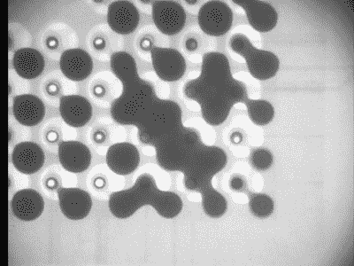
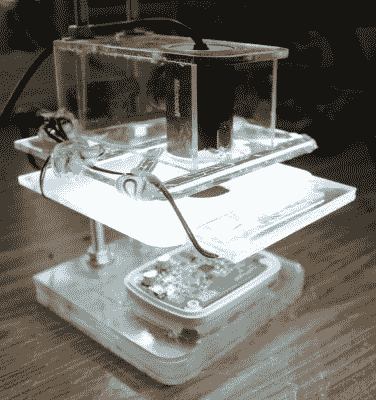
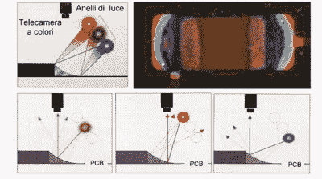

# 行业工具——检验

> 原文：<https://hackaday.com/2016/06/29/tools-of-the-trade-inspection/>

在最后一集里，我们让我们的电路板通过[回流过程](http://hackaday.com/2016/06/02/tools-of-the-trade-reflow/)。不幸的是，它不是 100%准确，并且经常会出现需要检测和修复的问题。这就是检查步骤的目的。可以在粘贴、放置和回流之后插入一个检查步骤，但前两个步骤只是锦上添花，大多数错误都是在回流之后发现的。

表面贴装回流工艺有许多典型的问题:

*   墓碑式——这是一个组件垂直竖立的时候。这是不好的，因为这意味着组件没有连接，存在开路。
*   广告牌——这是组件翻转的时候。它仍然是连接的，所以这里没有什么技术上的错误，但它不是很好，可能表明该过程中的其他问题。
*   搭桥——这真的很糟糕。过多的焊料(或不良的阻焊膜)会使两个相邻的焊盘意外地被焊料桥接，从而产生不必要的连接。
*   填充不足-如果没有足够的焊膏沉积在屏幕上，那么可能不足以进行连接。这种情况在 QFN 零件中更常见，这些零件具有可能被堵塞的超小孔径，在检查时很难看到。
*   空洞–类似于填充不足，这是指应该有焊料的地方没有焊料。这可能是由已经转化为气体但没有机会逸出的焊剂引起的，导致接头内部出现孔洞。或者如果焊盘上有通孔，焊料可能会渗入通孔，在焊盘和预期的连接之间产生空隙。
*   飞溅——想象锡膏中有一小滴水。当水变成蒸汽时，它会爆炸式地释放压力，将焊料颗粒撒得到处都是。通量也可以做到这一点。
*   焊球——太多的焊锡膏被涂上，最后聚集在一些阻焊膜上。因为焊料不会粘在阻焊膜上，而是粘在自身上，所以会在 PCB 顶部形成小球。这些球可以四处移动，并意外桥接连接。

上图是墓碑(C4)、广告牌(R6)、桥接(IC1)、飞溅(遍布)、焊球(右下角)和填充不足(IC2)的例子。

那么我们如何发现和纠正这些问题呢？

### 外观检验

在最少量的情况下，通常是由组装人员完成，最好的方法是使用你普通的老眼球。然而，仅仅一瞥是远远不够的。重要的是要有条不紊地看待并有意识地思考每个联系，以及它是好是坏。充足的光线也让工作变得更容易。

### 显微镜检查

仔细观察每个关节可能会使眼睛疲劳，而且根据可用的照明条件和所用部件的尺寸，这甚至是不可能的。有时需要带一台显微镜。你可以从放大镜开始，这是珠宝商通常使用的一种简单的手持镜头，或者是你助手手上的放大镜。这些也可以内置灯。还有 USB 显微镜，可以让你在大屏幕上看到放大的图像。其他的是纯光学的，让你把脸凑近目镜。

### 在电路测试中

A flying probe test with top and bottom probes and programmable angles ([http://acculogic.com/blog/production-testing-using-flying-probe-systems/](http://acculogic.com/blog/production-testing-using-flying-probe-systems/))

将两个探针移动到特定的位置，测量电阻或电容，重复这样做，你就有了一个很好的验证电路的方法。这有两种变化。在线测试使用一个测试夹具和一整串弹簧针(称为“钉床”)。夹具被压到 PCB 上，从每个引脚进行测量，就完成了。这种方法的缺点是在改变设计时需要一个新的夹具，但优点是测试速度超快，并且能够进行其他操作，包括编程。

另一种变化是飞行探针测试，在这种测试中，机器上有几个探针可以在电路板上以令人眩晕的速度飞行。不需要夹具，因此设置这一测试过程更快、更稳定，但由于该过程是串行的，而不是像 ICT 方法那样是并行的，因此测试每块 PCB 可能需要更长时间，从而使成本更高(加上机器既花哨又昂贵)。

### x 光和锯子

X-Ray of a PCB with a lot of bridges between solder balls.

你怎么知道你的 BGA 芯片组装是否正确？用 x 光照射它，看看里面！当然，这不是一个爱好者可以轻易使用的方法，至少不需要一些帮助，但这是检查 PCB 的唯一非破坏性方法。

另一种方法是用锯子非常小心地切开来偷窥。当然，这是破坏性的，所以它只对过程的诊断有好处，而不是个别的板。

### 廉价的 AOI

A desktop AOI.

我不得不提到这个，因为[我成功地为生产](http://bobbaddeley.com/2015/12/creating-an-automated-optical-inspector-for-50/)实现了一个廉价的 AOI。这个想法是使用廉价的网络摄像头和 OpenCV 来识别故障。AOI 代表自动光学检测，非常常用于测试电路板。这个便宜的 AOI 是同样的想法，但是有很多限制。基本上，你从一个固定 PCB 的固定装置开始，然后在它上面放置一个摄像头，这样 PCB 就可以占据摄像头的整个视野。你放一些“黄金”板进去，用模板训练 OpenCV 连接应该是什么样子。然后你屏蔽掉所有不是组件的东西，开始运行电路板。与模板匹配的连接将在屏幕上被屏蔽，而不匹配的连接将被放大显示，从而使操作人员更容易进行检查。这种方法可以识别桥梁、墓碑、缺失部件和广告牌，但还有其他类型的错误它无法捕捉，而且它也仅限于小型 PCB，经常出现误报。尽管如此，这种方法就其本身而言还是非常便宜的，所以对于几百到几千的运行来说是很好的。

### 商业 AOI

RGB light reflect off the meniscus differently, revealing the quality of the joint (from [http://www.seica.com/products/inspection-aoi/](http://www.seica.com/products/inspection-aoi/))

一个商业 AOI 是超级花哨的。它将有 RGB leds，以便它可以在它们之间快速切换，以查看光在哪里反射，并根据光的反射情况确定焊点的质量。

相机或 PCB 将被放在一个门架上，这样相机可以聚焦在电路板的不同部分，AOI 被训练来寻找许多不同类型的故障。它们仍然有很多误报，因此有一个经验丰富的操作员来验证故障是很重要的。这样会拖慢进程，增加成本，但在某些电路板上，这是每个电路板的必要步骤。

### 功能测试

还有另一个选择，它相当于“让我们插上电源，看看它会不会爆炸。”虽然有点戏剧性，但这是一个合法的测试解决方案，只要你对测试设备有足够的保护。如果它启动了，这是很好的第一步。如果它可以被编程，这表明有很多其他硬件正在运行。如果您的固件足够智能，它可以执行上电自检并读取特定 ADC 引脚上的电压电平，验证预期的 GPIO 值，或者如果连接到 USB 或其他通信，则报告它是否工作。我的一个项目经历了麦克风校准步骤，不仅验证了麦克风电路工作正常，还通过在一个小盒子中自动完成的一系列自测检查了其他传感器和 led 是否正常工作，并通过 USB 和设备的 MAC 地址进行报告。除非通过所有测试，否则硬件不能离开大楼。

### 结论

最终，这些测试方法中的大多数将被用于一个产品。在原型阶段，将进行目视和显微镜检查。然后是飞针或 AOI，随着产量的增加，ICT 在设计固化和产量增加后进入市场。偶尔会进行 x 光检查或锯检，以验证生产线是否仍在正常运行。功能测试几乎肯定是任何生产线的最后一站。