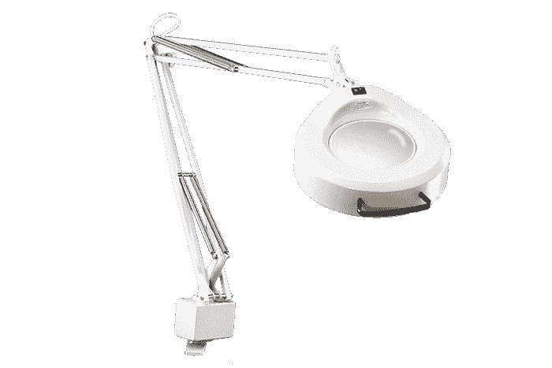
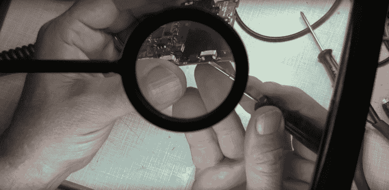
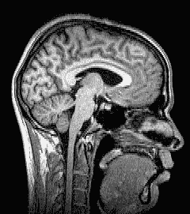

# 黑客变老指南

> 原文：<https://hackaday.com/2016/06/22/a-hackers-guide-to-getting-old/>

毫不奇怪，随着年龄的增长，事情会发生变化，曾经琐碎的任务会变得困难。举个例子:前几天晚上，我儿子向我求助解决他游戏耳机的电线问题。电缆断了，我们可以看到磨损的导线露在外面。拆开后发现，剪去坏的部分后，几乎看不到超细电线重新焊接。我设法做到了，但只是勉强做到。

这次经历让我思考如何应对不可避免的事情。一旦你的身体开始对抗你而不是帮助你，你如何作为一名黑客保持活跃？我最感兴趣的是处理视力的变化，但也对失去灵活性和精细运动技能感兴趣，并处理认知变化。这并不是一个时间破坏的完整列表，但它们可能是影响任何黑客相关爱好的最大因素。我找了几个经验更丰富的黑客同事[Bil]和[Rud]，向他们请教处理这些问题的技巧和诀窍。

## 视觉的事情

众所周知，随着年龄的增长，视力会发生巨大的变化。对我影响最大的是大约 10 年前我开始注意到的远视。我一生都患有*近视*，或近视。但是我总是能摘下眼镜，对着我的脸做很好的工作。[Bil]也有同样的报道:“就像有一个内置的微距镜头。然后有一天，再也没有了。”我发现自己需要把工作放得更远才能聚焦，但现在一切都显得更小了。我真的需要放大。

Luxo IFM lighted magnifier. A classic design.

台式放大的经典可能是卢克索 KFM。历史可以追溯到 20 世纪 30 年代，经典的铰接臂和巨大的放大镜仍然是许多电子工作站的亮点。真正漂亮的功能是放大镜周围的 22W 圆形荧光灯——360°照明意味着没有阴影和更少的由奇怪反射引起的伪像。Luxo 生产各种台式放大镜，有些是 LED 照明，而不是荧光灯，许多其他公司也生产类似的设备。

但是一些黑客不想被束缚在板凳上的一个位置。有时你不需要专注地研究一件事——你需要找到一个测试点来探测，然后看过去调整范围，然后摆弄信号发生器。顺便说一句，随着年龄的增长，你会惊奇地发现乐器上的标签变得越来越小。为了在他的头部转动时保持看清事物，[Bil]推荐了一个头戴式放大镜。这些有几个不同的镜头，可以翻转和翻转，还有一个可调的 LED 灯。我不认为你可以从一个 9 美元的工具上期待太多，但是[Bil]报道说，当他放错他的工具时，他店里的工作就会停止，所以它们不会太糟糕。他还说，在塑料头带周围套一条毛巾布吸汗带有助于提高舒适度。

怪胎——眼光独到。[w2ew]修复了一个手持通话器。[来源](https://www.youtube.com/watch?v=kQYFQCa7PCo)

其他与年龄相关的视力问题包括白内障，即晶状体模糊，以及*上睑下垂*，或眼睑下垂。白内障唯一真正的治疗方法是手术；在[Rud]的白内障恶化到足以永久治愈之前，他依靠提高店里的照明水平来提供帮助。至于下垂，是因为你的视野中有睫毛而造成模糊。手术矫正也是这里的答案。

## 德克斯特的实验室

人类发展的许多里程碑之一是幼儿精细运动技能的提高。仅仅几年时间，孩子们就从挥舞手臂到只能粗略地抓住粗铅笔，再到做出冰箱质量的艺术品。但是在生命的另一端，手的灵巧性也会有类似的下降，尽管这种下降更加缓慢。我们倾向于认为与年龄相关的运动技能变化主要是肌肉骨骼问题，关节炎是常见的坏人。但事实证明可能还有另一个原因——脑容量减少。是的，作为人类，我们期待得到的许多好处之一是，一旦我们到了中年，我们的大脑就开始萎缩。大脑体积与精细运动技能非常接近，所以你的灰质越多，你的手就越灵巧。

衰老的另一个有趣的事实是发展手抖的趋势。[Rud]说他的医生称之为*特发性震颤*，这是一种避免更具描述性的术语*良性特发性震颤*的聪明方法。“特发性”只是“我们不知道病因”的医学术语有时，震颤严重到需要用β-受体阻滞剂、肉毒杆菌素甚至深部脑电刺激治疗，但通常处理震颤更多的是自我导向职业治疗和人体工程学的练习。我发现，即使作为一个 12、13 岁的初露头角的电子爱好者，我也会在漫长的焊接过程中颤抖；适当地支撑我的前臂和锻炼上肢力量在当时很有帮助，我敢打赌现在也会有帮助。

对抗颤抖的另一种方法是:抽油烟机。这似乎有点牵强，但请听我说完。[Bil]我以前都做过急救工作，他提醒了我一个简单的临床事实——人们在缺氧时会发抖。呼吸控制对精细运动技能至关重要——屏住呼吸，你最终会开始颤抖。这就是排烟的用武之地。我知道我倾向于在焊接时屏住呼吸，以避免吸入焊剂烟雾和金属烟雾。一个抽油烟机，甚至一个简单的风扇都可以帮你清理工作空间，让你的手得到控制。

## 老年时刻

Nobody you know. [Source](https://en.wikipedia.org/wiki/Neuroimaging).

也许最微妙、最阴险的与年龄相关的变化是我们都经历过的认知变化。它有点让你毛骨悚然——红棕色是 220 欧姆还是 2.2k？那个零件号是什么来着？但是累积起来，它会成为一个真正的负担。我的父亲，一个终身木工和家具制造商，五年前开始抱怨他再也不能按照计划和指示行事了。如果我活到 75 岁，仍然像他一样敏锐，我会很激动，但我知道这将会发生。

把事情写下来很有帮助，参与任何智力挑战活动也是如此。我们的读者可以而且经常不同意我们黑客作家的成就被视为一种智力追求，但正如[Rud]指出的，我们从读者评论中获得的挑战是保持敏锐的一个很好的方式。“我总是做额外的研究来限制‘抓住’评论的数量。这对保持脑细胞活力有好处。”

积极的态度和一点点好的幽默可能也值得拥有。正如[比尔]讽刺的那样，他的基本板凳配件现在包括“一个口水杯和便携式除颤器。”而且[Rud]很快指出了成为银狐的一线希望:退休意味着你有更多的时间进行黑客攻击。

时钟只朝一个方向旋转，熵是残酷的生活事实。变化会发生，而且比你想象的要快得多。你对它的唯一防御就是知道将要发生什么，提前一点计划，带着一点优雅和许多幽默去面对它。