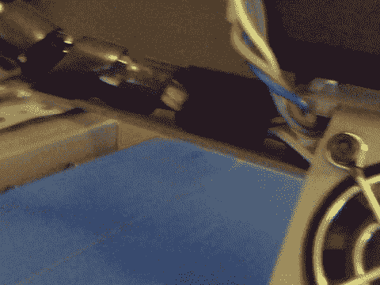

# 一天一个机器人

> 原文：<https://hackaday.com/2016/06/23/a-robot-in-a-day/>

虽然(几乎)从零开始制造一个机器人并不容易，但这不一定是一个漫长的过程。有可能在一天之内建造一个机器人吗？带着一些[的音乐动机](https://www.youtube.com/watch?v=Mr2ptPJrLNw) (a 队主题曲的 10 小时循环)[ 泰勒·布莱奇 ]以他为当地机器人比赛制作的黄色小机器人的形状响亮地回答“是”。

在运行中设计和制造，[Bletsch]使用 Sketchup 设计底盘，使用 OpenSCAD 建模车轮，而前者正在进行 3D 打印。预计到一些结构上的弱点，他设计了另一个版本，如果原来的失败，可以栓到木头上，但增加了一些金属支撑杆，提供了足够的稳定性。鼠标垫材料给了车轮足够的牵引力。带有 L298 控制模块的 Arduino 通过 HC-06 蓝牙板接收输入。八节 AA 电池为两个 Nextrox mini 12V 电机提供 12V 电源，集成电压表来测量电池寿命。

缺少合适的驱动带[带来了一点挑战](http://discspace.org/joining-gt2-belt-into-closed-loops/)，所以【Bletsch】以一种巧妙的足智多谋的表达方式，用一些强力胶和 3D 打印细丝包装拼凑了一个有效的解决方案；热压部件被证明是坚固且柔韧的。浪费不是行动中的制造者技能！

Arduino 代码是从 TerrorBytes 的学生那里借来的——主办比赛的组织——并由[Bletsch]改编。一个 python 脚本结合他在 Google App inventor 中制作的操纵杆模拟器和 WPILiB 的一些控制方程，让他可以从手机上控制他的新机器人。

无论是展示你的制造者技能，帮助你拿行李，还是参加你的 T2 董事会会议，机器人都可以成为日常生活中有价值的一部分——或者只是度过一天的一种有趣方式。