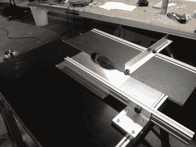

# 一个非常整洁的圆锯台

> 原文：<https://hackaday.com/2016/07/04/a-very-tidy-circular-saw-bench/>

如果在你成长的过程中，你的父母有一个工作室，那么它很有可能藏着一些工具，当你在形成性项目中使用这些工具时，你会逐渐了解并爱上它们。例如，我们的读者[Joerg]的父亲有一个[Joerg]非常想念的圆锯台，现在住在 500 多公里以外。我们今天的主题是他对这个问题的回应，现在需要切割铝[他着手创建自己的锯台](http://dangeroustools.com/2016/06/01/diy-circular-saw/)，结果是一个相当不错的构建。

 他把各种各样的 CAD 模型放在一起阐述自己的想法，最终得出一个 18 毫米防水胶合板结构，带有移动工作台直线轴承。锯条本身安装在一个 5 毫米的铝板上，尽管他没有告诉我们它使用什么马达。所有的木制部分都来自一张胶合板，结果是一个非常整洁的创作。

电锯是你车间里最危险的工具之一，不管它们是什么类型。如果这是一个商业锯，它可能会在其刀片顶部有一个防护装置，但即使没有它，其坚固的结构和相对较低的刀片使这一个站在我们见过的一些更基本的自制锯之上。制造电锯是你必须认真对待的事情。

这些年来，我们推出了不少国产电锯。至少[另外一个大台锯](http://hackaday.com/2015/09/17/circular-saw-innovative-fence-unique-diy-table-saw/)，一个相当[强大却出奇的小锯台](http://hackaday.com/2011/07/07/diy-table-saw-cuts-through-anything-leaves-no-room-for-mistakes/)，这个用缝纫机机构的卷轴锯，或者这个[简易拼图台](http://hackaday.com/2016/05/21/diy-jigsaw-table-makes-cutting-wood-even-easier/)怎么样？