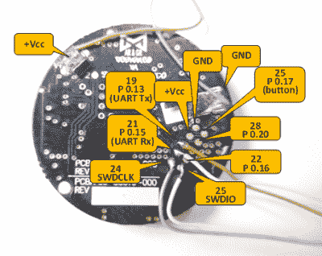

# 定制固件解锁健身追踪器

> 原文：<https://hackaday.com/2016/07/03/custom-firmware-unlocks-fitness-tracker/>

[Mikhail]向我们发送了一个他所做的黑客攻击的预告视频(嵌入在下面)。他拿起一个蓝牙 LE 健身追踪器加密狗，重新闪烁它吐出原始加速度计数据并触发事件。然后，他编写了一个手机应用程序，可以接收数据，并将该设备用作闹钟、开/关开关、数据记录设备等等。

我们认为这很酷，于是我们向[米哈伊尔]询问了更多的细节，然后[他毫不犹豫地给出了](http://msh-tools.com/misfit/index.html)！设备内部是一个 Nordic NRF51822，他们的 ARM Cortex +蓝牙芯片，一个加速度计和一串 led。[米哈伊尔]绘制出编程标题，删除旧的闪存，并用[自己的代码](http://msh-tools.com/misfit/downloads.html)重新填充。他甚至增加了空中 DFU 刷新功能，这样他就不用再打开箱子了。

等式中的[手机端同样重要，同样令人印象深刻。[米哈伊尔]使用](http://msh-tools.com/misfit/android.html) [Cordova](https://cordova.apache.org/) 开发了一个跨平台的基于浏览器的移动应用程序，可以与 BLE 设备进行对话。如果你想做类似的事情，这是一个很好的起点。

最终，[Mikhail]“健身追踪器”做的比最初开发者预期的要多得多，而且该项目对细节的关注达到了专业水平。太神奇了。即使没有那么详细的细节，你也已经有了一个便宜的 NRF51822 开发平台，如果你对蓝牙设备感兴趣的话。

 [https://www.youtube.com/embed/XsGhyzCalJk?version=3&rel=1&showsearch=0&showinfo=1&iv_load_policy=1&fs=1&hl=en-US&autohide=2&wmode=transparent](https://www.youtube.com/embed/XsGhyzCalJk?version=3&rel=1&showsearch=0&showinfo=1&iv_load_policy=1&fs=1&hl=en-US&autohide=2&wmode=transparent)

 [https://www.youtube.com/embed/SlxVI5KYimM?version=3&rel=1&showsearch=0&showinfo=1&iv_load_policy=1&fs=1&hl=en-US&autohide=2&wmode=transparent](https://www.youtube.com/embed/SlxVI5KYimM?version=3&rel=1&showsearch=0&showinfo=1&iv_load_policy=1&fs=1&hl=en-US&autohide=2&wmode=transparent)

